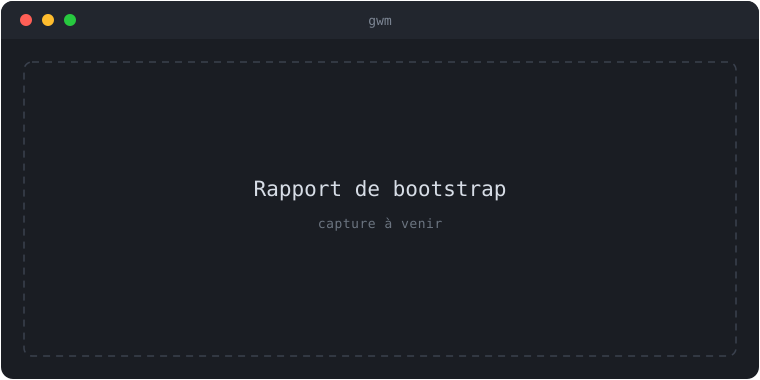

import { Aside } from '@astrojs/starlight/components';

Le pipeline de bootstrap prépare un worktree neuf à partir des règles de
[`.gwm.toml`](/reference/gwm-toml/). Il s'exécute **après** un `git worktree add`
réussi, sur chaque `gwm create` (sauf `--no-bootstrap`) et chaque `gwm bootstrap`,
et est ré-exécutable depuis la TUI via la touche `b`.

<Aside type="caution" title="Protégé par le trust ledger">
  Chaque point d'entrée passe d'abord par la [barrière de confiance TOFU](/concepts/trust-ledger/) :
  la première fois contre le `.gwm.toml` d'un dépôt, gwm demande confirmation (CLI) ou refuse avec
  une indication (TUI) avant qu'aucune étape ne s'exécute. Le pipeline lance des commandes shell
  arbitraires — d'où la frontière de confiance.
</Aside>

## Ordre d'exécution

```text
gwm create / gwm bootstrap
       ↓
trust gate (TOFU)            prompt / refus sur (origin, hash) non approuvé
       ↓
pre_bootstrap hooks          [[hooks.pre_bootstrap]] optionnels
       ↓
(1) [[bootstrap.no_symlink]] supprime les symlinks déclarés (et vendor/node_modules auto)
       ↓
(2) [[bootstrap.copy]]       duplique des fichiers main → worktree
      ↳ guard (deny-list regex sur la source avant copie)
      ↳ fallback (contenu inline si source absente)
       ↓
post_bootstrap hooks         [[hooks.post_bootstrap]] optionnels
       ↓
✓ worktree prêt — rapport ✓ / ! / ✗ / · par étape
```

L'ordre n'est pas arbitraire : `no_symlink` passe en premier (issue #93) pour
supprimer tout lien symbolique existant à la **destination** avant que `copy`
n'ouvre ces chemins en écriture. Inversé, un symlink planté à la destination
d'une copie deviendrait un vecteur d'écriture hors du worktree (primitive
write-anywhere via `O_CREAT | O_TRUNC`). Les guards s'exécutent **sur la source**,
à l'intérieur de la boucle de copies, avant tout transfert — échouer vite sur un
`.env` de prod avant qu'il ne soit copié. Les fallbacks s'exécutent dans la même
boucle, uniquement si la source est absente. Les entrées legacy `[[bootstrap.command]]`
sont traitées comme des hooks `post_create`.

## Rapports d'étape

| Sigle | Sévérité | Effet sur le pipeline                                                              |
| :---- | :------- | :--------------------------------------------------------------------------------- |
| `✓`   | succès   | rien — étape réussie                                                               |
| `!`   | warning  | l'étape est partiellement réussie ou substituée ; le pipeline continue             |
| `✗`   | échec    | l'étape est enregistrée comme échouée ; le pipeline **continue** (étapes core)     |
| `·`   | skip     | l'étape ne s'est pas exécutée (prédicat `when:` faux, source optionnelle absente…) |


{/* TODO(visuel): remplacer ce placeholder par une vraie capture (asciinema / screenshot) — suivi dans une issue dédiée. */}

Même convention de sigles que [`gwm doctor`](/guides/doctor/). **Comportement `✗` selon le type d'étape :**

- **Étapes core** (`no_symlink`, `copy`) : `bootstrap::run_core` retourne toujours `Ok(report)` — un `✗`
  est enregistré mais le pipeline continue vers les étapes suivantes. Le worktree n'est pas supprimé
  automatiquement ; relancez `gwm bootstrap` après avoir corrigé la cause.
- **Hooks** (`pre_bootstrap`, `post_bootstrap`, etc.) : un hook avec `on_fail = "abort"` (défaut)
  propage une `Err` et interrompt le pipeline. Le worktree reste sur disque.

Exemple de rapport réel illustrant l'ordre d'exécution sur un projet PHP (`.env.testing` absent,
symlink `vendor/` détecté, guard AWS inactif) :

```text
  ✓ [pre_bootstrap] direnv allow
  ! no-symlink vendor (auto)              removed symlink /path/to/wt/vendor
  · copy .env.testing -> .env.testing     optional source missing
  ✓ copy .env.example -> .env.example     copied from /main/.env.example
  ✓ [post_bootstrap] composer install
  ✓ [post_bootstrap] php artisan key:generate
```

Le `·` (skip) sur `.env.testing` est informatif : la source est absente et `required = false`.
Le `!` (warning) sur `vendor` signale la suppression du lien symbolique — comportement attendu.

## Copies de fichiers

`[[bootstrap.copy]]` duplique des fichiers du checkout principal vers le worktree
(`.env.testing`, `.envrc`, secrets vendorisés…). `required = true` abort si la
source manque, sauf si un `fallback` la sauve. Schéma complet :
[`.gwm.toml` → `[[bootstrap.copy]]`](/reference/gwm-toml/).

## Guards regex

`[[bootstrap.guard]]` examine chaque fichier copié face à une deny-list de
patterns regex. L'incident d'origine : un `.env` pointant vers l'hôte AWS RDS de
**production** copié dans un worktree, puis un `migrate:fresh --seed` lancé contre
la prod. La parade institutionnelle : ne jamais copier un `.env` aveuglément.

```toml
[[bootstrap.guard]]
name = "no-aws-rds"
deny_patterns = ['amazonaws\.com', '\.rds\.']
on_match      = "seed-from-example"     # abort | seed-from-example
example_file  = ".env.example"
```

- `on_match = "abort"` (défaut) — une correspondance enregistre un `✗` pour cette
  étape et affiche le pattern et la source fautifs. Le pipeline core continue ;
  relancez `gwm bootstrap` après avoir corrigé le fichier source.
- `on_match = "seed-from-example"` — substitue le fichier par `example_file`
  (rapporté `!`), pour repartir d'une base connue comme sûre (sqlite local…).

Les patterns utilisent la crate [`regex`](https://docs.rs/regex) (façon Perl, sans
look-around). Utilisez les chaînes littérales TOML (`'...'`) pour la regex brute.
Le guard ne s'exécute que référencé par `[[bootstrap.copy]].guards = [...]` ;
[`gwm doctor`](/guides/doctor/) (check 2) valide ces références.

## Vérifications no-symlink

`[[bootstrap.no_symlink]]` supprime un symlink existant au chemin déclaré
(typiquement `vendor/`, `node_modules/`). S'exécute **avant les copies** (issue #93) :
supprimer d'abord tout lien à la destination empêche qu'un symlink planté redirige
une copie entrante hors du worktree. `vendor` et `node_modules` sont également vérifiés
automatiquement même s'ils ne figurent pas dans la config — si le chemin est un symlink,
il est supprimé (`!`) ; si c'est un répertoire réel, l'étape passe sans effet (`✓`).

## Hooks de cycle de vie & prédicats `when:`

Les `[[hooks.*]]` enveloppent la création, le bootstrap et la suppression
(`pre_create`, `post_create`, `pre_bootstrap`, `post_bootstrap`, `pre_remove`,
`post_remove`). Chaque hook (et le legacy `[[bootstrap.command]]`) peut porter un
prédicat `when:` qui conditionne son exécution.

| Atome                   | Vrai quand …                                         |
| :---------------------- | :--------------------------------------------------- |
| `file_exists:<path>`    | `<worktree>/<path>` existe                           |
| `cmd_exists:<binary>`   | `<binary>` est sur le `$PATH`                        |
| `env_set:<NAME>`        | la variable est définie (possiblement vide)          |
| `env_eq:<NAME>=<value>` | la variable est définie et vaut exactement `<value>` |
| `glob_exists:<pattern>` | au moins un chemin sous le worktree matche (`**` ok) |

Composition booléenne `!` (NOT), `&&` (AND), `||` (OR) — `!a && b || c` se parse
`((!a) && b) || c`. Les mots-clés inconnus valent `true` par défaut ;
[`gwm doctor`](/guides/doctor/) (check 3) les fait remonter en avertissement.

```toml
[[hooks.post_create]]
name = "install (bun)"
run  = "bun install"
when = "file_exists:package.json && cmd_exists:bun && !env_set:CI"
```

## Sauter ou rejouer le bootstrap

```sh
gwm create feat 42 auth --no-bootstrap     # saute tout le pipeline
gwm bootstrap                              # rejoue sur le worktree du CWD
gwm bootstrap auth --skip-hooks pre_bootstrap
```

Utile quand vous scriptez une création en masse, que `.gwm.toml` est en
transition, ou que vous voulez inspecter le worktree nu avant tout effet de bord.

## Voir aussi

- [Trust ledger (TOFU)](/concepts/trust-ledger/) — la barrière qui protège le pipeline.
- [Fichier `.gwm.toml`](/reference/gwm-toml/) — la surface TOML de chaque section.
- [Diagnostic (doctor)](/guides/doctor/) — valide références de guards et grammaire `when:`.
- [Worktrees & nommage](/concepts/worktrees/) — ce qui précède le bootstrap.
