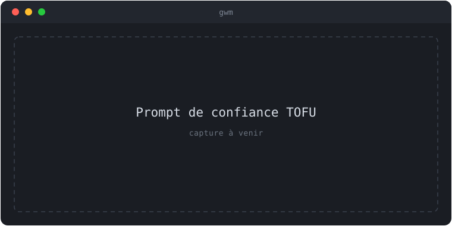

import { Aside } from '@astrojs/starlight/components';

gwm exécute le pipeline `[[bootstrap.*]]` de `.gwm.toml` sous votre utilisateur —
copies, guards regex, vérifications no-symlink et **commandes shell arbitraires**.
Cloner un dépôt et lancer `gwm create` équivaut donc à `curl … | sh` envers
quiconque a rédigé le `.gwm.toml`. Le trust ledger (TOFU, _Trust On First Use_)
établit une frontière explicite entre « j'ai cloné ce remote » et « ce remote
peut exécuter des commandes en mon nom ».

## Modèle de menace

La barrière se défend contre trois schémas concrets :

- **Fork / clone hostile** — cloner un miroir malveillant et lancer `gwm create`
  exécuterait les lignes `[[bootstrap.command]]` à la première invocation, sans
  aucun prompt.
- **Contamination par fork de PR** — récupérer le fork de PR d'un coéquipier pour
  le relire exécute le `.gwm.toml` du fork en votre nom.
- **Compromission d'un accès commit sur monorepo partagé** — une ligne de
  bootstrap livrée dans `.gwm.toml` s'exécute en tant que chaque collègue au
  prochain pull-and-create.

<Aside type="caution" title="Les octets comptent">
  Le ledger hash les **octets bruts** de `.gwm.toml`, pas le TOML parsé. `rm -rf /tmp/` et `rm -rf
  /tmp /` sont à un octet l'un de l'autre — une édition sous l'octet redéclenche le prompt. De même,
  **SSH ≠ HTTPS** : le ledger se base sur l'URL `origin` verbatim, donc `git@github.com:foo/bar.git`
  et `https://github.com/foo/bar` sont des chemins de confiance distincts.
</Aside>

## Comportement de la barrière

La barrière se déclenche en tête de chaque site d'appel du bootstrap :
`gwm create` (avant `git worktree add`, donc un refus laisse le disque intact),
`gwm bootstrap`, et les touches TUI `n` (nouveau) et `b` (re-bootstrap).

Arbre de décision à chaque invocation :

```text
.gwm.toml présent au workdir ?
├── non  → continue silencieusement (rien à exécuter)
└── oui  → mode == Deny ?
          ├── oui → refuse avec le hash dans l'erreur
          └── non → surface de bootstrap vide ?
                   ├── oui → continue silencieusement
                   └── non → mode == Allow ?
                            ├── oui → continue sans enregistrer
                            └── non → entrée (origin, hash) dans le ledger ?
                                     ├── oui → continue silencieusement
                                     └── non → CLI : prompt y/N/show · TUI : refuse avec indication
```

Le **court-circuit de surface vide** est délibéré : un `.gwm.toml` ne contenant
que `[worktree]` ne porte aucun risque de RCE, donc demander confirmation ne
ferait qu'entraîner l'utilisateur à marteler `y`. La surface est considérée non
vide si `[[bootstrap.copy]]`, `[[bootstrap.guard]]`, `[[bootstrap.no_symlink]]`,
`[[bootstrap.command]]` **ou** `[hooks]` sont déclarés — les hooks exécutent eux
aussi des commandes shell arbitraires.

## Surface CLI

```sh
gwm trust list                                # toute paire (origin, hash) approuvée
gwm trust revoke git@github.com:foo/bar.git   # supprime les entrées d'un origin (match verbatim)
gwm trust show                                # chemin du registre + TOML brut
```

Deux flags **globaux** interagissent avec le ledger sur chaque sous-commande qui
lance le bootstrap :

| Surface                 | Effet                                                                      |
| :---------------------- | :------------------------------------------------------------------------- |
| `--allow-bootstrap`     | Ignore le prompt **sans enregistrer**. Pour les contextes non interactifs. |
| `--deny-bootstrap`      | Refuse le bootstrap même en cas de confiance. Mode forensique.             |
| `GWM_ALLOW_BOOTSTRAP=1` | Équivalent env de `--allow-bootstrap` (runners CI).                        |
| `GWM_TRUST_LEDGER=…`    | Surcharge le chemin du registre.                                           |

`--allow-bootstrap` et `--deny-bootstrap` sont mutuellement exclusifs (rejet par
clap). Le bypass **n'enregistre aucune entrée** — un bypass CI ne doit pas
polluer le ledger local de quiconque lance ensuite un `gwm` interactif.

## Le prompt (CLI, premier lancement)

```text
gwm: this repo's .gwm.toml has not been trusted yet.
     path   : /path/to/repo/.gwm.toml
     origin : git@github.com:foo/bar.git
     hash   : 3a4f9c2bdeadbeef...
     bootstrap surface:
       - copy   .env.testing → .env.testing
       - run    composer install (composer install --no-interaction)

Trust this .gwm.toml? [y/N/show]:
```


{/* TODO(visuel): remplacer ce placeholder par une vraie capture (asciinema / screenshot) — suivi dans une issue dédiée. */}

`y` (ou `yes`) enregistre et continue. `N`, `no` ou une ligne vide annule. EOF
(Ctrl-D) annule également. `show` (ou `s`) réaffiche le `.gwm.toml` brut et
**reboucle** sur la question. Une réponse non reconnue affiche un avertissement
et **re-pose la question** — elle n'annule pas. Les exécutions suivantes passent
silencieusement jusqu'à ce que le fichier change.

## Comportement de la TUI

L'alternate-screen ne peut pas héberger un prompt stdin inline : un `.gwm.toml`
non approuvé se solde par un **refus dans la barre de statut** plutôt qu'un prompt.
Les touches affectées sont `n` et `b` ; les deux laissent la TUI en vie — corrigez
l'état de confiance depuis un autre terminal (`gwm bootstrap`, ou
`GWM_ALLOW_BOOTSTRAP=1`) puis réessayez. Le refus survient **avant**
`worktree::add`, donc aucun répertoire orphelin n'est laissé.

## Emplacement et format du registre

Défaut : `~/.config/gwm/trust.toml` (XDG sur Linux, `Application Support` sur
macOS, `%APPDATA%` sur Windows). Surcharge : `GWM_TRUST_LEDGER=/chemin/absolu`.

```toml
[[entries]]
origin     = "git@github.com:kbrdn1/gwm-cli.git"
config_sha = "3a4f9c2bdeadbeefbabe..."     # sha256 hex minuscule
trusted_at = "2026-05-22T10:00:00Z"
trusted_by = "kylian@laptop"               # indice d'audit best-effort, non pertinent pour la sécurité
```

Les écritures sont **atomiques** (fichier temporaire voisin + rename) : deux
processus `gwm` concurrents ne s'écrasent jamais. Un `trust.toml` **malformé est
une erreur, pas un état vide silencieux** — le traiter comme frais re-demanderait
confirmation pour chaque dépôt approuvé et habituerait l'utilisateur à `y`.
L'exception est `--allow-bootstrap`, qui court-circuite avant le chargement pour
qu'un ledger cassé ne casse pas le bypass CI.

## Connexe

- [Bootstrap par repo](/concepts/bootstrap/) — la primitive de RCE que la barrière protège.
- [Commandes CLI → `gwm trust`](/reference/cli/) — contrat par sous-commande.
- [La TUI](/guides/tui/) — annotations de `n` et `b`.
- [Diagnostic (doctor)](/guides/doctor/) — pourquoi doctor n'emprunte pas la barrière.
