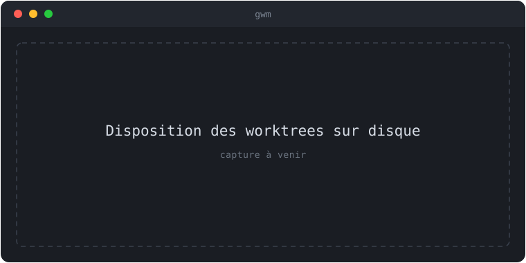

import { Aside } from '@astrojs/starlight/components';

Un **worktree** Git est un répertoire de travail supplémentaire rattaché au même
dépôt, avec sa propre branche checkout. gwm en fait l'unité de travail de base :
une branche = un worktree isolé, créé en une commande.

## Anatomie d'un `gwm create`

```sh
gwm create feat 42 user-authentication
```

Cette commande produit trois choses :

- un **worktree** dans `~/cc-worktree/<repo>/feat-42-user-authentication` ;
- une **branche** `feat/#42-user-authentication` ;
- une entrée git `branch.feat/#42-user-authentication.gwm-base` qui ancre le tronc
  d'origine.

## Convention de nommage

La forme est `gwm create <type> <issue> <desc>`, pilotée par deux patterns de
[`.gwm.toml`](/reference/gwm-toml/) :

```toml
[worktree]
path_pattern   = "{type}-{issue}-{desc}"
branch_pattern = "{type}/#{issue}-{desc}"
```

Types par défaut : `feat`, `fix`, `hotfix`, `docs`, `test`, `refactor`, `chore`,
`perf`, `ci`, `build`.

### Normalisation kebab-case

Le slot `{desc}` est normalisé de façon déterministe : mise en minuscules, puis
chaque suite de caractères non alphanumériques est réduite à un seul `-`, et les
`-` de début/fin sont retirés.

| Saisie                  | Normalisé en          |
| :---------------------- | :-------------------- |
| `"User Authentication"` | `user-authentication` |
| `user authentication`   | `user-authentication` |
| `User_Authentication`   | `user-authentication` |

Cela rend la complétion shell et la recherche fuzzy déterministes — `auth` matche
toujours `feat-42-user-authentication`.

## Disposition sur disque


{/* TODO(visuel): remplacer ce placeholder par une vraie capture (asciinema / screenshot) — suivi dans une issue dédiée. */}

- Le worktree vit dans `<base>/<path_pattern>` — **en dehors** du checkout
  principal par défaut, de sorte qu'il survit à un `git clean -fdx` et aux
  réindexations de l'IDE sur le tree principal.
- La branche est une **branche locale normale** — visible dans `git branch`, sans
  config spéciale.
- La base se situe par défaut sous `~/cc-worktree/<repo>/`, mais peut être
  relative au dépôt (`{repo_parent}/worktrees/{repo}`) — voir
  [`.gwm.toml` → `[worktree]`](/reference/gwm-toml/).

Sur disque, avec la base par défaut (`{home}/cc-worktree/{repo}`), le checkout
principal et ses worktrees restent dans des répertoires entièrement séparés :

```text
~/
├── Projects/
│   └── gwm-cli/                          # checkout principal (tronc)
└── cc-worktree/
    └── gwm-cli/                          # base par défaut
        ├── feat-42-user-authentication   # gwm create feat 42 user-authentication
        └── fix-58-null-pointer           # gwm create fix 58 null-pointer
```

Le chemin complet d'un worktree suit donc : `~/cc-worktree/<repo>/<type>-<issue>-<desc>`.
Un `git clean -fdx` dans le checkout principal ne touche pas à `~/cc-worktree/`.

Si vous préférez localiser les worktrees près du dépôt (utile en environnement
sans accès à `$HOME`), configurez une base relative dans `.gwm.toml` :

```toml
[worktree]
base = "{repo_parent}/worktrees/{repo}"
```

Cela produirait par exemple `../worktrees/gwm-cli/feat-42-user-authentication`
à côté du dépôt principal.

## L'ancre `gwm-base`

`branch.<name>.gwm-base` enregistre le tronc depuis lequel la branche a été
coupée. C'est ce qui permet au [launcher de review](/guides/tui/) de calculer
`git diff base..head` même après que l'upstream de la branche a disparu — la
[résolution de la base](/guides/tui/) s'appuie dessus.

<Aside type="tip" title="Lien issue automatique">
  Avec la convention `<type>/#<N>-<slug>`, le numéro d'issue est dérivé du nom de
  branche — aucun `gwm link issue` n'est nécessaire. Voir
  [Commandes CLI → `gwm link`](/reference/cli/).
</Aside>

## Lignée

Si vous avez utilisé [`gwq`](https://github.com/d-kuro/gwq) ou un script bash
maison `tools/worktree-manager.sh`, gwm en est la réécriture native en Rust —
même workflow, configurable par dépôt, sans dépendance à une CLI externe (les
opérations de worktree passent par libgit2 vendored).

## Voir aussi

- [Prise en main](/guides/prise-en-main/) — `create` → `list` → `remove` en pratique.
- [Bootstrap par repo](/concepts/bootstrap/) — ce qui s'exécute après la création.
- [Fichier `.gwm.toml`](/reference/gwm-toml/) — patterns de chemin et de branche.
