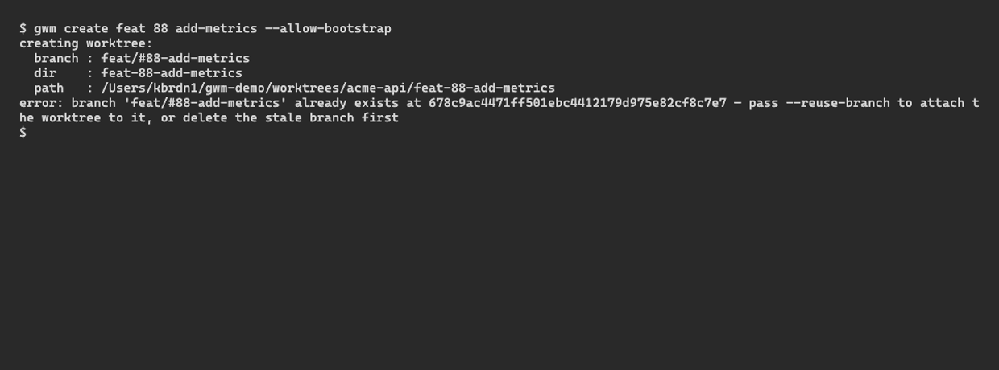

The bootstrap pipeline runs **after** `git worktree add` succeeds, on every `gwm create` (unless `--no-bootstrap` is set) and on every `gwm bootstrap`. It is also re-runnable from inside the TUI via the `b` key.



Every entry point is **gated by the [TOFU trust ledger](/configuration/trust-ledger)** - the first time you run `gwm create` / `gwm bootstrap` against a repo's `.gwm.toml`, the gate prompts (CLI) or refuses with a status-bar hint (TUI) before any pipeline stage executes. Subsequent runs against the same `(origin URL, sha256 of .gwm.toml)` pair pass silently; any byte change to `.gwm.toml` re-prompts. CI bypass: `--allow-bootstrap` or `GWM_ALLOW_BOOTSTRAP=1`.

Lifecycle hooks wrap the bootstrap core:

```
gwm create / gwm bootstrap
       ↓
trust gate (issue #95)                 prompt / refuse on untrusted (origin, hash)
       ↓
pre_bootstrap hooks                     optional [[hooks.pre_bootstrap]]
       ↓
(1) [[bootstrap.copy]]                  duplicate files from main → worktree
       ↓
(2) [[bootstrap.guard]]                 regex deny-list each copied file
       ↓
(3) [bootstrap.fallback.*]              materialise inline content when a
                                          required source is missing
       ↓
(4) [[bootstrap.no_symlink]]            refuse to inherit listed symlinks
       ↓
post_bootstrap hooks                    optional [[hooks.post_bootstrap]]
       ↓
✓ worktree ready, status bar reports per-step ✓ / ! / ✗
```

Stages **1 → 4** are tightly coupled - a guard `seed-from-example` action triggers a fallback (stage 3) inline, and the no-symlink check (stage 4) runs after copies so it can refuse links that the copy step would have followed. Legacy `[[bootstrap.command]]` entries are treated as `post_create` hooks for compatibility; prefer `[[hooks.post_create]]` in new configs.

## Stage reports

Each step prints one line with a sigil - same convention as `gwm doctor`:

| Sigil | Severity | Effect on the worktree                           |
| :---- | :------- | :----------------------------------------------- |
| `✓`   | success  | nothing                                          |
| `!`   | warning  | step is skipped or partial; pipeline continues   |
| `✗`   | failure  | pipeline aborts; the new worktree is rolled back |

Example output (from `gwm create feat 42 user-auth` with a typical config):

```
creating worktree:
  branch : feat/#42-user-auth
  dir    : feat-42-user-auth
  path   : /Users/you/cc-worktree/myrepo/feat-42-user-auth
✓ worktree created at /Users/you/cc-worktree/myrepo/feat-42-user-auth

bootstrap report:
  ✓ copy .env.testing
  ! no-symlink vendor
      target not present
  ✓ guard no-aws-rds on .env
  ✓ run composer install
  · run direnv allow
      when condition 'file_exists:.envrc' false
```

The `·` sigil (used by some predicate skips) is a "step did not run" indicator and is purely informational - no severity attached.

## Skipping bootstrap

```bash
gwm create feat 42 user-auth --no-bootstrap     # skip the whole pipeline
gwm bootstrap auth --skip-hooks pre_bootstrap   # skip one lifecycle hook phase
```

Useful when:

- You're scripting bulk creation and want bootstrap as a separate step.
- The repo's `.gwm.toml` is in transition and bootstrap would fail predictably.
- You want to inspect the bare worktree before any side-effects land.

Re-run bootstrap later without recreating:

```bash
gwm bootstrap                  # on the CWD worktree
gwm bootstrap auth             # ...on a fuzzy-matched name
```

## Why this order

The order is **not arbitrary**. It encodes the original safety lessons that motivated gwm:

1. **Copies first** - gives guards something to inspect.
2. **Guards immediately after** - fail fast on a `.env` containing AWS RDS endpoints **before** the worktree's shell hooks pull in real production data.
3. **Fallbacks** - when a guard fires `seed-from-example`, the substitution happens before the no-symlink check looks at the result.
4. **No-symlink** - runs last among the file-level stages, so it catches any link created by a `cp -R` that followed indirections.
5. **Shell commands** - the only stage that can have arbitrary side-effects on external systems (composer install, npm ci, etc.). Placed last so the file-level invariants hold by the time it runs.

## Related

- [Configuration → `.gwm.toml` schema](/configuration/gwm-toml) - the TOML surface of every bootstrap section
- [Regex guards](/configuration/guards) - how stage 2 works in detail
- [when: predicates](/configuration/when-predicates) - how stage 5 conditionalises commands
- [Integrations → `gwm doctor`](/integrations/doctor) - validates that bootstrap config is internally consistent (guard refs, predicate grammar)
