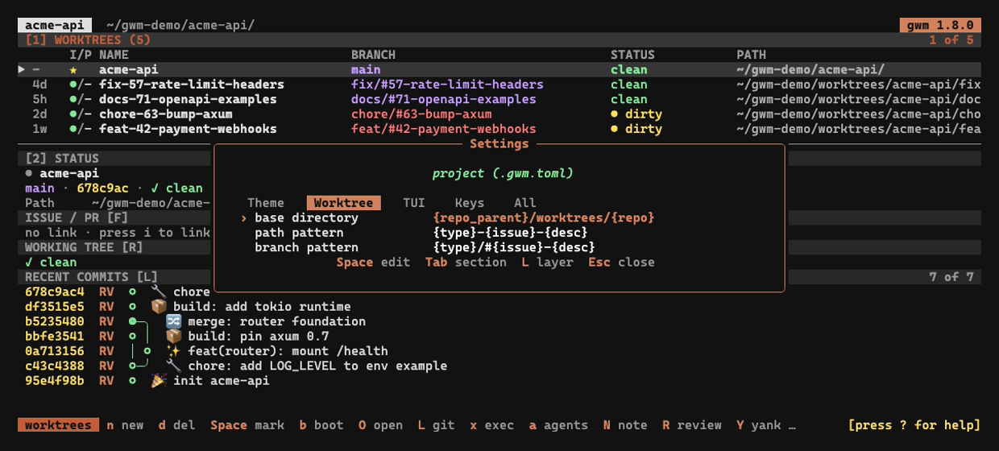

`.gwm.toml` lives at the repo root. Without one, gwm uses sensible defaults (path = `~/cc-worktree/<repo>/<type>-<issue>-<desc>`, no bootstrap, `lazygit -p {path}` as `l`). With one, you can configure every facet: branch naming, file copies, security guards, launcher commands, TUI behaviour, and doctor checks.

The annotated full version lives at [`examples/gwm.toml.example`](https://github.com/kbrdn1/gwm-cli/blob/main/examples/gwm.toml.example), and `gwm init` writes that file unchanged to your repo root.

The TUI's Settings panel (`4`) is the same schema, resolved: every key with the value in force and where it came from, editable in place.



Use `gwm config` for scriptable reads and safe edits:

```bash
gwm config get worktree.base
gwm config set tui.confirm_countdown_secs 5
gwm config list --prefix review
gwm config validate
```

`gwm config set` preserves existing comments and formatting, then validates the file against this schema before returning success.

The same schema may also live at `~/.config/gwm/config.toml` as a **user-level global config**, merged underneath each repo's `.gwm.toml`. See [User-level global config](/configuration/global-config).

## `[worktree]`

Branch and path conventions.

```toml
[worktree]
base           = "{home}/cc-worktree/{repo}"
path_pattern   = "{type}-{issue}-{desc}"
branch_pattern = "{type}/#{issue}-{desc}"
```

Placeholders: `{home}`, `{repo}`, `{type}`, `{issue}`, `{desc}`, `{repo_path}`, `{repo_parent}`. Tilde (`~/…`) is also expanded.

| Placeholder     | Expands to                                                        |
| :-------------- | :---------------------------------------------------------------- |
| `{home}`        | your home directory                                               |
| `{repo}`        | the repo name                                                     |
| `{type}`        | the branch type (`feat`, `fix`, …)                                |
| `{issue}`       | the issue number                                                  |
| `{desc}`        | the description slug                                              |
| `{repo_path}`   | the main repo's absolute working directory                        |
| `{repo_parent}` | the directory _containing_ the main repo (`{repo_path}`'s parent) |

`{repo_path}` and `{repo_parent}` let the base sit relative to the repo on disk. For example, `base = "{repo_parent}/worktrees"` puts worktrees in a sibling `worktrees/` dir, matching an editor's `../worktrees` convention (Zed's `git.worktree_directory`) without a per-project editor config. They are additive, so existing `{home}` / `{repo}` bases are unchanged.

```toml
[worktree]
base = "{repo_parent}/worktrees/{repo}"   # a sibling `worktrees/` dir
```

### `branch_pattern` is read back by a parser derived from itself

`branch_pattern` is honoured when gwm **writes** a branch name, and since [#417](https://github.com/kbrdn1/gwm-cli/issues/417) the parser that **reads one back** is compiled from that same pattern. One source of truth, so a repo that customises the pattern keeps issue auto-linking from the branch name, gitmoji selection, `gwm pr` template selection and placeholders, hook placeholders on the remove / bootstrap paths, the TUI rename, and the `doctor` branch-convention check.

Before #417 the reader was a fixed regex for the default `{type}/#{issue}-{desc}`, so all of those went quiet on a customised pattern with nothing connecting cause to effect. [#415](https://github.com/kbrdn1/gwm-cli/issues/415) turned that silence into a warning; #417 removed the cause.

A pattern may also **freeze** a segment instead of writing it from a placeholder: `feat/#{issue}-{desc}` hardcodes the type, `{type}/#1-{desc}` hardcodes the issue number. gwm reads the frozen literal back, so gitmoji, auto-linking and the rest keep working on those branches, exactly as they did before #417. What such a pattern does cost is stated separately: `gwm create fix 42 x` writes a `feat/` branch, so the type you asked for is not the type anyone reads back, and `gwm doctor` says so.

Two things a derived parser genuinely cannot recover, and `gwm doctor` / `gwm config validate` name both:

1. **A pattern whose split can move.** The question is never "is there a separator" but "can the boundary between two placeholders land in more than one place". `{issue}{desc}` writes `42123-x` from `42` and `123-x`, which reads back as `4212` and `3-x`; `{desc}{issue}` is worse, because `a12` is what both `a` + `12` and `a1` + `2` produce, so no parser can be right. A non-empty separator is no guarantee either: `{type}-{issue}9{desc}` writes `feat-42919x` from issue `42` and desc `19x`, and the greedy `\d+` slides right across the `9` to read issue `4291` and desc `x`.

   Both halves of the rule are narrower than they look. Adjacency alone is fine when the two alphabets are disjoint: `{type}{issue}` writes `feat42`, and since `[a-z]+` stops at the first digit and `\d+` at the first letter there is exactly one split. A separator inside the left placeholder's charset is fine too, as long as the right one cannot supply it back: `-` after `{desc}` can be swallowed but never reappear, because an issue number cannot contain it, so `{desc}-{issue}` stays legal. Even a multi-character separator only counts if the left side can eat a _repeating_ prefix of it, which is why `{type}-{issue}9-{desc}` works where `{type}-{issue}9{desc}` does not. Everything that fails is refused with a message naming the fix.

2. **A segment the pattern neither writes nor freezes.** `{type}/{desc}` has no `{issue}` and no literal number to stand in for one, so nothing can read an issue out of a branch it wrote. The warning says which placeholder to add.

**The two commands differ on exit code, which matters if you gate CI on them:**

| Command               | On a pattern that does not round-trip                                                                                |
| :-------------------- | :------------------------------------------------------------------------------------------------------------------- |
| `gwm config validate` | prints the warning on stderr, exits **`0`**, since a custom pattern is valid configuration rather than an error      |
| `gwm doctor`          | reports a `!` check, so the run exits **`1`** like any other Warning ([exit codes](/integrations/doctor#exit-codes)) |

A CI job that runs `gwm doctor` and tolerates Warnings should use `gwm doctor; [ $? -le 1 ]`.

`config validate` reads the effective pattern, so one set only in the global `~/.config/gwm/config.toml` is caught too.

`path_pattern` is unaffected: it is generation-only, and a worktree's name comes from its directory rather than from re-parsing the pattern.

#### Which patterns work

The field stays free-form. The table below is verified against the real check, not assumed: a test pins it so it cannot drift.

**Round-trips fully**, so every branch-name feature keeps working:

| Pattern                                                      | Note                                                                             |
| :----------------------------------------------------------- | :------------------------------------------------------------------------------- |
| `{type}/#{issue}-{desc}`                                     | the default                                                                      |
| `{type}-{issue}-{desc}`                                      | slash-less, and unambiguous: `-` is in neither `[a-z]+` nor `\d+`                |
| `{type}_{issue}_{desc}`                                      | any separator works, as long as there is one                                     |
| `{type}/{issue}-{desc}`                                      | the `#` is decoration, not structure                                             |
| `{type}/#{issue}_{desc}`                                     |                                                                                  |
| `{repo}/{type}/#{issue}-{desc}`, `wt/{type}/#{issue}-{desc}` | extra leading segments are fine                                                  |
| `{type}/#{issue}-prefix-{desc}`                              | a literal wedged between placeholders is fine                                    |
| `{type}/#{issue}-{desc}-{repo}`                              | so is one appended after `{desc}`                                                |
| `{desc}/#{issue}-{type}`                                     | the order is yours                                                               |
| `{type}/#{desc}-{issue}`                                     | a `-` after `{desc}` is legal: `\d+` can never contain it, so there is one split |
| `{type}{issue}-{desc}`, `{issue}{type}-{desc}`               | adjacent, but `[a-z]+` and `\d+` share no character, so the split cannot move    |
| `{type}-{issue}9-{desc}`                                     | `\d+` can eat the `9` but never the `-` that would have to follow it             |

**Refused as unreadable**, with an error naming the fix:

- `{issue}{desc}`, `{desc}{issue}`, `{type}{desc}` : adjacent placeholders whose alphabets overlap, so a character can cross the split
- `{type}-{issue}9{desc}`, `{type}a{desc}`, `{desc}1{issue}` : a separator both neighbours could contain, so the split can move
- `{desc}-{desc}` : the same placeholder twice, since every occurrence expands to the same value

**Freezes a segment.** The literal is read back, so nothing stops working on the branches these produce. What is lost is the argument `gwm create` was given, and `gwm doctor` names it:

- `feat/#{issue}-{desc}` : every branch is a `feat` branch, whatever type you pass. Harmless when `feat` is the only configured branch type, and `gwm doctor` stays quiet in that case
- `{type}/#1-{desc}` : every branch links to issue 1
- `{type}/#{issue}-fixed` : every branch has the description `fixed`

The TUI rename form shows a frozen segment, and whether it can be changed depends on where the new value could go. The question is the formatter's, so all three patterns it expands are asked: `branch_pattern`, `worktree.path_pattern`, and `[worktree].base`. When the path pattern writes the segment, editing it renames the worktree directory; when `base` writes it, the worktree moves between base directories, which is what a `base` of `.../{type}` is for. Either way the branch is left alone, which is a real rename and is allowed, and the modal's preview states it by showing the branch unchanged. Only when none of the three writes the segment is the edit refused, because the submit would rebuild the same branch at the same path. Segments `branch_pattern` writes are always editable.

The value it shows comes from the worktree's **directory** when `path_pattern` carries the segment and `branch_pattern` does not ([#478](https://github.com/kbrdn1/gwm-cli/issues/478)). Under `branch_pattern = "feat/#{issue}-{desc}"` with the default `path_pattern`, `gwm create fix 42 x` writes the branch `feat/#42-x` and the directory `fix-42-x`, and `fix` exists nowhere else, so renaming the description keeps it instead of moving the directory to `feat-42-…`. The branch always wins for a segment it writes itself: a directory renamed by hand never rewrites the worktree's identity.

The recovery is positional first, then an exact match, never a guess. A literal is only read as a segment if it sits **where that segment goes**: before `{issue}` for a type, after it for a description. So `feat/#{issue}-fix` recovers both, even though `feat` and `fix` are each a configured branch type, and `wt/{type}/#{issue}` recovers nothing, since `wt` sits before the type, where no segment goes, so it stays the namespace it looks like. Then each candidate is put to its own test: a branch type is looked up in the repo's configured list, so `feature/#{issue}-{desc}` recovers nothing (`feature` names a namespace, not a type); an issue number has to be all digits; a description is whatever `DESC_RE` accepts. A segment is recovered when every reading of the pattern names it with the same value, and the rule is per segment: `feat/fix-{issue}-{desc}` names two different configured types in the same position and recovers neither, `feat/feat/#{issue}-{desc}` reads `feat` whichever of its two candidates is taken and so freezes the type like any other literal, and `feat/#{issue}-fix/done` is read two ways that disagree about the description while both saying `feat`, so it recovers the type and not the description.

**Carries no such segment at all**, so `gwm doctor` warns and says which placeholder to add:

- `{issue}-{desc}` : no `{type}` and no literal type to freeze one from
- `{type}/{desc}` : no `{issue}`, so issue auto-linking from the branch name is inactive
- `{type}/#{issue}` : no `{desc}`

One shape the compiler does not mirror: a pattern starting with `~`, because the writer runs tilde expansion as its last step and the reader has no way to undo it. `gwm doctor` reports it as a pattern nothing reads back.

### Supported branch types

`feat`, `fix`, `hotfix`, `docs`, `test`, `refactor`, `chore`, `perf`, `ci`, `build`. Override per repo if your team uses something else.

## `[[bootstrap.copy]]`

File copies from the main checkout into the new worktree.

```toml
[[bootstrap.copy]]
from = ".env.testing"
to   = ".env.testing"
required = true
fallback = "inline"        # inline | skip | abort (default: skip when required=false)

[[bootstrap.copy]]
from = ".env"
to   = ".env"
required = false
guards = ["no-aws-rds"]    # reference into [[bootstrap.guard]]
```

| Field      | Type            | Default      | Meaning                                                                  |
| :--------- | :-------------- | :----------- | :----------------------------------------------------------------------- |
| `from`     | string          | _(required)_ | source path, relative to the main checkout                               |
| `to`       | string          | _(required)_ | destination path, relative to the new worktree                           |
| `required` | bool            | `false`      | when `true`, missing source aborts the bootstrap unless `fallback` saves |
| `guards`   | list of strings | `[]`         | names of `[[bootstrap.guard]]` rules to apply after the copy             |
| `fallback` | string          | none         | `inline` (use `[bootstrap.fallback.<key>]`), `skip`, or `abort`          |

See [Bootstrap pipeline](/configuration/bootstrap) for execution order.

## `[[bootstrap.guard]]`

Regex deny-lists on copied files, generalised from the original "no AWS RDS in `.env`" use case.

```toml
[[bootstrap.guard]]
name = "no-aws-rds"
deny_patterns = ["amazonaws\\.com", "\\.rds\\."]
on_match      = "seed-from-example"     # abort | seed-from-example
example_file  = ".env.example"
```

See [Regex guards](/configuration/guards) for the full pattern API.

## `[bootstrap.fallback.<key>]`

Inline content used when a required `[[bootstrap.copy]]` source is missing and `fallback = "inline"`.

```toml
[bootstrap.fallback.env_testing]
target  = ".env.testing"
content = """
APP_ENV=testing
DB_CONNECTION=sqlite
DB_DATABASE=:memory:
"""
```

The `<key>` is referenced implicitly by matching `target` to a copy step's `to`. Multiple fallbacks may coexist.

## `[[bootstrap.no_symlink]]`

Refuse to inherit a symlink at the listed path (typically `vendor/`, `node_modules/`), which stops a stray symlink from polluting the main repo's build output.

```toml
[[bootstrap.no_symlink]]
path = "vendor"

[[bootstrap.no_symlink]]
path = "node_modules"
```

## `[[bootstrap.command]]`

Legacy shell hooks. New configs should prefer `[[hooks.post_create]]`. When a config defines both legacy `[[bootstrap.command]]` entries and any `[hooks.*]` entries, gwm prints a deprecation warning and treats the legacy commands as extra `post_create` steps to avoid ordering ambiguity.

```toml
[[bootstrap.command]]
name = "composer install"
run  = "composer install --no-interaction --prefer-dist"
when = "file_exists:composer.json"
env  = { COMPOSER_IGNORE_PLATFORM_REQ = "ext-imagick" }
```

| Field  | Type                   | Meaning                                                        |
| :----- | :--------------------- | :------------------------------------------------------------- |
| `name` | string                 | shown in the bootstrap report                                  |
| `run`  | string                 | shell line to exec (split via `sh -c`)                         |
| `when` | string                 | [`when:` predicate](/configuration/when-predicates) (optional) |
| `env`  | table of string→string | extra env vars injected for this command (optional)            |

## `[[hooks.*]]`

Lifecycle hooks run around worktree creation, bootstrap, and removal. Supported phases:

- `[[hooks.pre_create]]`: before `git worktree add`, with `cwd` at the main repo.
- `[[hooks.post_create]]`: after the worktree exists, with `cwd` at the worktree.
- `[[hooks.pre_bootstrap]]` / `[[hooks.post_bootstrap]]`: around the bootstrap core.
- `[[hooks.pre_remove]]` / `[[hooks.post_remove]]`: before and after a removal, whether it came from `gwm remove` or from `d` in the TUI.

```toml
[[hooks.post_create]]
name = "install deps"
run  = "npm ci"
when = "file_exists:package-lock.json"
on_fail = "warn" # abort | warn | ignore (default: abort)
env = { CI = "1" }
```

| Field     | Type                   | Meaning                                                        |
| :-------- | :--------------------- | :------------------------------------------------------------- |
| `name`    | string                 | shown in lifecycle reports as `[phase] name`                   |
| `run`     | string                 | shell line to exec via `sh -c`                                 |
| `when`    | string                 | [`when:` predicate](/configuration/when-predicates) (optional) |
| `env`     | table of string→string | extra env vars injected for this hook (optional)               |
| `on_fail` | string                 | `abort`, `warn`, or `ignore`; default is `abort`               |

Hook commands and env values can use placeholders: `{branch}`, `{path}`, `{type}`, `{issue}`, `{desc}`, `{user}`, `{owner}`, `{repo}`.

**A placeholder is a value, not a fragment of script.** In `run`, each substituted value is shell-escaped, so a branch name carrying `;`, `|`, `$`, a backtick or a space arrives at your command as one argument instead of changing what the command _is_. Git permits all of those in a ref, and a ref can come from someone else's push. Substitution is single-pass, so a value that itself contains a `{token}` is passed through untouched rather than expanded a second time. In `env`, values are **not** escaped: they go straight to the process environment and never see a shell, so escaping them would put literal quote characters into what your hook reads back.

One consequence worth knowing: an **empty** placeholder now expands to an empty argument rather than to nothing at all. On a branch that does not match the branch convention, `{type}` / `{issue}` / `{desc}` are empty, so `mycmd {issue}` passes `mycmd` one empty argument where it previously passed none. Inside a larger word (`mycmd issue={issue}`) nothing changes.

**The same context is exported as environment variables**, so a hook can skip placeholder syntax entirely:

| Variable     | Same as    |
| :----------- | :--------- |
| `GWM_BRANCH` | `{branch}` |
| `GWM_PATH`   | `{path}`   |
| `GWM_TYPE`   | `{type}`   |
| `GWM_ISSUE`  | `{issue}`  |
| `GWM_DESC`   | `{desc}`   |
| `GWM_USER`   | `{user}`   |
| `GWM_OWNER`  | `{owner}`  |
| `GWM_REPO`   | `{repo}`   |

```toml
[[hooks.post_create]]
name = "notify"
run  = 'printf "%s is ready at %s\n" "$GWM_BRANCH" "$GWM_PATH"'
```

Quote them (`"$GWM_BRANCH"`, not `$GWM_BRANCH`): a shell never re-parses metacharacters coming out of a variable, so nothing there can start a second command, but an unquoted expansion is still subject to word splitting and filename globbing, and a ref may contain a tab, a newline or a `*`. An explicit `env` entry with the same name wins over the exported one.

Emergency bypass:

```bash
gwm create feat 42 auth --skip-hooks pre_create
gwm bootstrap auth --skip-hooks pre_bootstrap,post_bootstrap
gwm remove auth --force # implies --skip-hooks pre_remove,post_remove
```

The TUI has no `--skip-hooks`: `d` is the plain form of `gwm remove`, so a
`pre_remove` that refuses refuses there too. To delete past a hook, use the
CLI with `--force`.

Running a hook means executing code out of `.gwm.toml`, so the TUI checks the
[trust ledger](/configuration/trust-ledger) before a delete in a repo whose
config defines `pre_remove` or `post_remove` steps. The alternate screen
cannot host the approval prompt, so an unapproved config refuses the delete
rather than skipping the hook; `gwm trust add` from a terminal approves it,
and `--allow-bootstrap` (or `GWM_ALLOW_BOOTSTRAP=1`) at launch bypasses the
ledger for the session. A config whose hooks are all `post_create` runs
nothing on a delete and is never asked.

## `[git_tui]` and `[review]`

The TUI launcher bindings. Full schema lives in [TUI → Configurable launchers](/tui/launchers).

```toml
# l keybinding — pre-v0.6 default kept implicit when omitted
[git_tui]
command    = "lazygit -p {path}"
fullscreen = true

# R keybinding — inert until configured
[review]
tool         = "lumen"                # OR command = "<your line>"
fullscreen   = true                   # only honoured when command is set
default_base = "main"                 # optional override for the base resolution chain
```

## `[exec]` and `[clean]`

Named profiles for the `gwm exec` and `gwm clean` fan-out commands (issue #324). Both blocks are opt-in: without them, `gwm exec -- <cmd>` and the built-in `gwm clean` set behave exactly as before.

```toml
[exec]
jobs = 1                             # global default parallelism; 1 = sequential

# Saved commands for `gwm exec --profile <name>`.
[exec.profiles.test]
command = ["cargo", "test"]          # argv ARRAY — no shell

[exec.profiles.fmt]
command = ["cargo", "fmt", "--all"]
jobs = 4                             # this profile fans out 4 at a time

# Run a profile's command inside a container (issue #421).
[exec.profiles.ci]
command = ["cargo", "test", "--all-features"]

  [exec.profiles.ci.container]
  image      = "rust:1.90"           # required
  runtime    = "podman"              # optional; auto-detected (docker, then podman)
  extra_args = ["-e", "CI=1", "-v", "gwm-cargo:/usr/local/cargo/registry"]

# Saved directory sets for `gwm clean --profile <name>`.
# `default` is what `gwm clean` uses WITHOUT --profile.
[clean.profiles.default]
dirs = ["target", "node_modules", "dist", "build", "coverage", ".turbo"]

[clean.profiles.deep]
dirs = ["target", "node_modules", "dist", "build", ".cache", ".venv"]
```

**exec: `command` is an argv array, not a shell line.** A profile's `command` is a list of argv tokens (`["cargo", "test"]`) run with **no shell**: no word-splitting, no globbing, no `{path}` placeholders. The program is executed verbatim in each worktree, exactly like the inline `gwm exec -- <cmd>`. This is a deliberate divergence from `[git_tui]` and `[review]`, whose `command` is a single **shell** line (`"lazygit -p {path}"`). The two semantics are frozen for 1.0; don't expect shell features under `[exec.profiles]`.

- `gwm exec --profile <name>` runs the saved command. `--profile` and an inline `-- <cmd>` are **mutually exclusive** (passing both exits 1); an **unknown** profile name exits 1.

**exec: `jobs` is bounded parallelism.** `[exec] jobs` is the global default; a profile's `jobs` overrides it; the `--jobs <n>` flag wins over both. Precedence: `--jobs` > `[exec.profiles.<name>].jobs` > `[exec] jobs` > `1`. **`1` (or absent) runs sequentially** with live, inherited output, the unchanged default. **`> 1` runs up to N worktrees at once**, capturing each one's output and printing it as a per-worktree block (in worktree order) once the fan-out completes, so concurrent runs don't interleave. The aggregate exit code is unchanged: non-zero if any worktree's command failed.

**exec: `[container]` runs a profile's command inside a container.** `[exec.profiles.<name>.container]` wraps the profile's command in `<runtime> run` instead of running it on the host. It rides a **profile only**: the inline `gwm exec -- <cmd>` always runs on the host, whatever the config says, so a command line that used to run locally never starts a container behind your back. A containerised run announces itself in the per-worktree header: `━━ feat-1 (/path/to/feat-1) [docker rust:1.90]`.

| key               | meaning                                                                                                                                                                                                                                                                               |
| ----------------- | ------------------------------------------------------------------------------------------------------------------------------------------------------------------------------------------------------------------------------------------------------------------------------------- |
| `image`           | **required**, non-empty. The image to run, e.g. `"rust:1.90"`                                                                                                                                                                                                                         |
| `runtime`         | The container CLI. Absent ⇒ auto-detected: **`docker` first, then `podman`**. Any Docker-compatible CLI works (`nerdctl`, a wrapper script); an explicit value is honoured even if it isn't on `PATH`                                                                                 |
| `extra_args`      | Extra `run` flags, spliced in **after** gwm's own and **before** the image: `["-e", "CI=1"]`, `["-v", "cache:/root/.cargo"]`, `["--network", "none"]`                                                                                                                                 |
| `selinux_relabel` | Suffix gwm's own mounts with `:z`, for an SELinux-enforcing host (Fedora, RHEL). Off by default because relabelling **writes to the host**, recursively, on the worktree and the main checkout's `.git`. `extra_args` cannot express it: it cannot reach the mounts gwm builds itself |

The command gwm builds for each worktree:

```sh
<runtime> run --rm -v <worktree>:<worktree> -v <main>/.git:<main>/.git -w <worktree> \
  -e GIT_CONFIG_COUNT=2 -e GIT_CONFIG_KEY_0=safe.directory -e GIT_CONFIG_VALUE_0=<worktree> \
  -e GIT_CONFIG_KEY_1=safe.directory -e GIT_CONFIG_VALUE_1=<main>/.git \
  <extra_args…> <image> <cmd…>
```

**Host paths are mirrored, and the main checkout's gitdir is mounted alongside.** This is the point of the feature rather than a detail. A linked worktree's `.git` is not a directory, it is a **file** holding the **absolute host path** of `<main>/.git/worktrees/<id>`. Mount only the worktree and that path does not exist inside the container: no `git status`, no `git describe` to stamp a version, no commit, no hook, and no coding agent that touches git. Mounting the main checkout's `.git` at its own host path fixes it, and once a host-absolute path has to be reproduced anyway, a `/workspace` mount point buys nothing, so `-w` is the worktree's own path and `{path}` / `GWM_PATH` stay true on both sides. When the gitdir already lives inside the worktree (the main checkout, reachable via an explicit slug), the first mount covers it and the second is skipped.

- **Every mounted path is declared `safe.directory`.** With a rootful Docker on Linux the container runs as uid 0 while the bind-mounted tree belongs to you, and git refuses a repository it reads as `dubious ownership`, which would undo the mount above. gwm declares the paths **it mounts itself** through `GIT_CONFIG_*` environment: nothing is written to any config file, and the blanket `*` is never used, so the ownership check stays on for everything else. It is the same fix CI providers apply to their own checkouts. What this does **not** change is file ownership: with a rootful daemon, files the command creates (a `target/`, a `node_modules/`) belong to root on the host. Add `extra_args = ["--user", "1000:1000"]` if that matters to you, keeping in mind that some images expect root (a writable `CARGO_HOME`, `apt-get`).
- **`gwm exec` allocates no TTY; the TUI overlay does.** A fan-out over N worktrees has no use for a terminal per container. The TUI exec overlay (`e`) spawns into a real pty, so there the container is started with `-i -t` and a REPL, a debugger or any prompting command keeps working, exactly as it does when the profile runs on the host.
- **Not supported on Windows.** The wrapper mirrors host paths, and `C:\…` is neither mountable nor resolvable inside a Linux container. Worse, a linked worktree's `.git` file would still name a drive-letter path, so even a translated mount would leave git unable to answer, which is the one thing this feature exists to guarantee. A profile carrying `[container]` is refused there with a message saying so, rather than handed to `docker run` to fail obscurely.
- **argv, never a shell string.** gwm hands `docker`/`podman` an argument vector; nothing is quoted, joined, or re-parsed by a shell at any point. This is an invariant, not a happy consequence (see [GHSA-fffq-vg6f-gxqm](https://github.com/kbrdn1/gwm-cli/security/advisories/GHSA-fffq-vg6f-gxqm), branch-name injection through a shell hook).
- **The command is the container's CMD**, so an image with an `ENTRYPOINT` receives it as arguments. `extra_args = ["--entrypoint", ""]` opts out. The stock language images (`rust`, `node`, `golang`, …) declare no entrypoint, so the plain form works for them.
- **No `interactive` / TTY knob.** `gwm exec` is a fan-out over N worktrees, where a TTY per container means nothing. It will come with the surfaces that can honour it (the multiplexer windows, the PTY overlay), not here.
- **`extra_args` come last, so they win.** A repeated flag overrides gwm's: `["-w", "/workspace"]` moves the working directory. Taking that means owning the consequence: the worktree is still mounted at its host path, so `-w /workspace` points at a directory the container does not have. If you also remount it (`["-v", "<worktree>:/workspace", "-w", "/workspace"]`), the `.git` file inside it still names the host path, and git will only answer because the gitdir mount is there.
- **The container is removed when the TUI overlay closes.** Killing a `docker run` client does **not** stop the container: the daemon owns it, and `--rm` only fires once it exits. So a long command would keep writing to the worktree after the overlay visibly closed. The overlay names its container (`--name gwm-<worktree>-<pid>-<n>`, carrying gwm's pid so two gwm processes on the same worktree cannot agree on a name and tear down each other's container) and removes it on close, from the worktree, so a relative `runtime` resolves the same way it did on the way in. `--name` in `extra_args` is refused for that reason: a runtime honours the last one it is given, which would leave the teardown removing something else. The `gwm exec` fan-out needs none of this, since it never kills its client mid-run.
- **A `:` in the worktree path is refused.** It is legal on Unix but is the field separator of `-v source:destination`, so such a mount cannot be expressed. gwm says so instead of letting the runtime reject the spec with a message about neither the worktree nor gwm.
- **For caches, prefer a named volume to a host path.** `.gwm.toml` is committed and travels between machines, so `-v gwm-cargo:/usr/local/cargo/registry` is portable where `/Users/you/.cargo` is not. There is no `~` or `$VAR` expansion in `extra_args`: tokens are passed through verbatim.
- **Any Docker-compatible socket works, with nothing to integrate.** OrbStack, Colima, Rancher Desktop, Docker Desktop and native Linux Docker all expose the `docker` CLI; gwm only builds an argv for it. Listing them as "supported runtimes" would be marketing rather than integration.

**clean: a profile's `dirs` is a complete set that replaces the built-ins.** `[clean.profiles.<name>].dirs` does **not** add to the built-in `target`/`node_modules`/`dist`/`build`: it **replaces** them wholesale. Each entry must be a **single worktree-relative directory name**, one path component. An absolute path, a `..` traversal, an empty string, a bare `.` (which resolves to the worktree root), a **nested** path like `target/debug`, or a name with **git pathspec metacharacters** (`* ? [ ]` or a leading `:`) is rejected (exit 1). The nesting restriction is deliberate for 1.0 (an intermediate component could be a symlink the scan/delete would follow out of the worktree); the metacharacter restriction keeps the git-ignored / tracked-file safety checks matching the literal directory. A leading `-` is fine. Exact duplicate entries are dropped so a directory is reclaimed once. The safety gate (git-ignored + no tracked files + skip symlinks) still applies to every directory in the set.

- `gwm clean` **without** `--profile` uses `[clean.profiles.default]` when present, else the built-in four. `gwm clean --profile <name>` uses that profile's set; an **unknown** name exits 1.

## `[tui]`

Runtime knobs for the worktree TUI.

```toml
[tui]
# Safety countdown (in seconds) for the delete-confirm overlay when `p` is armed.
# Accepts 0..=5; values above 5 are clamped on read. Setting it to 0 keeps the
# classic single-keystroke modal even when delete-branch-on-remove is armed.
confirm_countdown_secs = 3

# Which side the worktree-details sidebar sits on in the side-by-side layout.
# "right" (default, pre-#188 behaviour) or "left". Toggle it live with `v`.
sidebar_position = "right"

# How the sidebar is arranged relative to the table: "stacked" (default),
# "side-by-side", or "auto" (width-driven). Cycle it live with `z`.
sidebar_orientation = "stacked"

# How panes and sidebar sections are framed: "compact" (default, filled
# one-line headers) or "bordered" (the lazygit-style boxes, gwm's layout up
# to 1.7). See "layout" below.
layout = "compact"

# Dim the body of whichever pane does not hold focus. Off by default — it
# trades contrast for a stronger "where am I" signal. Applies to both layouts.
dim_unfocused = false

# Fold the sidebar's Status block onto one line (branch · head · state ·
# diff · age). On by default; set to false for the labelled four-row block.
status_one_line = true

# How yanked text reaches the clipboard: "auto" (OSC52 over SSH, host tools
# otherwise), "osc52", or "tools".
clipboard = "auto"

# Periodic worktree-list refresh interval, in seconds. Default 60 keeps the
# Issue/PR table state reasonably fresh; set to 0 to disable the auto-refresh
# loop entirely (you can still refresh on demand with the `refresh` key).
auto_refresh_secs = 60
```

`sidebar_position` (issue #188) sets the default side of the details sidebar in the **side-by-side** layout: `"right"` (default) or `"left"`. `v` toggles it live in the TUI. The **stacked** layout (table on top, sidebar below) ignores this, since there the sidebar is always at the bottom. An unknown value is a **hard config error at load time**.

`sidebar_orientation` (issue #365) sets how the sidebar is arranged relative to the table:

| Value            | Behaviour                                                                                                             |
| :--------------- | :-------------------------------------------------------------------------------------------------------------------- |
| `"stacked"`      | Table on top, sidebar below. **Default** since issue #217, because the status pane reads best at full terminal width. |
| `"side-by-side"` | Always beside the table, whatever the terminal width.                                                                 |
| `"auto"`         | Side-by-side at `>= 120` columns, stacked below that.                                                                 |

`z` cycles it live (`auto` → side-by-side → stacked → `auto`; it was `Space` before #484). Before #365 that live choice was runtime-only and reset on every launch; setting the key here makes it stick. An unknown value is a **hard config error at load time**. It is also exposed in the Settings panel under the **TUI** tab.

### Layout

`layout` (issue [#545](https://github.com/kbrdn1/gwm-cli/issues/545)) chooses how panes and sidebar sections are framed. A bordered section spends two rows and two columns on its frame plus a third row on its bottom-rule counter; a compact one spends a single row.

|                       | `"compact"` (default)                                                    | `"bordered"`                     |
| :-------------------- | :----------------------------------------------------------------------- | :------------------------------- |
| Section frame         | one filled header line                                                   | four rules, title in the top one |
| Title                 | `ISSUE / PR [F]` (uppercased)                                            | `Issue / PR [F]`                 |
| Counter               | right of the header line                                                 | bottom rule, right-aligned       |
| Focus signal          | header text + fill (`selection_bg` when focused, `section_bg` otherwise) | border colour                    |
| Pane boundary         | a `muted` rule between the two panes                                     | the boxes themselves             |
| Worktrees pane height | its row count, capped at its share                                       | its share of the stacked split   |

**`"compact"` is the default.** The density is the point: the box rules were the single largest source of wasted space on screen, and the mode buys back two rows and two columns per section.

**`"bordered"` reproduces gwm's layout up to 1.7** for users who prefer it. It is deliberately left untouched by the compact-mode refinements - no dimming, no separator rule - so it stays a faithful restore rather than a third look.

The header fill is the `section_bg` [theme role](/tui/themes), an indexed colour rather than a translucent white so it stays readable on a terminal without truecolor. Each preset keeps it below its own `selection_bg`, which is also what makes the focused and unfocused header states distinct.

Overlays and modals keep their border under either value - a panel floating over content is where a rule earns its keep.

An unknown value is a **hard config error at load time**. `layout`, `dim_unfocused` and `status_one_line` are also exposed in the Settings panel under the **TUI** tab (`4`), where cycling the choice applies live.

### dim_unfocused

`dim_unfocused` dims the body of whichever pane does not hold focus. **Off by default**, and it applies to **both** layouts - the signal is about focus, not about how a pane is framed.

It ships off because it is a trade-off rather than a strict improvement: the inactive pane's content is still information you may be reading, and dimming costs contrast on a surface that is often a screenshot. Users who move between the two panes constantly get a stronger "where am I" cue by turning it on.

The dimming uses the terminal's `DIM` attribute rather than repainting in `muted`, so the body keeps its semantic colours - a dirty branch stays yellow, a staged file stays cyan. A terminal that ignores `DIM` simply renders as if the option were off, where the header fill (compact) or the border colour (bordered) still carries the signal.

### status_one_line

`status_one_line` (issue [#547](https://github.com/kbrdn1/gwm-cli/issues/547)) folds the Status block's four values onto a single row. **On by default.**

```text
status_one_line = true                      status_one_line = false

feat/#42-webhooks · f9e8a58 · ● dirty …     Branch   feat/#42-webhooks · f9e8a58
Path     ~/cc-worktree/webhooks             Created  1w
                                            Diff     +2 -0
                                            State    ● dirty
                                            Path     ~/cc-worktree/webhooks
```

Four labelled rows for four values of a handful of characters each was the sidebar's largest remaining waste once #545 cut the chrome. The fold buys back three rows and hands them to the panes below.

It is a knob rather than a compact-mode behaviour, so it applies under **both** layouts - `bordered` folds too unless you turn this off. The `Path` row is never folded in: a path is the one value long enough that sharing a row would clip the path and whatever joined it.

**Segment order is the width policy.** The sidebar does not wrap, so a row wider than the pane is clipped on the right: identity (branch, head) leads because it is what the row is for, and `Created` trails because it is the value the pane can most afford to lose. Every segment keeps the [theme role](/tui/themes) it wears in the labelled block.

`clipboard` (issue #367) selects how yanked text (path, branch, worktree name, command logs) reaches the clipboard:

| Value     | Behaviour                                                                             |
| :-------- | :------------------------------------------------------------------------------------ |
| `"auto"`  | **Default.** OSC52 when `$SSH_TTY` or `$SSH_CONNECTION` is set, host tools otherwise. |
| `"osc52"` | Always emit the OSC52 escape sequence.                                                |
| `"tools"` | Always use `pbcopy` / `wl-copy` / `xclip` / `xsel` / `clip.exe`.                      |

The host tools write to the clipboard of the machine gwm runs on. Over SSH that is the wrong one, and it fails _silently_: on a remote macOS host `pbcopy` exists, succeeds, and gwm reports `yanked branch name (pbcopy)` while your actual clipboard is untouched. OSC52 hands the text to your terminal emulator, which owns the clipboard you paste from. An unknown value is a **hard config error at load time**. Also exposed in the Settings panel under the **TUI** tab.

Three caveats, all rooted in the fact that **OSC52 is never acknowledged**: gwm can report that it emitted the sequence, never that the terminal took it:

- **tmux** needs `set -g allow-passthrough on`. gwm wraps the sequence in DCS passthrough, but the option is off by default since tmux 3.3 and gwm cannot detect or enable it.
- **GNU screen** (`$STY`) gets the host tools instead: screen needs its own chunked form, and an unwrapped sequence there is silently swallowed. Falling back is the honest failure.
- **Terminal support varies**: kitty, WezTerm, Alacritty and iTerm2 (with the setting enabled) honour OSC52; Terminal.app does not. `"tools"` is the escape hatch. It is also the answer for a stale `$SSH_CONNECTION` in a tmux pane, which can make `auto` guess wrong.

`auto_refresh_secs` (issue #285) drives a periodic background refresh of the worktree list so the Issue/PR table state stays current without a manual keystroke. It is a non-negative integer count of seconds; the default is `60` and `0` disables the loop. It is also exposed in the Settings panel under the **TUI** tab.

See [TUI → Confirm-overlay countdown](/tui/confirm-countdown) and [TUI → Sidebar](/tui/sidebar).

## `[tui.macro1]` and `[tui.macro2]`

User-defined commands fired from the worktree list (issue #290). Each is an optional sub-table; when present, the `macro_one` / `macro_two` actions (bound to `h` / `H` by default, see `gwm tui keys`) run the command **in the selected worktree's directory**. When the sub-table is absent the key is a no-op.

```toml
[tui.macro1]
command = "gh pr view --web"     # forwarded to the OS shell (`sh -c`)
open_in = "pty"                  # "pty" (default) | "mux_pane"

[tui.macro2]
command = "lazygit"
open_in = "mux_pane"
```

- `command` (required) is the shell command to execute, forwarded to the OS shell (`sh -c …`).
- `open_in` (optional, default `"pty"`) chooses where the command runs:
  - `"pty"`: an embedded PTY overlay, same as the lazygit / terminal launchers; the TUI suspends until the command exits.
  - `"mux_pane"`: a new pane of the running multiplexer (tmux via `$TMUX`, or Zellij via `$ZELLIJ`), falling back to a PTY overlay when no multiplexer is detected.

The value is `snake_case`, so write `"mux_pane"` (not `"muxpane"`). Both keys are validated at load time; an unknown field under the sub-table errors.

## `[tui.keys.modal.<context>]`

Beyond the list-view keymap, the per-modal keymaps are rebindable too (issue #219). Where `[tui.keys]` holds **arrays** for global `View::List` actions (`quit = ["q"]`), the `[tui.keys.modal]` namespace holds **tables**, one per modal context, each binding a context's verbs:

```toml
[tui.keys.modal.confirm]
confirm = ["y"]
cancel  = ["n", "Esc"]

[tui.keys.modal.help]
close = ["Esc", "q", "?"]

# Nested contexts use a dotted stage path:
[tui.keys.modal.link.choose_target]
accept = ["Enter"]
cancel = ["Esc"]
```

Each verb takes an array of keys. Unlike the list-view keymap, **modal bindings are single keystrokes**: multi-key chords like `g g` are rejected. An override replaces the verb's default key set; verbs left unmentioned keep their defaults.

The `note` context (issue #515) is the narrowest one: the editor is always typing, so every printable plus `Enter`, `Backspace` and `Delete` route to the buffer before any lookup, and only its two exits are bindable.

```toml
[tui.keys.modal.note]
close       = ["Esc"]     # writes the buffer and closes
open_editor = ["Ctrl+e"]  # hands the same file to $EDITOR
```

Binding either of those to a printable, `Enter`, `Backspace` or `Delete` is refused at load time: the key would type instead of firing, leaving the editor with no way out.

The set of contexts and verbs is what the TUI actually exposes. Run `gwm tui keys` to print every modal context (`confirm`, `create`, `help`, `command_logs`, `config`, `config.edit`, `report`, `open_menu`, `palette`, `link.choose_target`, `link.input_number`, …) with its verbs and resolved keys. Binding under a context **group** rather than a leaf stage (e.g. `[tui.keys.modal.link]` instead of `[tui.keys.modal.link.choose_target]`) is a load-time error that names the stage to use.

Load-time validation rejects, as a hard `GwmError::Config`: an unknown modal context, an unknown verb for a context, an unparsable or multi-stroke key, and a per-context conflict. Note that a handful of names (`create`, `help`, `command_logs`, `link`) exist as both a global action and a modal context; TOML forbids defining the same key twice, so pick the array form (global) or the `[tui.keys.modal.<name>]` table form (modal) in a given file.

See [TUI → Keymap and palette](/tui/keymap-and-palette).

## `[tui.keys]`

Configurable keymap (issue #87). Rebind every list-view action with crossterm-grammar keys, including multi-key chords like `g g`. An override **replaces** the default binding for that action; it does not merge. Passing an empty list (`down = []`) unbinds the action entirely.

```toml
[tui.keys]
down                    = ["j", "Down"]
up                      = ["k", "Up"]
top                     = ["g g"]
bottom                  = ["G", "End"]
quit                    = ["q"]
sync                    = ["s"]
delete_branch           = ["D"]
toggle_sidebar          = ["V"]
cycle_sidebar_layout    = ["z"]
toggle_select           = ["Space"]
command_palette         = [":"]
```

Each value is a list of chord strings. Within a chord string, whitespace separates keystrokes (so `"g g"` is press `g` twice) and `+` separates modifiers from the key (`"Ctrl+x Ctrl+s"`). Use `"Space"` for the literal space character. Recognised modifiers: `Ctrl`, `Alt`, `Shift`. Named keys include `Tab`, `Enter`, `Esc`, `Up`, `Down`, `Left`, `Right`, `Backspace`, `BackTab`, `Home`, `End`, `PageUp`, `PageDown`, `Insert`, `Delete`, `Space`. A shifted letter (`"V"`, `"Shift+v"`) canonicalises to the same uppercase stroke regardless of how the terminal reports shift.

### Rebindable actions

These are the resolved defaults of the current binary (post-#290 keymap
redesign). `gwm tui keys` prints the live list with a per-row source, and stays
authoritative if a future build shifts a default.

| Action slug               | Default chord(s) | Verb                                                  |
| :------------------------ | :--------------- | :---------------------------------------------------- |
| `down`                    | `j`, `Down`      | move selection down                                   |
| `up`                      | `k`, `Up`        | move selection up                                     |
| `top`                     | `g g`            | jump to first row                                     |
| `bottom`                  | `G`, `End`       | jump to last row                                      |
| `focus_swap`              | `Tab`            | swap focus between table and sidebar                  |
| `focus_worktrees`         | `1`              | focus the worktrees pane                              |
| `focus_status`            | `2`              | focus the status pane                                 |
| `command_logs`            | `3`              | open the Command Logs overlay                         |
| `config_panel`            | `4`              | open the Settings panel                               |
| `toggle_sidebar`          | `V`              | show / hide the details sidebar                       |
| `toggle_sidebar_mode`     | `S`              | cycle the Details panel (`commits` ↔ `stashes`)       |
| `cycle_sidebar_layout`    | `z`              | cycle layout (`auto` → side-by-side → stacked → auto) |
| `toggle_sidebar_position` | `v`              | flip the sidebar left ↔ right                         |
| `filter`                  | `/`              | open the fuzzy filter bar                             |
| `refresh`                 | `f`              | refresh the worktree list                             |
| `sync`                    | `s`              | fetch + rebase onto upstream (`gwm sync`)             |
| `create`                  | `n`              | open the new-worktree overlay                         |
| `toggle_select`           | `Space`          | mark / unmark the row for a bulk delete               |
| `delete`                  | `d`              | open the delete-confirm overlay (on the marked rows)  |
| `bootstrap`               | `b`              | re-run bootstrap on the selected worktree             |
| `delete_branch`           | `D`              | arm delete-branch-on-remove                           |
| `pull`                    | `p`              | `git pull` on the selected branch (async)             |
| `push`                    | `P`              | `git push` on the selected branch (async)             |
| `edit_worktree`           | `c`              | rename the worktree / branch                          |
| `edit_note`               | `N`              | edit the worktree's note in a modal                   |
| `exit_to_worktree`        | `e`              | quit and print the selected path to stdout            |
| `lazygit_pty`             | `l`              | lazygit in the embedded PTY overlay (`[git_tui]`)     |
| `lazygit_fullscreen`      | `L`              | lazygit fullscreen                                    |
| `review_pty`              | `r`              | review tool in the PTY overlay (`[review]`)           |
| `review_fullscreen`       | `R`              | review tool fullscreen                                |
| `terminal_pty`            | `o`              | open dispatch in the PTY overlay (`[tui.open]`)       |
| `terminal_fullscreen`     | `O`              | open-mode menu / fullscreen terminal                  |
| `yank_path`               | `Y`              | copy the worktree path                                |
| `yank_branch_name`        | `y`              | copy the branch name                                  |
| `yank_worktree_name`      | `w`              | copy the worktree name                                |
| `mux_pane`                | `t`              | open the worktree in a new tmux / zellij pane         |
| `macro_one`               | `h`              | run `[tui.macro1]`                                    |
| `macro_two`               | `H`              | run `[tui.macro2]`                                    |
| `browse_links`            | `B`              | browse the issue / PR links                           |
| `open_docs`               | `.`              | open the docs in the browser                          |
| `link`                    | `i`              | open the issue/PR link prompt                         |
| `fetch_github`            | `F`              | fetch GitHub issue/PR state                           |
| `help`                    | `?`              | toggle the help overlay                               |
| `quit`                    | `q`              | quit the TUI                                          |
| `command_palette`         | `:`              | open the command palette                              |

`Ctrl+C` (emergency quit) and the contextual `Esc` / `Enter` keys are hard-coded escape hatches outside the keymap, and they keep working regardless of `[tui.keys]`.

**Load-time validation** rejects, as a hard `GwmError::Config`:

- an **unknown action** slug (the error points you at `gwm tui keys` for the full list);
- a **parse error** in a chord string (empty, dangling `+`, unknown modifier, unknown key name);
- a **chord conflict**: two actions bound to the same chord;
- a **prefix collision**: a chord that is a strict prefix of another bound chord (e.g. binding `g` alone while `g g` is also bound). Resolving this at runtime would need a Vim-style timeout in the event loop, so gwm refuses the config instead.

`gwm tui keys` prints the resolved keymap with a per-row source; `gwm doctor` warns when no non-`Ctrl+C` binding for `quit` survives the overrides. The help overlay (`?`) is keymap-driven, so the documentation always matches the resolved bindings.

See [TUI → Keymap and palette](/tui/keymap-and-palette).

## `[tui.open]`

What the `o` key does. Full details in [TUI → Open dispatch](/tui/open-dispatch).

```toml
[tui.open]
mode = "shell"          # shell (default) | editor | finder
shell_cmd  = ""          # override $SHELL when mode=shell; empty = unset
editor_cmd = "hx"        # override $EDITOR when mode=editor; empty = unset
```

Unknown `mode` values are a **hard config error at load time**, not a silent fallback.

## `[theme]`

Role-based TUI colours (issue #33). Every visual signal maps to a semantic role rather than a hard-coded colour, so a `[theme]` block re-skins the whole TUI. Two knobs: an optional `preset` (a built-in palette) and any number of per-role overrides on top of it.

```toml
[theme]
preset = "catppuccin"     # optional — seed every role from a built-in palette
focus  = "#89b4fa"        # per-role override on top of the preset
accent = "mauve"          # (illustrative — named colours below)
```

`preset` (optional) seeds every role from a built-in palette; when absent, gwm starts from the default scheme (the pre-#33 hardcoded look). Built-in presets:

| Preset        | Alias(es)          |
| :------------ | :----------------- |
| `catppuccin`  | `catppuccin-mocha` |
| `gruvbox`     | `gruvbox-dark`     |
| `tokyo-night` | `tokyonight`       |
| `claude-dark` | `claude`           |

`gwm theme list` prints the preset names; `gwm theme show <name>` dumps a preset as a copy-pasteable, round-trippable `[theme]` block.

### Roles

Override any of these keys individually: a per-role override **wins over the preset** (and over the default). The override is applied on top of whichever base `preset` selects.

| Role           | Used for                                             | Default     |
| :------------- | :--------------------------------------------------- | :---------- |
| `focus`        | focused border / cursor / active overlay highlight   | `cyan`      |
| `accent`       | header title, help-overlay key hints, palette prompt | `cyan`      |
| `branch`       | branch name in lists and the sidebar identity card   | `green`     |
| `clean`        | "working tree is clean" status indicator             | `green`     |
| `dirty`        | "working tree is dirty" status indicator             | `yellow`    |
| `main`         | main / trunk worktree badge                          | `yellow`    |
| `locked`       | locked worktree badge (`🔒`)                         | `magenta`   |
| `prunable`     | prunable worktree badge (`⚠`)                        | `red`       |
| `muted`        | de-emphasised text: hints, footers, placeholders     | `dark_gray` |
| `selection_bg` | selection highlight background                       | `dark_gray` |
| `name`         | worktree name + `Issue #N` / `PR #N` summary heads   | `white`     |
| `path`         | worktree path column in the table                    | `gray`      |
| `staged`       | staged (index-side) git-status changes               | `cyan`      |
| `modified`     | worktree-side git-status modifications               | `yellow`    |
| `untracked`    | untracked / created git-status entries (`??`)        | `green`     |
| `section_bg`   | compact-mode section header fill (`[tui] layout`)    | `236`       |

### Colour value formats

Each role accepts a colour in one of three forms:

- **Named**: `cyan`, `Cyan`, `dark_gray`, `bright_blue` (case-insensitive).
- **256-palette index**: `0`..=`255` (e.g. `220`).
- **Hex**: `#RRGGBB` (six hex digits + leading `#`, e.g. `#89b4fa`). Short `#RGB` form is **not** supported; the parser refuses to guess.

**Validation runs at load** (issue #33): an unknown `preset`, an unknown role key, or an unparsable colour value are each a hard `GwmError::Config`, attributed to the offending `theme.<role>` coordinate. Users who omit `[theme]` see the unchanged default scheme.

See [TUI → Themes](/tui/themes).

## `[doctor]`

Knobs for `gwm doctor`. Currently exposes the trunk list used by the orphan-branch check.

```toml
[doctor]
# Branches the orphan check treats as "merge destinations". A gwm-style
# branch fully reachable from one of these is preserved per CONTRIBUTING
# ("never delete the source branch after merge") and NOT flagged as orphan.
# Empty list → every unclaimed gwm-style branch is flagged.
trunks = ["dev", "main"]
```

Repos using a non-default trunk (`master`, `trunk`, `release-1.x`, …) must list it here to keep the orphan check meaningful.

## `[gitmoji]` (issue #85)

Per-repo override of the built-in `branch_type → :shortcode:` table consumed by [`gwm commit-prefix`](/cli/reference#gwm-commit-prefix---branch-name---unicode), [`gwm types --gitmoji`](/cli/reference#gwm-types---gitmoji), and the bundled commit-msg hook ([`gwm hooks install commit-msg`](/cli/reference#gwm-hooks-install-commit-msg---force)).

```toml
[gitmoji]
feat      = ":rocket:"    # team uses 🚀 for new features instead of ✨
migration = ":truck:"     # custom branch type
```

Defaults (used when `[gitmoji]` is absent or omits a key):

| branch type | shortcode               | unicode |
| :---------- | :---------------------- | :------ |
| `feat`      | `:sparkles:`            | ✨      |
| `fix`       | `:bug:`                 | 🐛      |
| `hotfix`    | `:ambulance:`           | 🚑      |
| `docs`      | `:memo:`                | 📝      |
| `test`      | `:white_check_mark:`    | ✅      |
| `refactor`  | `:recycle:`             | ♻       |
| `chore`     | `:wrench:`              | 🔧      |
| `perf`      | `:zap:`                 | ⚡      |
| `ci`        | `:construction_worker:` | 👷      |
| `build`     | `:package:`             | 📦      |

`[gitmoji]` is **additive**: overriding one entry doesn't wipe the other nine. Custom branch types declared under `[[branch_types]]` can carry their own emoji here without redeclaring the built-ins.

### `--unicode` normalisation of overrides

Surfaces that render the prefix as a unicode glyph (`gwm commit-prefix --unicode`, the unicode column of `gwm types --gitmoji`, and the installed commit-msg hook) **normalise known `:shortcode:` overrides to their glyph**:

```toml
[gitmoji]
feat = ":rocket:"
```

```text
$ gwm commit-prefix --branch feat/#1-x
:rocket: feat(#1):

$ gwm commit-prefix --branch feat/#1-x --unicode
🚀 feat(#1):
```

The known-shortcode set covers the ten built-in mappings plus a curated extension of the most commonly-swapped Gitmoji entries (`:rocket:`, `:fire:`, `:lock:`, `:art:`, `:lipstick:`, `:hammer:`, `:bookmark:`, …). **Unknown shortcodes fall through verbatim**: no panic, no substitution:

```toml
[gitmoji]
feat = ":foo:"          # not in the built-in unicode table
```

```text
$ gwm commit-prefix --branch feat/#1-x --unicode
:foo: feat(#1):
```

Without `--unicode`, every override is emitted verbatim regardless of whether the table knows it: the shortcode form is the one downstream consumers (GitHub Markdown, commit linters, gitmoji-cli) parse.

## `[[labels]]` (issue #81)

Declarative GitHub label set pushed to the `origin` remote by [`gwm labels push`](/cli/reference#gwm-labels-listpush).

```toml
[[labels]]
name        = "bug"
description = "Something isn't working"
color       = "d73a4a"          # optional — deterministic pastel if omitted

[[labels]]
name        = "enhancement"
description = "New feature or request"

[[labels]]
name        = "good first issue"
description = "Good for newcomers"
color       = "7057ff"
```

| Field         | Type   | Required | Meaning                                                                                                                                                                                                     |
| :------------ | :----- | :------- | :---------------------------------------------------------------------------------------------------------------------------------------------------------------------------------------------------------- |
| `name`        | string | yes      | GitHub label name. Whitespace preserved verbatim, so quote it: `name = "good first issue"`.                                                                                                                 |
| `description` | string | no       | Empty / absent means "don't change the description on the remote".                                                                                                                                          |
| `color`       | string | no       | 6-hex lowercase, no leading `#` (`#D73A4A` is accepted and normalised). When omitted, gwm derives a deterministic pastel from an FNV-1a hash of `name` so the same label gets the same colour across repos. |

Resolution order:

1. **Declared `color`** in `.gwm.toml` wins.
2. **Deterministic pastel** from a hash of the name when `color` is omitted (default).
3. **Random pastel** when the user passes `gwm labels push --random-colors`.

Workflow:

- `gwm labels list`: print the resolved set plus the diff against the remote (`+ create`, `~ update`, `= match`, `- extra-on-remote`).
- `gwm labels push`: apply create + update.
- `gwm labels push --dry-run`: plan only, no remote mutations. Still reads remote labels via `gh label list` to compute the diff; only create / update / delete calls are skipped.
- `gwm labels push --prune`: also delete labels on the remote that aren't declared in config (destructive, opt-in).

Without a `[[labels]]` block, `gwm labels {list|push}` are no-ops (`0 labels declared, nothing to push`) and never shell out to `gh`. Requires `gh` on `$PATH` once labels are declared (the same soft dependency as `gwm status`).

## `[[milestones]]` (issue #82)

Declarative GitHub milestone set pushed to the `origin` remote by [`gwm milestones push`](/cli/reference#gwm-milestones-listpush). Mirrors the `[[labels]]` shape; the REST endpoint is used because `gh` has no native `gh milestone` subcommand.

```toml
[[milestones]]
title       = "v0.7.0"
description = "Configurability sprint"
due_on      = "2026-07-15"      # YYYY-MM-DD → end-of-day UTC
state       = "open"            # default "open", or "closed"

[[milestones]]
title       = "v0.8.0"
due_on      = "2026-10-01T17:00:00Z"   # full RFC3339 also accepted

[[milestones]]
title       = "v0.6.0"
state       = "closed"          # archive declaratively
```

| Field         | Type   | Required | Meaning                                                                                                                                                         |
| :------------ | :----- | :------- | :-------------------------------------------------------------------------------------------------------------------------------------------------------------- |
| `title`       | string | yes      | GitHub milestone title (unique per repo). Whitespace preserved verbatim.                                                                                        |
| `description` | string | no       | Empty / absent means "don't change the description on the remote".                                                                                              |
| `due_on`      | string | no       | `YYYY-MM-DD` (materialised as 23:59:59 UTC of that day, common-sense "due Friday" semantic) or full RFC3339 (`2026-07-15T17:00:00Z`). Absent means no due date. |
| `state`       | string | no       | `"open"` (default) or `"closed"`. Use `"closed"` to archive a milestone declaratively.                                                                          |

Workflow:

- `gwm milestones list`: print the resolved set plus the diff against the remote (`+ create`, `~ update`, `= match`, `- extra-on-remote`).
- `gwm milestones push`: apply create + update.
- `gwm milestones push --dry-run`: plan only, no remote mutations. Still reads remote milestones via `gh api` to compute the diff; only create / update / delete calls are skipped.
- `gwm milestones push --prune`: also delete milestones on the remote that aren't declared in config (destructive, opt-in).

Without a `[[milestones]]` block, `gwm milestones {list|push}` are no-ops (`0 milestones declared, nothing to push`) and never shell out to `gh`. Requires `gh` on `$PATH` once milestones are declared (the same soft dependency as `gwm labels` / `gwm status`).

## `[issue_template]` (issue #83)

Per-branch-type defaults for `gwm new <type> <desc>`. The command renders a GitHub issue-form YAML file from `.github/ISSUE_TEMPLATE/`, creates the issue with `gh issue create`, then creates the worktree using the returned issue number.

```toml
[issue_template]
default = "feature_request.yml"

[issue_template.by_type]
feat   = { template = "feature_request.yml", surface = "cli", title_prefix = "[Feature]: ", labels = ["enhancement"] }
fix    = { template = "bug_report.yml", surface = "cli", title_prefix = "[Bug]: " }
docs   = { template = "task.yml", title_prefix = "[Docs]: " }
hotfix = { template = "bug_report.yml", surface = "cli", title_prefix = "[Hotfix]: ", labels = ["priority: high"] }
```

| Field          | Type            | Meaning                                                         |
| :------------- | :-------------- | :-------------------------------------------------------------- |
| `default`      | string          | fallback file under `.github/ISSUE_TEMPLATE/`                   |
| `template`     | string          | per-type template override                                      |
| `surface`      | string          | default value for a form field with `id: surface`               |
| `title_prefix` | string          | overrides the issue-form `title:` prefix                        |
| `labels`       | list of strings | extra labels appended to labels declared by the issue-form YAML |

Template bodies support placeholders `{type}`, `{desc}`, and `{repo}`. Issue-form markdown blocks are preserved, text inputs/areas become markdown sections, and configured dropdown defaults render as single-line `**Label:** value` entries.

## `[pr_template]` (issue #84)

Per-branch-type PR bodies for `gwm pr [--draft] [--base <ref>] [--render]`. Without the subcommand, `gh pr create` falls back to `.github/pull_request_template.md`; `gwm pr` lets each branch type point at its own body so a `docs/` PR doesn't get the same checklist as a `hotfix/`.

```toml
[pr_template]
default = ".github/pull_request_template.md"

[pr_template.by_type]
feat = { path = ".github/pr-templates/feat.md" }
fix  = { path = ".github/pr-templates/fix.md" }
docs = { path = ".github/pr-templates/docs.md" }

[pr_template.by_type.chore]
body = """
## Summary
{desc}

Closes #{issue}

## Test plan
- [ ] cargo test
"""
```

| Field     | Type   | Meaning                                                              |
| :-------- | :----- | :------------------------------------------------------------------- |
| `default` | string | fallback Markdown file (workdir-relative path)                       |
| `path`    | string | per-type Markdown file (workdir-relative path)                       |
| `body`    | string | inline Markdown body, wins over `path` when both are set on one type |

Both `default` and `path` are workdir-relative paths; absolute paths, `..` parents, and Windows drive prefixes are rejected to stop a template path from escaping the worktree root.

Placeholders the renderer substitutes before handing the body to `gh pr create`:

| Placeholder       | Source                                                                          |
| :---------------- | :------------------------------------------------------------------------------ |
| `{type}`          | branch type parsed from the current branch name                                 |
| `{issue}`         | issue number parsed from the branch name (empty when none)                      |
| `{desc}`          | description slug parsed from the branch name                                    |
| `{base}`          | resolved trunk from `[doctor].trunks` (first that exists) or `--base` value     |
| `{head}`          | current branch shorthand                                                        |
| `{repo}`          | `owner/repo` slug parsed from the `origin` remote URL                           |
| `{commits}`       | `git log --pretty=format:- %s {base}..{head}` (one bullet per commit subject)   |
| `{files_changed}` | `git diff --stat {base}..{head}`, capped at 30 lines (`… N more lines trimmed`) |

`gwm pr --render` prints the rendered body to stdout instead of creating a PR, which is useful for `gwm pr --render | gh pr create --body-file -` when you want to tweak the body in `$EDITOR` first.

## `[aliases]` (issue #86)

Repo-level CLI aliases: declarative `git config`-style aliases that follow the repo across machines. Each entry maps an alias name to an argv-substituted expansion run BEFORE clap parses, so `wip = "create feat 0 wip"` makes `gwm wip` behave as `gwm create feat 0 wip`.

```toml
[aliases]
wip    = "create feat 0 wip"
ll     = "list --format names"
sync   = "bootstrap"
```

A user-level fallback lives at `~/.config/gwm/aliases.toml` (resolved like the [global config](/configuration/global-config#location): `$XDG_CONFIG_HOME` wins outright, otherwise the first existing of `~/.config` then the platform dir, issue #374); same `[aliases]` block shape. Repo aliases win over user aliases on name collision.

Surface the resolved chain with `gwm aliases list`. See [CLI → `gwm aliases list`](/cli/reference#gwm-aliases-list-issue-86) for the rendered output and the per-source flagging.

**Rules enforced at load time** (`Config::load_for_repo` returns `GwmError::Config` on violation):

| Rule                                                                              | Reason                                                                                 |
| :-------------------------------------------------------------------------------- | :------------------------------------------------------------------------------------- |
| Alias name MUST NOT shadow a built-in subcommand (`list`, `switch`, …)            | Built-in subcommands are the strongest binding, and silent shadowing is a bug factory. |
| Alias name MUST NOT shadow a built-in visible alias (`s`, `cd`)                   | Same reasoning: `gwm s` should always reach `switch`.                                  |
| Alias value MUST NOT be empty                                                     | Nothing to expand to.                                                                  |
| Alias value MUST NOT contain shell metachars (`&&`, `\|\|`, `\|`, `;`, backticks) | Aliases are argv substitution only, so use a shell alias for shell semantics.          |

Single-pass expansion: `wip = "ll"` followed by `ll = "list --format names"` expands ONCE and then dispatches; the second hop is not resolved.

## Defaults without `.gwm.toml`

| Setting                         | Default                                                                                           |
| :------------------------------ | :------------------------------------------------------------------------------------------------ |
| `[worktree].base`               | `{home}/cc-worktree/{repo}`                                                                       |
| `[worktree].path_pattern`       | `{type}-{issue}-{desc}`                                                                           |
| `[worktree].branch_pattern`     | `{type}/#{issue}-{desc}`                                                                          |
| `[[bootstrap.*]]`               | empty, no pipeline                                                                                |
| `[git_tui].command`             | `lazygit -p {path}`                                                                               |
| `[git_tui].fullscreen`          | `true`                                                                                            |
| `[review]`                      | inert (`R` does nothing)                                                                          |
| `[tui].confirm_countdown_secs`  | `3`                                                                                               |
| `[tui].sidebar_position`        | `right`                                                                                           |
| `[tui].sidebar_orientation`     | `stacked`                                                                                         |
| `[tui].layout`                  | `compact`                                                                                         |
| `[tui].dim_unfocused`           | `false`                                                                                           |
| `[tui].status_one_line`         | `true`                                                                                            |
| `[tui].clipboard`               | `auto`                                                                                            |
| `[tui].auto_refresh_secs`       | `60` (`0` disables)                                                                               |
| `[tui.macro1]` / `[tui.macro2]` | absent, `h` / `H` are no-ops                                                                      |
| `[tui.keys]`                    | built-in keymap (see table above)                                                                 |
| `[tui.keys.modal.*]`            | built-in modal keymaps (`gwm tui keys`)                                                           |
| `[tui.open].mode`               | `shell` (v0.6, was `finder`)                                                                      |
| `[theme].preset`                | none, default hardcoded scheme                                                                    |
| `[doctor].trunks`               | `["dev", "main"]`                                                                                 |
| `[[labels]]`                    | empty, `gwm labels {list,push}` are no-ops                                                        |
| `[issue_template]`              | empty, `gwm new` is not configured                                                                |
| `[pr_template]`                 | empty, `gwm pr` errors with a hint, `gh pr create` keeps using `.github/pull_request_template.md` |
| `[aliases]`                     | empty, no CLI alias expansion                                                                     |

## Validation rules

- Unknown TOML keys are a **hard load error**: the root `[Config]` table and nearly every sub-table (`[worktree]`, `[bootstrap]`, `[hooks]`, `[doctor]`, `[tui]`, `[tui.open]`, `[git_tui]`, `[review]`, `[[labels]]`, `[[milestones]]`, `[[branch_types]]`, `[issue_template]`, `[pr_template]`) reject fields they don't recognise. A stray top-level key (or an unknown key inside a deny-fields table) fails the load with a `Config` error rather than being ignored. The same check runs on the merged result, so a typo in the global `~/.config/gwm/config.toml` fails just as hard. Exceptions: `[theme]` flattens per-role overrides (arbitrary role-named keys are accepted, then validated against the known role set, see below), and `[gitmoji]` / `[aliases]` are open key→value maps.
- Unknown `[tui.open].mode`, `[tui].sidebar_position`, `[tui].sidebar_orientation`, `[tui].layout` and `[tui].clipboard` values **error at load time**.
- `[theme]` errors at load on an unknown `preset`, unknown role key, or unparsable colour value.
- `[tui.keys]` errors at load on an unknown action, an unparsable chord, a chord conflict, or a prefix collision.
- `[tui.keys.modal.*]` errors at load on an unknown context, an unknown verb, an unparsable or multi-stroke key, binding under a context group instead of a leaf stage, or a per-context conflict.
- `[tui.macro1]` / `[tui.macro2]` error at load on an unknown field; `open_in` accepts only `"pty"` or `"mux_pane"`.
- `[aliases]` names that shadow a built-in subcommand / visible alias, are empty, or contain shell metachars **error at load time**.
- `[[bootstrap.guard]]` references in `[[bootstrap.copy]].guards` are validated by `gwm doctor` (check #2).
- `[[bootstrap.command]].when` predicates with unknown keywords default to `true` (so old configs keep running); `gwm doctor` (check #3) surfaces them.

Run `gwm doctor` after every edit to catch the catchable mistakes. See [Integrations → `gwm doctor`](/integrations/doctor).
