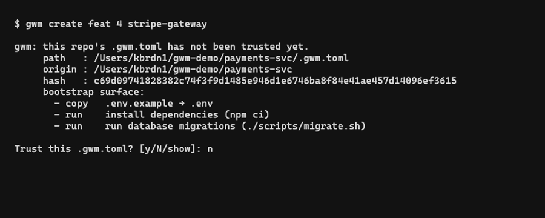

`gwm` runs the `[[bootstrap.*]]` pipeline from `.gwm.toml` under your user: copies, regex guards, no-symlink checks, and arbitrary shell commands. Cloning a repository and running `gwm create` (or any command that triggers bootstrap) is therefore equivalent to `curl … | sh` against whoever authored the `.gwm.toml`. The trust ledger ([#95](https://github.com/kbrdn1/gwm-cli/issues/95)) establishes an explicit trust boundary between "I cloned this remote" and "this remote can execute commands as me".



## Threat model

The gate exists to defend against three concrete attack patterns:

- **Hostile fork / clone**: a user clones a malicious mirror of a legitimate project and runs `gwm create` against it. Pre-gate, `[[bootstrap.command]]` lines from the malicious `.gwm.toml` would execute on the first invocation without any user-visible prompt.
- **PR-fork contamination**: a contributor pulls down a teammate's PR fork to review and runs `gwm create` to set up their review worktree. The fork's `.gwm.toml` runs as them.
- **Shared monorepo commit-access compromise**: anyone with commit access to `.gwm.toml` in a shared repo can ship a bootstrap line that runs as every co-worker on the next pull-and-create.

**Whitespace matters.** The ledger hashes the raw bytes of `.gwm.toml`, not the parsed TOML. `rm -rf /tmp/` and `rm -rf /tmp /` are one byte apart and behave catastrophically differently, so a sub-byte edit re-triggers the prompt.

**SSH ≠ HTTPS.** The ledger keys on the verbatim `origin` URL. `git@github.com:foo/bar.git` and `https://github.com/foo/bar` record as distinct trust paths, and they ARE distinct (different auth, different intercept failure modes), so trusting one doesn't transitively trust the other. Run `gwm trust list` to audit which form you've approved.

## Gate behaviour

The gate fires at the top of every `bootstrap::run` call site:

- `gwm create`: before `git worktree add`, so a refusal leaves disk state untouched.
- `gwm bootstrap`: before the pipeline runs.
- TUI `n` (new worktree): same ordering as `gwm create`.
- TUI `b` (re-bootstrap selected): same ordering as `gwm bootstrap`.

Decision tree on each invocation:

```
.gwm.toml at workdir?
├── no   → proceed silently (nothing to execute)
└── yes  → mode == Deny ?
          ├── yes → refuse with hash in the error
          └── no  → bootstrap surface empty?
                   ├── yes → proceed silently
                   └── no  → mode == Allow ?
                            ├── yes → proceed without recording
                            └── no  → ledger entry exists for (origin, hash)?
                                     ├── yes → proceed silently
                                     └── no  → CLI: prompt y/N/show · TUI: refuse with hint
```

The **empty-surface short-circuit** is deliberate UX: a `.gwm.toml` with only `[worktree]` carries no RCE risk, so prompting for it would just train the user to mash `y`. The **Allow-before-load short-circuit** is the CI contract: a malformed `~/.config/gwm/trust.toml` on a runner host must not break the `--allow-bootstrap` bypass.

## CLI surface

### `gwm trust {list|revoke|show}`

Manage the ledger from a shell. See [CLI reference → `gwm trust`](/cli/reference#gwm-trust-listrevokeshow-issue-95) for the full per-subcommand contract.

```bash
gwm trust list                                # audit every approved (origin, hash) pair
gwm trust revoke git@github.com:foo/bar.git   # drop entries for an origin (verbatim match)
gwm trust show                                # print the ledger path + raw TOML
```

### Global flags + env

| Surface                 | Effect                                                                                                                            |
| :---------------------- | :-------------------------------------------------------------------------------------------------------------------------------- |
| `--allow-bootstrap`     | Skip the prompt without recording. Use in non-interactive contexts.                                                               |
| `--deny-bootstrap`      | Refuse to run bootstrap even when trusted. Forensic mode.                                                                         |
| `GWM_ALLOW_BOOTSTRAP=1` | Env equivalent of `--allow-bootstrap`, for CI runners where you can't always inject extra args.                                   |
| `GWM_TRUST_LEDGER=…`    | Override the ledger path (default `~/.config/gwm/trust.toml`). Used by `gwm trust *` tests and power users with non-XDG dotfiles. |

`--allow-bootstrap` and `--deny-bootstrap` are `clap` global flags: they work on every subcommand that runs bootstrap (`gwm create`, `gwm bootstrap`, bare `gwm` for the TUI). The clap `conflicts_with` constraint rejects passing both at once.

## TUI behaviour

The alternate-screen mode can't host an inline stdin prompt without a dedicated modal view (deferred follow-up). So in the TUI, an untrusted `.gwm.toml` lands as a **refusal in the status bar** rather than a prompt:

```
.gwm.toml at /path/to/repo/.gwm.toml not in trust ledger (hash 3a4f9c2b…) — run `gwm bootstrap` from a CLI in another terminal to approve, or relaunch with GWM_ALLOW_BOOTSTRAP=1 / --allow-bootstrap
```

The keys affected are `n` (new worktree) and `b` (re-run bootstrap on the selected worktree). Both leave the TUI alive, so you can fix the trust state from another terminal and retry without restarting `gwm`.

In `submit_create` the gate fires **before** `worktree::add`, so a refusal leaves zero on-disk side-effects (no orphaned worktree directory to clean up). Mirrors the `cmd_create` ordering on the CLI side.

## Ledger location and format

Default location: `~/.config/gwm/trust.toml` (resolved via `dirs::config_dir()`: XDG on Linux, `Application Support` on macOS, `%APPDATA%` on Windows).

Override with `GWM_TRUST_LEDGER=/absolute/path/to/trust.toml`. Empty value falls back to the default.

Format:

```toml
[[entries]]
origin = "git@github.com:kbrdn1/gwm-cli.git"
config_sha = "3a4f9c2bdeadbeefbabe..."         # lowercase hex sha256
trusted_at = "2026-05-22T10:00:00Z"
trusted_by = "kylian@laptop"
```

`trusted_by` is a best-effort `user@host` audit string captured at record time (`gethostname(3)` on Unix, `%COMPUTERNAME%` fallback on Windows). Not security-relevant: never used for trust decisions, purely an audit hint for multi-machine users sharing the ledger via dotfiles.

**Writes are atomic.** `gwm` serialises to a uniquely-named sibling file (`gwm-trust-<random>.tmp`) and renames it onto the target, so two concurrent `gwm` processes never clobber each other's writes. The temp file is consumed by the rename; a successful save leaves no `.tmp` sidecar.

**Malformed ledgers are an error, not silently empty.** A corrupted `trust.toml` is suspicious (potential tampering), and refusing to load it loudly is better than silently treating it as fresh, which would re-prompt every previously trusted repo and habituate the user to `y`. The exception is `--allow-bootstrap`, which short-circuits before the load specifically so a broken ledger doesn't break the CI bypass.

## Migration notes

The trust ledger is a **soft breaking change** introduced in `[Unreleased]`. Existing users on the first run after upgrade get a one-shot prompt per repo:

```
gwm: this repo's .gwm.toml has not been trusted yet.
     path   : /path/to/repo/.gwm.toml
     origin : git@github.com:foo/bar.git
     hash   : 3a4f9c2bdeadbeef...
     bootstrap surface:
       - copy   .env.testing → .env.testing
       - guard  no-aws-rds (on_match=seed-from-example, deny=1 pattern(s))
       - run    composer install (composer install --no-interaction)

Trust this .gwm.toml? [y/N/show]:
```

`y` records and proceeds, `N` (or EOF / unrecognised answer) aborts, `show` re-prints the raw `.gwm.toml`. Subsequent runs are silent until the file changes.

For CI runners, set `GWM_ALLOW_BOOTSTRAP=1` (or pass `--allow-bootstrap`) in the workflow env. The bypass does NOT record an entry: CI bypasses must not pollute the local ledger of whoever ends up running an interactive `gwm` from the same machine later.

## Related

- [CLI reference → `gwm trust`](/cli/reference#gwm-trust-listrevokeshow-issue-95): per-subcommand contract.
- [Bootstrap pipeline](/configuration/bootstrap): the RCE primitive the gate protects.
- [TUI keybindings](/tui/keybindings): `n` and `b` annotations re: trust gate.
- Source: [`src/trust.rs`](https://github.com/kbrdn1/gwm-cli/blob/main/src/trust.rs), whose module-level comment carries the canonical threat model.
- Issue: [#95](https://github.com/kbrdn1/gwm-cli/issues/95).
