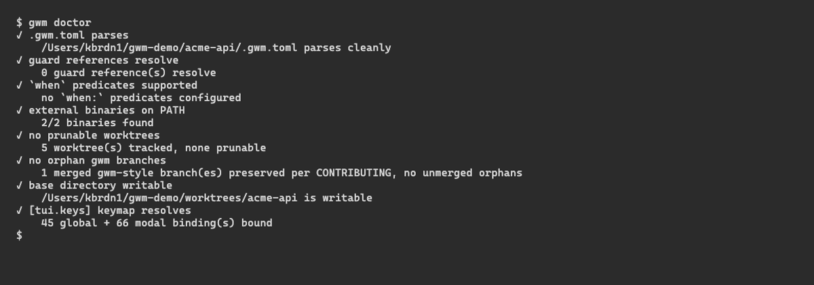

`gwm doctor` exécute une batterie de vérifications peu coûteuses sur le dépôt courant, affiche un rapport par vérification, et sort avec un code significatif pour pouvoir être branché en CI ou dans un hook pre-commit sans parser stdout.



## Codes de sortie

| Code | Signification | Déclenché par                    |
| :--- | :------------ | :------------------------------- |
| `0`  | tout vert     | chaque vérification retourne `✓` |
| `1`  | avertissement | au moins un `!`, aucun `✗`       |
| `2`  | échec         | au moins un `✗`                  |

La distinction Avertissement / Échec correspond à la convention de sigles du pipeline de bootstrap - voir [Pipeline de bootstrap](/fr/configuration/bootstrap#rapports-détape).

## Exemple de sortie

```bash
$ gwm doctor
✓ .gwm.toml parses
    /path/to/repo/.gwm.toml parses cleanly
✓ guard references resolve
    2 guard reference(s) resolve
✓ `when` predicates supported
    1 predicate(s) recognised
✓ external binaries on PATH
    3/3 binaries found
✓ no prunable worktrees
    5 worktree(s) tracked, none prunable
✓ no orphan gwm branches
    7 merged gwm-style branch(es) preserved per CONTRIBUTING, no unmerged orphans
✓ base directory writable
    /home/you/cc-worktree/myrepo is writable
✓ [tui.keys] keymap resolves
    14 action(s) bound
```

Une exécution avec des problèmes :

```
! no prunable worktrees
    1 prunable entry: feat-12-old
    → run `gwm prune` to clear them
! no orphan gwm branches
    1 unmerged orphan branch(es): feat/#99-wip-experiment
    → git branch -d feat/#99-wip-experiment
```

Chaque Avertissement / Échec porte une indication de remédiation sur une ligne, copiable-collable.

## Vérifications effectuées

### 1. `.gwm.toml` parse

Lit `.gwm.toml` depuis la racine du dépôt.

- **`✓`** - le fichier parse proprement, **OU** le fichier est absent (les valeurs par défaut sont supposées)
- **`✗`** - le TOML est malformé, ou contient une valeur `[tui.open].mode` inconnue

Le cas « absent » est intentionnellement un `✓` - `gwm` fonctionne sans `.gwm.toml` et le message affiché à l'utilisateur le dit.

### 2. les références de guard résolvent

Parcourt chaque `[[bootstrap.copy]].guards = [...]` et vérifie que chaque nom résout vers un `[[bootstrap.guard]]` existant.

- **`✓`** - chaque référence pointe vers un guard réel
- **`✗`** - au moins une référence est pendante

Attrape les fautes de frappe comme `guards = ["no-aws-dbs"]` quand le guard est `no-aws-rds`.

### 3. les prédicats `when` sont pris en charge

Parse chaque `[[bootstrap.command]].when` et signale les mots-clés inconnus.

- **`✓`** - chaque atome utilise un mot-clé reconnu
- **`!`** - au moins un mot-clé n'est pas reconnu (Avertissement, pas Échec - la commande fautive s'exécute quand même, en se rabattant sur `true`)

Mots-clés reconnus : `file_exists:`, `cmd_exists:`, `env_set:`, `env_eq:`, `glob_exists:`. La composition booléenne (`!`, `&&`, `||`) est également validée. Voir [prédicats `when:`](/fr/configuration/when-predicates).

### 4. binaires externes sur le PATH

Sonde `$PATH` pour chaque binaire que gwm ou `.gwm.toml` prévoit de lancer :

- **`lazygit`** - seulement si `[git_tui]` ne surcharge pas la commande
- **le premier token de `[git_tui].command`** - quand surchargé
- **le premier token de `[review].command` / preset**
- **`direnv`** - seulement si `.envrc` existe dans le worktree (l'action `seed-from-example` peut tenter `direnv allow`)
- **le premier token exécutable de chaque `[[bootstrap.command]].run`**

Rapport :

- **`✓`** - tous les binaires sondés ont été résolus
- **`!`** - binaire `[review]` manquant (la review est opt-in ; un hook pre-commit en CI continue de passer)
- **`✗`** - binaire `[git_tui]` manquant ou binaire d'une commande de bootstrap manquant

> La mise à jour v0.6 de cette vérification (sondage de `[git_tui]` et `[review]`) est arrivée avec [#75](https://github.com/kbrdn1/gwm-cli/issues/75). Avant la v0.6, seuls `lazygit` et `direnv` étaient vérifiés.

### 5. pas de worktrees à élaguer

Examine `.git/worktrees/` et signale les entrées dont le répertoire de travail a été supprimé manuellement (par exemple quelqu'un a fait `rm -rf` du répertoire de worktree en dehors de gwm).

- **`✓`** - chaque entrée suivie pointe vers un répertoire réel
- **`!`** - au moins une entrée obsolète, avec `gwm prune` comme remédiation

### 6. pas de branches gwm orphelines

Parcourt les branches locales correspondant à `<type>/#<N>-<slug>` et signale celles sans worktree associé.

- **`✓`** - chaque branche de style gwm est soit active (a un worktree), soit mergée dans un trunk
- **`!`** - au moins un orphelin **non mergé**, avec `git branch -d <name>` comme remédiation

L'exemption « mergée dans un trunk » respecte la règle « ne jamais supprimer la branche source après merge » de `CONTRIBUTING.md` - les branches mergées sont préservées, pas signalées. La liste des trunks est configurable via `[doctor].trunks` (par défaut `["dev", "main"]`) ; une liste vide désactive l'exemption.

Les branches gérées par l'utilisateur (`main`, `release-*`, `dependabot/...`, tout ce qui ne correspond pas au motif gwm) sont ignorées silencieusement.

### 7. répertoire de base accessible en écriture

Vérifie que le `[worktree].base` configuré existe et est accessible en écriture, ou - s'il n'existe pas encore - que son **parent** est accessible en écriture. gwm crée la base paresseusement au premier `gwm create`, donc une base inexistante est acceptable tant qu'elle peut être créée.

- **`✓`** - la base (ou son parent) est accessible en écriture
- **`✗`** - ni l'une ni l'autre n'est accessible en écriture (gwm ne peut pas créer de worktrees ici)

### 8. le keymap `[tui.keys]` résout

Réexécute le même chemin de résolution `[tui.keys]` que le TUI lui-même utilise au démarrage, afin que toute erreur de keymap apparaisse dans `gwm doctor` avant que le TUI ne réussisse pas à dispatcher. Ajouté par [#87](https://github.com/kbrdn1/gwm-cli/issues/87) / [#165](https://github.com/kbrdn1/gwm-cli/pull/165) en parallèle du keymap configurable.

- **`✓`** - le keymap résout et `quit` a au moins une liaison visible par l'utilisateur ; le détail indique combien d'actions sont liées (`N action(s) bound`)
- **`!`** - le keymap résout, mais `quit` a été entièrement délié. `Ctrl+C` quitte toujours le TUI via un repli codé en dur dans `run_app`, mais il ne reste plus de touche de sortie découvrable - l'indication suggère d'ajouter par exemple `quit = ["q", "Esc"]` à `[tui.keys]`
- **`✗`** - le keymap ne résout pas (erreur de parsing, slug d'action inconnu, conflit de chord, ou collision de préfixe) ; le détail répète textuellement l'erreur `[tui.keys]` sous-jacente, et l'indication pointe vers `gwm tui keys` pour la liste complète des slugs d'action

Seules les actions ayant au moins un chord comptent dans le chiffre `N action(s) bound` - une action définie à `[]` dans `[tui.keys]` est déliée et exclue. Voir [schéma `.gwm.toml` → `[tui.keys]`](/fr/configuration/gwm-toml#tuikeys), [TUI → Keymap et palette de commandes](/fr/tui/keymap-and-palette), et [TUI → Raccourcis](/fr/tui/keybindings) pour les slugs d'action et la grammaire des chords.

### 9. `worktree.branch_pattern` fait l'aller-retour via le parseur

`branch_pattern` pilote la façon dont gwm **écrit** un nom de branche, mais le parseur qui en **relit** un est une regex codée en dur pour le défaut `{type}/#{issue}-{desc}`. Quand les deux divergent, toutes les fonctionnalités reposant sur les segments parsés lisent la mauvaise valeur - silencieusement. Ajouté par [#415](https://github.com/kbrdn1/gwm-cli/issues/415).

Le contrôle est un vrai test d'aller-retour, pas une comparaison avec la chaîne par défaut : **un motif personnalisé n'est pas automatiquement cassé**. `{type}/#{issue}-prefix-{desc}` produit encore `feat/#42-…`, donc `type` et `issue` survivent et seul `desc` revient faux.

- **`✓`** - `parse_branch` relit les segments que `branch_name` écrit, pour toutes les branches que le dépôt peut produire
- **`!`** - le motif ne fait pas l'aller-retour. Trois formes :
  - **rien ne se parse** → l'auto-liaison de l'issue depuis le nom de branche, le gitmoji / `gwm commit-prefix`, la sélection de template et les placeholders de `gwm pr`, les placeholders des hooks sur les chemins remove / bootstrap, le renommage TUI et le contrôle de convention de branche (#6 ci-dessus) sont tous inactifs. **La détection PR/MR n'est pas touchée** - `Forge::find_pr_for_branch` interroge la forge avec le nom de branche entier et ne le parse jamais
  - **seules certaines valeurs se parsent** → le détail nomme un exemple qui échoue et limite la perte aux branches qui lui ressemblent. `{desc}/#{issue}-{type}` est illisible pour un desc portant un `-` et parfaitement lisible pour un desc sans ; déclarer tout le motif mort serait faux pour la moitié des branches qu'il produit
  - **tout se parse mais un segment revient différent** → le détail nomme lequel et toutes les fonctionnalités qui le lisent : `type` → sélection du gitmoji, `issue` → auto-liaison de l'issue, et les deux → placeholders des hooks remove/bootstrap et renommage TUI, qui consomment les trois segments

  L'indication reste neutre - restaurer le défaut, ou garder le motif et accepter exactement la perte que le détail nomme. Le contournement applicable dépend du segment cassé, donc en recommander un inconditionnellement serait faux.

### Comment l'espace de sonde est choisi

L'aller-retour dépend des valeurs, donc sonder deux valeurs arbitraires ne prouve rien, ni dans un sens ni dans l'autre. La sonde énumère l'espace de valeurs que `gwm create` accepte réellement, par construction et non par échantillonnage :

| Segment  | Sondé avec                                | Pourquoi c'est l'espace entier                                                                                                                                                                                                           |
| :------- | :---------------------------------------- | :--------------------------------------------------------------------------------------------------------------------------------------------------------------------------------------------------------------------------------------- |
| `type`   | chaque type de branche configuré          | fini, donc exhaustif - et un type interdit par vos `[[branch_types]]` ne doit pas déclencher d'avertissement sur des branches qui ne peuvent pas exister                                                                                 |
| `issue`  | un à un chiffre, un à plusieurs chiffres  | `\d+` est la seule distinction sur laquelle `BRANCH_RE` peut découper                                                                                                                                                                    |
| `desc`   | un avec `-`, un sans, un tout en chiffres | le tiret est le seul caractère qui entre en collision avec un séparateur littéral ; le tout-chiffres est le seul desc que le groupe `\d+` de `BRANCH_RE` peut avaler (`{type}/#{desc}-{issue}` se parse pour `123` et pour rien d'autre) |
| `{repo}` | le **vrai** nom du dépôt                  | le verdict en dépend : `{repo}/#{issue}-{desc}` va très bien dans un dépôt nommé `gwm` et devient illisible dans un dépôt nommé `gwm-cli`, dont le tiret est rejeté par la classe `[a-z]+` du type                                       |

Un motif qui survit à tout cela, c'est l'affirmation la plus forte que ce contrôle peut faire sans dériver le parseur du motif. Et le verdict ne quantifie jamais au-delà de ce que les sondes ont observé : quand seule une partie des formes sondées perd quelque chose, le détail les compte (`on 27 of the 30 branch shapes probed, …`) au lieu d'affirmer que toutes les branches sont touchées.

Ce contrôle énonce la limitation, il ne la corrige pas. La dérivation du parseur depuis le motif est suivie par [#417](https://github.com/kbrdn1/gwm-cli/issues/417). `gwm config validate` affiche le même message sur stderr et sort quand même en `0` - un motif personnalisé est une configuration valide, pas une erreur - et lit le motif **effectif**, donc un motif posé uniquement dans le `~/.config/gwm/config.toml` global est détecté aussi.

## Intégration CI

```yaml
# .github/workflows/ci.yml
- name: gwm health
  env:
    GWM_ALLOW_BOOTSTRAP: '1' # if the job also runs `gwm create` / `gwm bootstrap`
  run: gwm doctor # exits 1 on Warning, 2 on Failure
```

`gwm doctor` lui-même ne passe pas par la [barrière de confiance TOFU](/fr/configuration/trust-ledger) (le doctor n'invoque jamais `bootstrap::run` - il lit seulement la config), donc `GWM_ALLOW_BOOTSTRAP=1` est inoffensif ici. Définissez-le pour les jobs qui créent aussi des worktrees dans le même run de workflow.

> **Ce que doctor n'audite PAS (encore)** : le contenu du registre de confiance lui-même. Un job voulant affirmer « cet hôte CI a fait confiance exactement aux configs attendues par le workflow » devrait parser `~/.config/gwm/trust.toml` (ou `$GWM_TRUST_LEDGER`) manuellement. L'audit du registre depuis `gwm doctor` est sur la liste de suivi post-#95.

Ou comme hook pre-commit :

```bash
# .git/hooks/pre-commit (or via pre-commit framework)
gwm doctor || { echo "gwm doctor reported issues, see above"; exit 1; }
```

Comme un `[review]` manquant ne déclenche qu'un Avertissement (sortie `1`), un hook pre-commit peut choisir d'autoriser les Avertissements (`gwm doctor; [ $? -le 1 ]`) et de ne bloquer que sur les Échecs.

## Connexe

- [Pipeline de bootstrap](/fr/configuration/bootstrap) - même convention `✓ / ! / ✗` utilisée par les rapports d'étape
- [TUI → Lanceurs configurables](/fr/tui/launchers#interaction-avec-gwm-doctor) - pourquoi le binaire manquant du lanceur de review est un Avertissement, pas un Échec
- [schéma `.gwm.toml` → `[doctor]`](/fr/configuration/gwm-toml#doctor) - le réglage `trunks`
