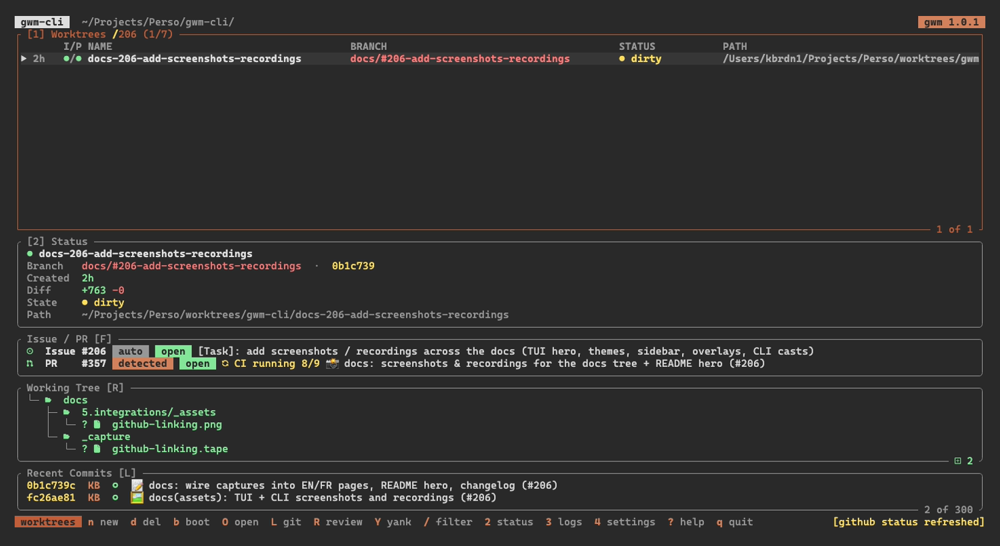

Ajouté par [#67](https://github.com/kbrdn1/gwm-cli/issues/67) / [#68](https://github.com/kbrdn1/gwm-cli/pull/68) ; affiné en v0.6 par [#75](https://github.com/kbrdn1/gwm-cli/issues/75).

Chaque worktree peut être lié à une issue GitHub et / ou à une pull request. La liaison alimente le bloc `Issue / PR` en temps réel dans la [barre latérale du TUI](/fr/tui/sidebar#bloc-issue--pr) et apparaît dans `gwm status` pour le scripting.



## Modèle de stockage

Les liaisons vivent dans la **config git**, scopées à la branche, jamais dans un fichier que gwm possède :

- `git config branch.<name>.gwm-issue` - le numéro de l'issue liée
- `git config branch.<name>.gwm-pr` - le numéro de la PR liée

À côté des liaisons explicites, gwm met en cache la **PR auto-détectée** ainsi que les titres / états récupérés, afin que les chemins de lecture sans fetch (`gwm list`, la table du TUI au démarrage) puissent colorer les pastilles issue / PR sans un appel `gh` par ligne :

- `git config branch.<name>.gwm-pr-detected` - le numéro de la PR auto-détectée ([#283](https://github.com/kbrdn1/gwm-cli/issues/283))
- `git config branch.<name>.gwm-pr-detected-title` / `.gwm-pr-detected-state` - le titre / l'état en cache de la PR détectée
- `git config branch.<name>.gwm-issue-title` / `.gwm-issue-state` - le titre / l'état en cache de l'issue liée
- `git config branch.<name>.gwm-pr-title` / `.gwm-pr-state` - le titre / l'état en cache de la PR explicitement liée

Cela signifie que :

- La liaison **survit aux déplacements de worktree** (lorsque `gwm` réécrit `.git/worktrees/<name>/HEAD`, il ne touche pas à la config de branche).
- La liaison est **par branche, locale** - non committée, non poussée, non partagée avec les autres clones du dépôt.
- `git config --unset branch.<name>.gwm-issue` est une alternative 100 % valide à `gwm unlink issue`.

## Détection automatique

Les branches suivant la convention de nommage gwm `<type>/#<N>-<slug>` déduisent le numéro d'issue à partir du nom de branche - aucune configuration nécessaire.

```
feat/#42-user-auth          → issue #42 auto-linked
fix/#117-leak               → issue #117 auto-linked
chore/#5-rename             → issue #5 auto-linked
release-1.x                 → no auto-link (no #N pattern)
```

Les numéros de PR n'ont pas de convention de nom de branche, ils sont donc détectés autrement : [#181](https://github.com/kbrdn1/gwm-cli/issues/181) a ajouté la **détection automatique des PR**. Lorsqu'une branche n'a pas de liaison PR explicite, gwm demande à GitHub quelle PR a été ouverte depuis elle (`gh pr list --head <branch> --state all`) et l'affiche marquée `detected` :

```
$ gwm status --json | jq '.pr.source'
"detected"          # vs "explicit" for a `gwm link pr`, "branch-name" for issues
```

Le champ `source` porte la provenance de la liaison : `"branch-name"` (déduit de la convention `<type>/#<N>-<slug>`, issues seulement), `"explicit"` (un `gwm link` enregistré), `"detected"` (`LinkSource::Detected`, auto-détecté depuis `gh` - résolu en temps réel lors d'un fetch, ou lu depuis le cache persisté), ou `"none"`.

La détection est **persistée** ([#283](https://github.com/kbrdn1/gwm-cli/issues/283)) : dès qu'une sonde réussit, le numéro détecté (avec son titre / état) est mis en cache dans la config git sous `branch.<name>.gwm-pr-detected`. Ce cache est ce qui permet aux chemins de lecture sans fetch (`gwm list`, la table du TUI au démarrage) de colorer la pastille PR sur chaque ligne sans un appel `gh` par ligne. Le cache persisté ne supplante jamais une liaison explicite - `read_link` résout la PR dans cet ordre :

1. un `gwm link pr` explicite (`gwm-pr`) - l'emporte toujours,
2. puis l'auto-détection persistée (`gwm-pr-detected`),
3. puis rien.

Le cache reste honnête car les **chemins de détection en temps réel le réconcilient au rafraîchissement** : une re-sonde réussie réécrit le numéro stocké, et un résultat vide l'efface, de sorte qu'un numéro obsolète n'est jamais ressuscité après que la PR a été fermée ou remplacée. Un échec de `gh` (non installé, pas de réseau) laisse le cache intact, donc la dernière détection connue survit à la sonde échouée. `gwm unlink pr` supprime aussi la détection persistée, de sorte que dissocier ne laisse pas un numéro `gwm-pr-detected` qui resurgirait comme une PR `detected`.

Comme chaque nouvelle résolution est un appel `gh`, la détection en temps réel ne s'exécute que là où elle est peu coûteuse ou demandée :

- **`gwm status`** - toujours (un seul worktree) ; réconcilie le cache.
- **barre latérale du TUI** - lors du rafraîchissement `F` (un seul worktree sélectionné, dédupliqué). Une PR détectée est marquée ` (detected)` pour la distinguer d'une liaison explicite.
- **`gwm list --detect-pr`** - drapeau opt-in ; ajoute une colonne `PR` au prix d'un appel `gh` par worktree, et réconcilie le cache pour chacun. Le `gwm list` simple reste sans réseau, lisant le cache persisté pour colorer les pastilles.

Pour épingler une liaison durable et explicite à la place (par exemple une PR non ouverte depuis la tête de cette branche) :

```bash
gwm link pr 61
```

## Liaison explicite

```bash
# Link the current (CWD) worktree
gwm link issue 42
gwm link pr 61

# Link a fuzzy-matched worktree from anywhere
gwm link issue 42 --worktree feat-auth

# Remove an explicit override (auto-detect resurfaces for issues)
gwm unlink issue
gwm unlink pr

# Open the link in the browser via the OS opener
gwm open issue
gwm open pr --print-url        # print the URL on stdout instead

# Inspect the current state
gwm status                     # human-readable
gwm status --json              # stable schema for scripts
```

Voir [CLI → Référence des sous-commandes](/fr/cli/reference#gwm-link-issuepr-n---worktree-pattern) pour les tableaux de drapeaux.

## état en temps réel via `gh`

`gwm status` (et la touche `F` du TUI) délègue à `gh issue view` et `gh pr view` pour récupérer l'état, le titre, les labels et le rollup CI :

```
$ gwm status
Issue #42 [open] TUI: fuzzy search
PR #61 [draft] · checks 2/3
```

| Valeur entre crochets | Source                                         |
| :-------------------- | :--------------------------------------------- |
| `[open]`              | le `state` de `gh`                             |
| `[closed]`            | le `state` de `gh`                             |
| `[merged]`            | le `state` de `gh` (PR uniquement)             |
| `[draft]`             | le `isDraft` de `gh` (PR uniquement)           |
| `checks N/M`          | le `statusCheckRollup` de `gh` (PR uniquement) |

Sans `gh` (ou hors d'un dépôt avec une remote GitHub), gwm se dégrade proprement - seule la liaison locale est affichée, sans erreur :

```
$ gwm status
Issue #42 (gh not available — local link only)
```

## Surface TUI

Dans la vue liste des worktrees, le panneau de détails de droite affiche un **bloc `Issue / PR` en temps réel** pour le worktree sélectionné (masqué quand rien n'est lié). Trois raccourcis le pilotent :

| Touche | Action                                                                                      |
| :----- | :------------------------------------------------------------------------------------------ |
| `O`    | menu d'ouverture (`i` ouvre l'issue dans le navigateur, `p` ouvre la PR dans le navigateur) |
| `L`    | invite de liaison (`i` issue ou `p` pr → saisir le numéro → Entrée pour valider)            |
| `F`    | rafraîchir l'état GitHub (fetch `gh` synchrone, met à jour la barre de statut)              |

> Le raccourci `F` était `R` avant la v0.6 - réassigné par [#75](https://github.com/kbrdn1/gwm-cli/issues/75) lorsque `R` a été réservé pour le [lanceur de review](/fr/tui/launchers). Voir [Raccourcis → Résumé du réassignement v0.6](/fr/tui/keybindings#résumé-des-remappages-v06).

Le bloc `Issue / PR` est **reconstruit à chaque changement de sélection**, donc naviguer avec `j` / `k` ne fait jamais apparaître de données obsolètes du worktree précédemment sélectionné.

## Point coloré de statut dans l'en-tête de la barre latérale

La ligne d'en-tête `● <worktree-name>` porte un `●` coloré qui suit l'état de la PR / issue liée :

- **vert** - ouvert
- **gris** - brouillon
- **magenta** - mergé
- **rouge** - fermé
- **gris foncé** - rien de lié / état inconnu

Le point est reconstruit à partir de l'état de fetch `gh` en cache à chaque frame, il suit donc le statut en temps réel sans invalider le reste du cache de prévisualisation git de la barre latérale. Appuyez sur `F` pour forcer un rafraîchissement.

## Dérivation de l'URL

gwm dérive l'URL de l'issue / de la PR à partir de la remote GitHub du dépôt :

```
https://github.com/<owner>/<repo>/issues/<N>
https://github.com/<owner>/<repo>/pull/<N>
```

L'extraction owner/repo gère quelques bizarreries :

- `/` final sur l'URL de la remote (`https://github.com/owner/repo.git/`) - corrigé dans #68 par la review de Copilot ; le suffixe `.git` est désormais retiré après normalisation des slashs finaux.
- Forme SSH (`git@github.com:owner/repo.git`) - analysée de la même manière.

Si la remote n'est pas GitHub, `gwm open` sort avec une erreur plutôt que de deviner une URL.

## Connexe

- [TUI → Barre latérale](/fr/tui/sidebar#bloc-issue--pr) - où le bloc en temps réel s'affiche
- [TUI → Raccourcis](/fr/tui/keybindings#invite-de-liaison-issue--pr-l) - les overlays `O` / `L` / `F`
- [CLI → Référence des sous-commandes](/fr/cli/reference#gwm-link-issuepr-n---worktree-pattern) - chaque commande et drapeau
