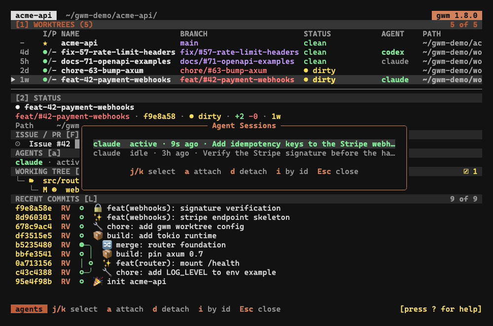

Ajouté par [#408](https://github.com/kbrdn1/gwm-cli/issues/408).

Dès qu'on fait tourner plusieurs agents en parallèle, la question n'est plus « c'est quoi cette branche » mais « qui est déjà dessus ». gwm y répond sans vous demander de tenir la carte mentale : il lit les artefacts de session que les agents écrivent de toute façon sur disque, les associe au worktree dans lequel chacun tourne, et affiche le résultat sur trois surfaces.



## Ce qui est détecté

Quatre agents, quatre magasins d'artefacts, tous lus en `std::fs` uniquement :

| Agent        | Magasin d'artefacts                                      | Nom de session tiré de                                                                    |
| :----------- | :------------------------------------------------------- | :---------------------------------------------------------------------------------------- |
| Claude Code  | `~/.claude/projects/<chemin du worktree sluggé>/*.jsonl` | le registre de sessions vivantes tant qu'elle tourne, sinon le premier prompt utilisateur |
| Codex        | `~/.codex/sessions/AAAA/MM/JJ/rollout-*.jsonl`           | `session_index.jsonl`, donc un renommage de thread s'affiche, sinon le premier prompt     |
| opencode     | `~/.local/share/opencode/storage/` (XDG)                 | le titre de session dans `opencode.db`                                                    |
| Mistral Vibe | `~/.vibe/logs/session/`                                  | le titre enregistré                                                                       |

Aucune énumération de processus, aucune API spécifique à un OS : le même chemin de code tourne sur Linux, macOS et Windows, et chaque backend est testable contre un répertoire temporaire seedé. La détection est délibérément totale : un répertoire manquant, un enregistrement malformé ou un fichier illisible dégradent vers « aucune session », jamais vers une erreur.

Quand les artefacts ne portent aucun nom exploitable, la ligne retombe sur l'id complet de la session.

> `GWM_AGENTS_HOME` remplace le répertoire home sous lequel les quatre magasins sont résolus. Cette couture existe pour les tests et la CI, et les captures de cette page s'en servent pour lire une fixture seedée plutôt que le magasin réel de la machine.

## Fraîcheur

Une session est **active** quand ses artefacts ont été écrits dans les **5 dernières minutes**, **idle** sinon. Les sessions dont la dernière activité dépasse **30 jours** ne sont pas scannées du tout, ce qui rend le coût de la détection indépendant d'un historique accumulé sur des années.

Une session _terminée_ ne s'observe pas toujours depuis les seuls artefacts. Seul Mistral Vibe enregistre un marqueur de fin explicite, et sous Unix une session Claude Code dont le PID enregistré a disparu retombe immédiatement en idle ([#441](https://github.com/kbrdn1/gwm-cli/issues/441)). Pour les autres backends et sous Windows, une session qui vient de se terminer peut apparaître **active** pendant jusqu'à 5 minutes : un scan de processus général reste un non-objectif délibéré ([#414](https://github.com/kbrdn1/gwm-cli/issues/414)).

## Les trois surfaces

- **La colonne `AGENT`** de la table des worktrees : l'agent le plus récemment actif pour ce worktree, coloré selon sa fraîcheur. C'est la réponse en un coup d'œil.
- **La [barre latérale de détails](/fr/tui/sidebar)** : une ligne résumé `Agent:` dans le bloc `Worktree`, plus un pane `Agents` listant les sessions **épinglées** (plafonné à trois lignes avec un `+N more`, entièrement replié quand rien n'est épinglé).
- **La surcouche `a`**, en image ci-dessus : chaque session attachée au worktree sélectionné, la plus récente d'abord, une ligne par session avec l'agent, sa fraîcheur, une dernière activité lisible et le nom de session. Un worktree sans session ouvre une ligne explicite _no agent session found_ plutôt qu'une modale vide.

La détection tourne hors du thread de rendu et se re-vérifie toutes les **30 secondes** : rien de tout cela n'a lieu sur le chemin de rendu.

## épingler : quand la détection ne peut pas savoir

L'auto-détection associe une session à un worktree par le répertoire de travail que l'agent a enregistré. Ça échoue dans un cas courant : l'agent a démarré depuis le checkout principal et n'a travaillé dans le worktree qu'ensuite, si bien que son répertoire enregistré désigne le mauvais arbre.

L'épinglage est l'override manuel. Dans la surcouche, `a` épingle la session sélectionnée au worktree et `d` retire l'épingle ; `i` ouvre une invite d'attache par id qui filtre **toutes** les sessions détectées, y compris celles associées à aucun worktree, qui sont justement celles qui méritent une épingle. Plusieurs épingles peuvent coexister sur un worktree, et une ligne épinglée est marquée `pinned`.

Le même override est disponible depuis le shell, ce qu'utilisent un script ou un hook :

```bash
gwm agents                    # sessions par worktree
gwm agents attach . <id>      # épingle <id> au worktree englobant
gwm agents detach feat-42     # retire toutes les épingles de ce worktree
```

Les flags complets sont dans la [référence CLI](/fr/cli/reference), sous `gwm agents`.

## Touches et surfaces machine

La table des touches de la surcouche vit avec le reste des bindings, sous [surcouche des sessions d'agents (`a`)](/fr/tui/keybindings#surcouche-des-sessions-dagents-a) ; chaque verbe est remappable sous `[tui.keys.modal.detail]`.

Au-delà de la TUI, la même détection alimente un champ `agents` additif sur les lignes de worktree JSON et daemon (tier expérimental, `SCHEMA_VERSION` reste 1) ainsi que le segment agent-actif de [`gwm statusline`](/fr/integrations/daemon-consumers).
