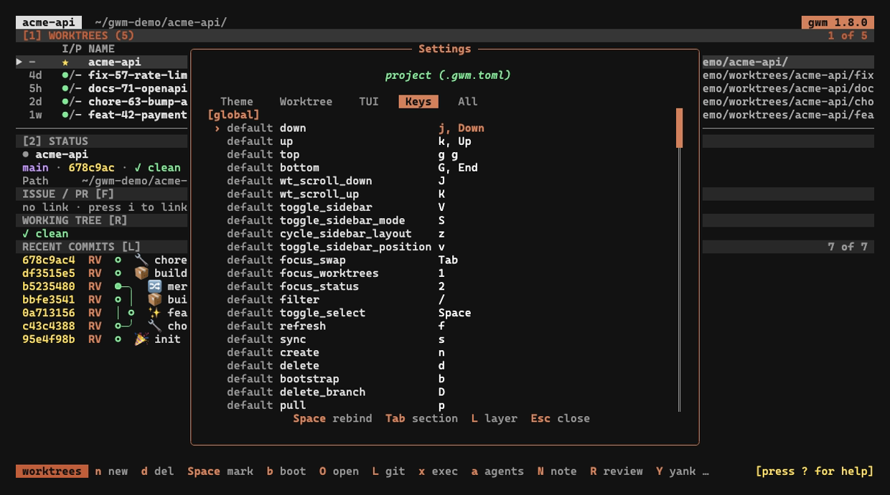

Ajoutés par [#87](https://github.com/kbrdn1/gwm-cli/issues/87) / [#165](https://github.com/kbrdn1/gwm-cli/pull/165) (keymap) et [#32](https://github.com/kbrdn1/gwm-cli/issues/32) / [#167](https://github.com/kbrdn1/gwm-cli/pull/167) (palette) ; étendus aux **touches de modale** remappables par [#219](https://github.com/kbrdn1/gwm-cli/issues/219) et à un **éditeur de touches** dans la TUI par [#294](https://github.com/kbrdn1/gwm-cli/issues/294).




Les bindings de la vue liste de la TUI ne sont pas figés : chaque action est adressable par un slug, vous pouvez la remapper, et vous pouvez aussi la déclencher par son nom depuis une palette de commandes. Les deux surfaces partagent un même dispatcher `Action` sous-jacent, de sorte qu'elles ne peuvent jamais diverger sur les verbes qui existent ou leur comportement.

## Keymap remappable (`[tui.keys]`)

Le bloc `[tui.keys]` dans `.gwm.toml` remappe n'importe quelle action de la vue liste avec des touches en grammaire crossterm, y compris les **chords multi-touches** comme `g g` :

```toml
[tui.keys]
down = ["j", "Down"]
top  = ["g g"]        # chord : appuyer sur g, puis g
quit = ["q", "Q"]
```

Chaque action conserve sa valeur par défaut intégrée tant que vous ne la surchargez pas. Les bindings affichés dans [Raccourcis clavier](/fr/tui/keybindings) sont ces valeurs par défaut.

### Validation au chargement

Les surcharges sont validées au chargement de la config. Ce sont des erreurs dures, remontées avant l'ouverture de la TUI :

- **action inconnue** : une touche que la table des slugs ne reconnaît pas.
- **erreur de parsing** : une chaîne de touche que crossterm ne peut pas parser.
- **conflit de chord** : deux actions liées au même chord.
- **collision de préfixe** : un binding est un préfixe d'un autre (`g` masquerait `g g`).

`gwm doctor` signale en outre un keymap qui laisse `quit` non lié, de sorte que vous ne pouvez pas vous verrouiller hors de la TUI.

### Inspecter le keymap résolu

`gwm tui keys` affiche le keymap résolu (les valeurs par défaut intégrées superposées de vos surcharges `[tui.keys]`), une ligne par action, avec une colonne **source** par ligne pour distinguer une valeur par défaut d'une surcharge :

```
action            keys              source
```

La colonne action liste les slugs acceptés dans `[tui.keys]` ; la colonne keys montre chaque chord lié à cette action (séparés par des virgules) ; une cellule keys vide signifie que l'action est actuellement non liée.

La surcouche d'aide `?` est construite à partir de ce même keymap résolu, de sorte que la documentation dans l'application correspond toujours à vos bindings réels plutôt qu'aux valeurs par défaut.

`gwm tui keys` affiche aussi le keymap des modales (un bloc par contexte, voir ci-dessous), et `gwm doctor` relit la config sur disque et signale les conflits par contexte.

## Touches de modale remappables

Ajoutées par [#219](https://github.com/kbrdn1/gwm-cli/issues/219). Les touches _à l'intérieur_ des surcouches (le formulaire de création / renommage, la modale de confirmation de suppression, l'invite de liaison, le panneau Paramètres, l'overlay Command Logs, la surcouche d'aide, le menu d'ouverture issue/PR, la palette de commandes et le rapport de bootstrap) ne sont plus codées en dur. Chaque surcouche est un **contexte** avec ses propres **verbes** typés, remappés dans une sous-table imbriquée `[tui.keys.modal.<contexte>]` :

```toml
[tui.keys.modal.confirm]
confirm = ["y"]
cancel  = ["n", "Esc"]

[tui.keys.modal.create]
submit     = ["Enter"]
next_field = ["Tab"]
```

L'espace de noms `modal` est délibérément distinct de la table globale `[tui.keys]`, de sorte qu'un contexte ne peut pas entrer en collision avec une action globale de même nom. Un tableau global `create` et une table modale `[tui.keys.modal.create]` coexistent :

```toml
[tui.keys]
create = ["n"]            # global : ouvrir le formulaire Nouveau worktree

[tui.keys.modal.create]   # dans ce formulaire : les verbes de navigation entre champs
submit = ["Enter"]
```

Règles et conventions :

- **Frappes uniques seulement.** Contrairement aux actions globales, un verbe modal prend une seule touche par binding : un chord multi-touches est rejeté au chargement.
- **Même touche, sens différent.** Comme chaque contexte se résout indépendamment, la même touche physique peut signifier des choses différentes selon les modales : `Enter` vaut `submit` dans le formulaire de création mais `activate` dans la modale de confirmation de suppression.
- **Les surfaces à deux étapes utilisent un chemin pointé** : `[tui.keys.modal.link.choose_target]`, `[tui.keys.modal.link.input_number]` et `[tui.keys.modal.config.edit]`.
- **Les touches réservées ne peuvent pas être assignées.** `Ctrl+C`, les `Esc` / `Enter` contextuels de la vue liste et l'`Esc` d'urgence de la surcouche PTY restent codés en dur par conception.

`gwm tui keys` liste chaque contexte et verbe avec ses touches résolues et sa source ; `gwm doctor` valide les bindings contextuels par rapport à la config sur disque. La surcouche d'aide Raccourcis clavier et les indications du pied de page de la barre de statut résolvent aussi les touches de modale depuis la couche de surcharge, donc elles correspondent toujours à votre config plutôt qu'à des chaînes figées. Voir les tables par surcouche dans [Raccourcis clavier](/fr/tui/keybindings).

Vous pouvez éditer chacune d'elles (globales _et_ modales) sans toucher `.gwm.toml` à la main, depuis l'**onglet Keys** du [panneau Paramètres](/fr/tui/keybindings#panneau-paramètres-4) (`4`) : sélectionnez un binding, appuyez sur la touche d'activation et capturez une nouvelle touche en direct ; la capture écrit le tableau TOML dans la couche ciblée, le valide et recharge le keymap sur-le-champ.

## Macros utilisateur (`[tui.macro1]` / `[tui.macro2]`)

[#290](https://github.com/kbrdn1/gwm-cli/issues/290) a ajouté deux commandes définies par l'utilisateur, déclenchées directement depuis la vue liste (`h` lance `macro_one`, `H` lance `macro_two`), chacune s'exécutant dans le répertoire du worktree sélectionné :

```toml
[tui.macro1]
command = "cargo clean"

[tui.macro2]
command = "cargo install --path ."
open_in = "pty"          # "pty" (défaut, surcouche embarquée) ou "mux_pane"
```

`open_in` vaut `"pty"` par défaut (une [surcouche PTY](/fr/tui/launchers#loverlay-pty-embarqué-l--r) embarquée, la TUI se suspend jusqu'à la sortie) ; mettez `"mux_pane"` pour lancer la commande dans un nouveau panneau tmux / zellij à la place. Les bindings `h` / `H` sont eux-mêmes remappables comme les actions `macro_one` / `macro_two` dans `[tui.keys]`.

## Palette de commandes

Appuyez sur `:` (remappable comme `command_palette` dans `[tui.keys]`) pour ouvrir la palette de commandes. Tapez pour **filtrer en flou** les actions enregistrées (`:create`, `:bootstrap`, `:yank-path`, et le reste des verbes de la vue liste) :

| Touche            | Action                                   |
| :---------------- | :--------------------------------------- |
| _(taper)_         | filtrer en flou les actions enregistrées |
| `Enter`           | déclencher l'action surlignée            |
| `Tab` / `↓` / `↑` | faire défiler le surlignage              |
| `Esc`             | annuler                                  |

Chaque entrée de la palette est un verbe stable (`name`) plus une description d'une ligne ; les noms sont ce que vous tapez après `:`. Parce que la palette et le dispatcher de frappes résolvent à travers le **même dispatcher `Action`**, chaque binding clavier a un jumeau dans la palette et vice-versa : les deux surfaces ne peuvent jamais être en désaccord sur les verbes adressables ou leur comportement.

## En lien

- [Raccourcis clavier](/fr/tui/keybindings) : les bindings par défaut sur lesquels le keymap se superpose
- [Configuration → schéma `[tui.keys]`](/fr/configuration/gwm-toml#tuikeys) : référence complète des champs du keymap
- [Thèmes](/fr/tui/themes) : l'autre moitié de la surface de personnalisation de la TUI
