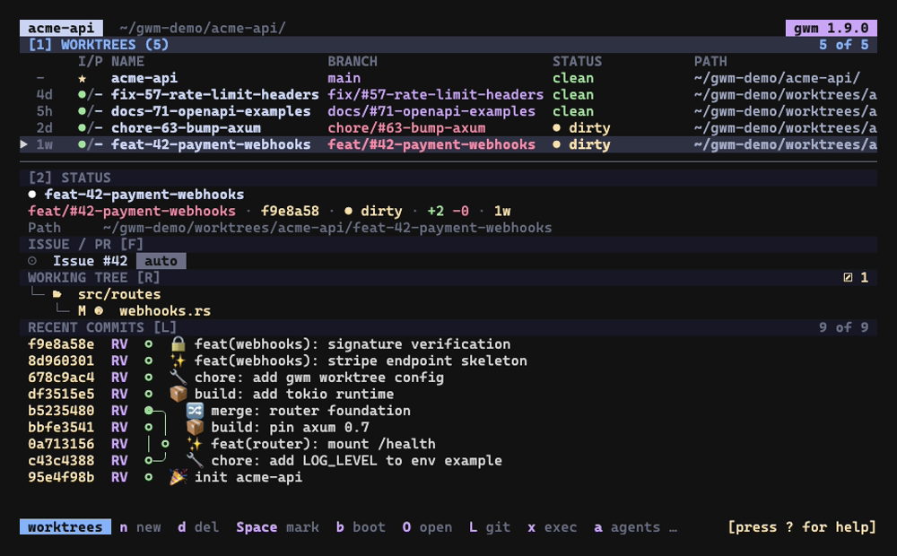
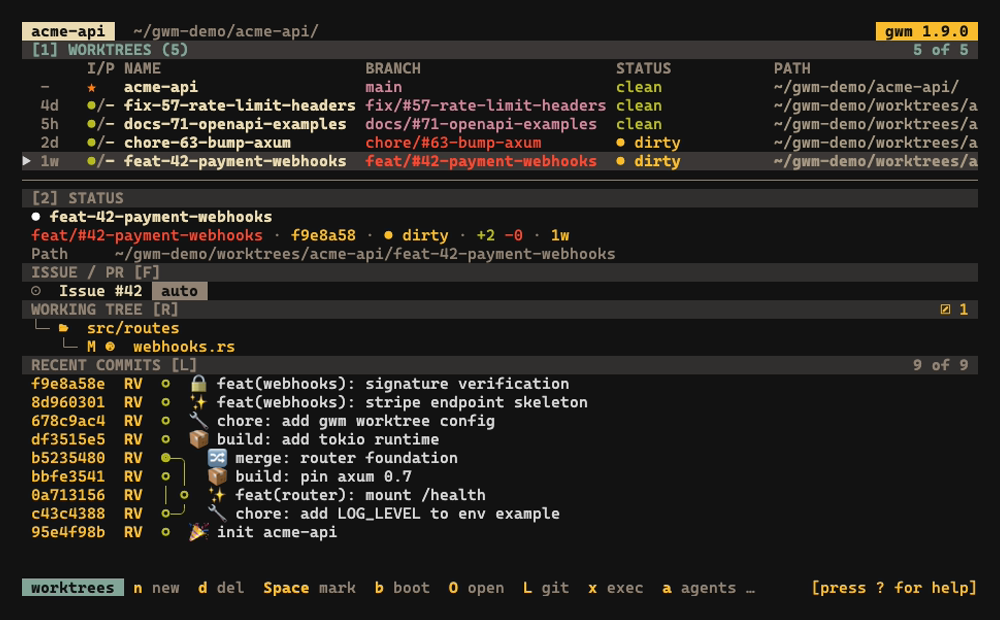
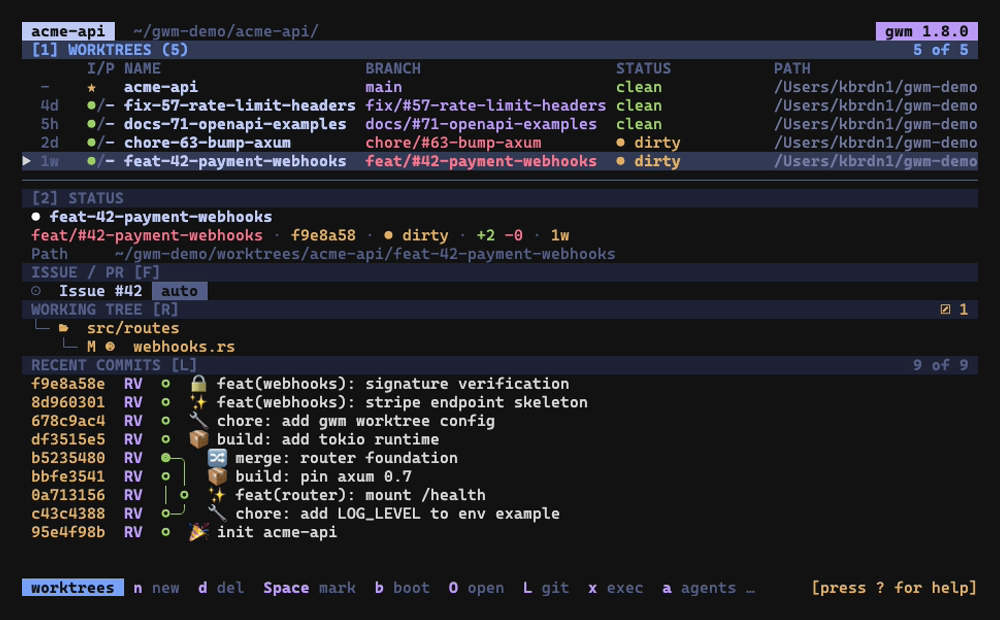

Ajoutés par [#33](https://github.com/kbrdn1/gwm-cli/issues/33) / [#168](https://github.com/kbrdn1/gwm-cli/pull/168), avec le preset `claude-dark` ajouté dans [#185](https://github.com/kbrdn1/gwm-cli/issues/185).






Les couleurs de la TUI sont pilotées par un bloc `[theme]` dans `.gwm.toml`. Au lieu de valeurs codées en dur, chaque site de peinture lit un **rôle sémantique**, de sorte qu'un seul preset ou une poignée de surcharges recolore tout l'interface de manière cohérente.

## Rôles

Un thème est un ensemble de liaisons rôle → couleur :

| Rôle           | Ce qu'il colore                                                                        | Par défaut |
| :------------- | :------------------------------------------------------------------------------------- | :--------- |
| `focus`        | bordure focalisée / curseur / surlignage de surcouche active                           | `Cyan`     |
| `accent`       | titre du header, indications de touches dans la surcouche d'aide, puces d'accent       | `Cyan`     |
| `branch`       | nom de branche dans les listes et la carte d'identité de la barre latérale (état sain) | `Green`    |
| `clean`        | indicateur de statut « le working tree est propre »                                    | `Green`    |
| `dirty`        | indicateur de statut « le working tree est sale »                                      | `Yellow`   |
| `main`         | badge du worktree main / trunk                                                         | `Yellow`   |
| `locked`       | badge du worktree verrouillé (`🔒`)                                                    | `Magenta`  |
| `prunable`     | badge du worktree élagable (`⚠`)                                                       | `Red`      |
| `muted`        | texte secondaire / atténué                                                             | `DarkGray` |
| `selection_bg` | arrière-plan de la ligne sélectionnée                                                  | `DarkGray` |
| `name`         | nom du worktree (table + en-tête sidebar) et têtes `Issue #N` / `PR #N`                | `White`    |
| `path`         | colonne du chemin du worktree dans la table                                            | `Gray`     |
| `staged`       | changements git-status indexés (côté index) dans le panneau working-tree               | `Cyan`     |
| `modified`     | modifications git-status côté working-tree                                             | `Yellow`   |
| `untracked`    | entrées git-status non suivies / créées (`??`)                                         | `Green`    |

Le thème par défaut reproduit exactement l'apparence codée en dur d'avant #33 de gwm, de sorte que les utilisateurs du thème par défaut ne voient aucun changement. Les rôles `name` / `path` ([#210](https://github.com/kbrdn1/gwm-cli/issues/210)) ont promu le dernier chrome structurel `Color::White` / `Color::Gray` laissé après l'audit #170 ; le chemin de la carte d'identité de la sidebar reste sur `muted` pour ne pas changer son apparence par défaut. Les rôles `staged` / `modified` / `untracked` ([#211](https://github.com/kbrdn1/gwm-cli/issues/211)) découplent les familles de statut working-tree, qui empruntaient auparavant `accent` / `dirty` / `clean`. Leurs valeurs par défaut égalent ces couleurs empruntées, donc le panneau est inchangé tant que vous ne les surchargez pas.

## préréglages

Définissez `preset = "<name>"` pour remplacer **tous** les rôles d'un coup :

```toml
[theme]
preset = "catppuccin"
```

Presets intégrés :

| Preset        | Alias              |
| :------------ | :----------------- |
| `catppuccin`  | `catppuccin-mocha` |
| `gruvbox`     | `gruvbox-dark`     |
| `tokyo-night` | `tokyonight`       |
| `claude-dark` | `claude`           |

Un preset remplace chaque rôle : les presets partiels ne sont pas supportés. Listez-les avec `gwm theme list` ; vidangez n'importe quel preset sous forme de bloc `[theme]` copiable-collable et round-trippable avec `gwm theme show <name>` (voir [CLI → `gwm theme`](/fr/cli/reference)).

## Surcharges par rôle

Surchargez des rôles individuels par-dessus (ou en l'absence d')un preset. **Les surcharges par rôle l'emportent sur le preset** :

```toml
[theme]
preset = "catppuccin"
focus  = "#89b4fa"   # surcharge mocha blue par-dessus le preset
```

## Formats de valeur

Une valeur de rôle accepte trois formes :

- **nommée** : `"cyan"`, `"Cyan"`, `"dark_gray"`, `"bright_blue"` (insensible à la casse).
- **index de palette 256** : `"220"` (`0`..=`255`).
- **hex** : `"#89b4fa"` (la forme courte `#0ff` n'est **pas** supportée ; le parseur refuse de deviner).

La validation s'exécute au chargement de la config : un preset inconnu, un rôle inconnu, ou une mauvaise valeur de couleur sont tous rejetés avec la coordonnée TOML fautive. Voir [Configuration → schéma `[theme]`](/fr/configuration/gwm-toml#theme).

## Comment la TUI l'utilise

Le thème résolu est propagé via `App.theme` et lu à chaque site de dessin. La bordure du panneau focalisé (liste des worktrees ↔ barre latérale) est désormais peinte avec le rôle `focus`. La valeur par défaut reste `Cyan`, donc les utilisateurs du thème par défaut ne voient aucune différence, mais le preset `claude-dark` la peint en orange.

> Un audit complet des couleurs de chaque site de dessin (pour qu'aucun site
> de peinture ne tende encore vers un `Color::` codé en dur au lieu d'un rôle
> de thème) est suivi en follow-up dans [#170](https://github.com/kbrdn1/gwm-cli/issues/170).

## En lien

- [CLI → `gwm theme list` / `gwm theme show`](/fr/cli/reference) : découvrir et vidanger les presets
- [Configuration → schéma `[theme]`](/fr/configuration/gwm-toml#theme) : référence complète des rôles / valeurs
- [Keymap & palette de commandes](/fr/tui/keymap-and-palette) : l'autre moitié de la surface de personnalisation de la TUI
