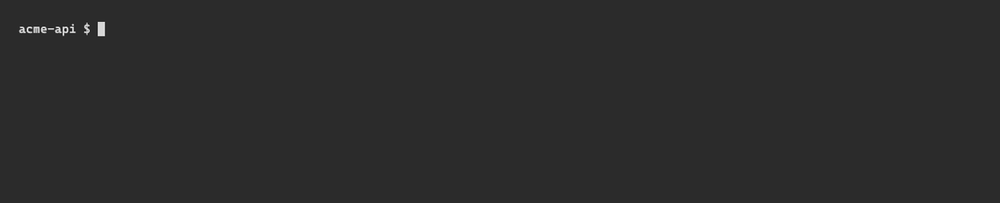

A binary by itself cannot change the parent shell's current directory - only the shell can. `gwm shell-init <shell>` prints a function (named `gcd`) that bridges two flows into one wrapper:

- `gcd <pattern>` → `gwm cd <pattern>` (fuzzy resolve, exits `0` on a hit, `1` on miss / ambiguous / not in a repo).
- `gcd` (no argument) → `gwm switch` (interactive picker; `Enter` to commit, `Esc` / `Ctrl-C` / `q` to cancel with exit code `1`).

In both cases the wrapper only performs the `cd` after a successful exit code, so a cancelled picker or a missed pattern never strands you in `$HOME`.



## Install

`eval` the wrapper in your shell's rc file:

```bash
# zsh
echo 'eval "$(gwm shell-init zsh)"' >> ~/.zshrc

# bash
echo 'eval "$(gwm shell-init bash)"' >> ~/.bashrc

# fish — also persist by adding to ~/.config/fish/config.fish
gwm shell-init fish | source

# PowerShell — current session only
Invoke-Expression (& gwm shell-init powershell | Out-String)
# PowerShell — persist via $PROFILE
gwm shell-init powershell | Out-File -Append -Encoding utf8 $PROFILE
```

Open a fresh shell (or `source` the rc file) and `gcd` is on your `$PATH` as a shell function.

## Use

```bash
gcd auth                       # → cd $(gwm cd auth)
                               #   → e.g. ~/cc-worktree/myrepo/feat-99-user-authentication

gcd                            # → cd $(gwm switch)
                               #   → opens the picker, cd's into the chosen worktree
```

The pattern is matched with the same fuzzy engine used by the TUI filter ([nucleo-matcher](https://docs.rs/nucleo-matcher)) - `auth` matches `feat-99-user-authentication`, `mig` matches `chore-12-rails-migration`, etc. Ambiguity (two worktrees match equally well) exits `1` and prints both candidates so the wrapper does not `cd`.

## Raw form (no wrapper)

If you don't want to install the wrapper, the raw forms work too:

```bash
cd "$(gwm cd auth)"            # fuzzy resolve, $(...) captures the path
cd "$(gwm switch)"             # open picker, type to narrow, Enter to commit
gwm s                          # alias for `switch`
```

## Related

- [TUI → Fuzzy filter](/tui/filter) - same engine, same matching rules
- [CLI → Subcommand reference](/cli/reference#gwm-path-pattern-alias-gwm-cd-pattern) - full `gwm cd` and `gwm switch` flags
- [CLI → Shell completions](/cli/completions) - drop a `_gwm` completer that knows about worktree names
