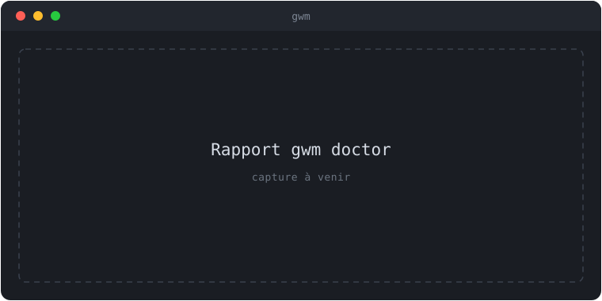

import { Aside } from '@astrojs/starlight/components';

`gwm doctor` exécute une batterie de vérifications peu coûteuses sur le dépôt
courant, affiche un rapport par vérification, et sort avec un code significatif —
pour être branché en CI ou dans un hook pre-commit sans parser stdout.

## Codes de sortie

| Code | Signification | Déclenché par                    |
| :--- | :------------ | :------------------------------- |
| `0`  | tout vert     | chaque vérification retourne `✓` |
| `1`  | avertissement | au moins un `!`, aucun `✗`       |
| `2`  | échec         | au moins un `✗`                  |

La distinction avertissement / échec suit la même convention de sigles que le
[pipeline de bootstrap](/concepts/bootstrap/).

## Exemple de sortie


{/* TODO(visuel): remplacer ce placeholder par une vraie capture (asciinema / screenshot) — suivi dans une issue dédiée. */}

```text
$ gwm doctor
✓ .gwm.toml parses
✓ guard references resolve
✓ `when` predicates supported
✓ external binaries on PATH
✓ no prunable worktrees
✓ no orphan gwm branches
✓ base directory writable
✓ [tui.keys] keymap resolves
```

Chaque avertissement / échec porte une indication de remédiation sur une ligne,
copiable-collable :

```text
! no prunable worktrees
    1 prunable entry: feat-12-old
    → run `gwm prune` to clear them
```

## Les 8 vérifications

### 1. `.gwm.toml` parse

- `✓` — le fichier parse proprement, **ou** est absent (les défauts s'appliquent).
- `✗` — TOML malformé, ou valeur `[tui.open].mode` inconnue.

Le cas « absent » est volontairement un `✓` : gwm fonctionne sans `.gwm.toml`.

### 2. Les références de guard résolvent

Vérifie que chaque nom dans `[[bootstrap.copy]].guards` pointe vers un
`[[bootstrap.guard]]` existant.

- `✓` — chaque référence pointe vers un guard réel.
- `✗` — au moins une référence est pendante (attrape les fautes de frappe).

### 3. Les prédicats `when` sont pris en charge

Parse chaque `[[bootstrap.command]].when` et signale les mots-clés inconnus.

- `✓` — chaque atome utilise un mot-clé reconnu.
- `✗` — au moins un atome inconnu (la commande s'exécute quand même en se
  rabattant sur `true`, mais la condition de déclenchement est silencieusement
  ignorée — gwm le considère comme une erreur de configuration).

Mots-clés : `file_exists:`, `cmd_exists:`, `env_set:`, `env_eq:`, `glob_exists:`,
avec composition `!`, `&&`, `||`. Voir [Bootstrap par repo](/concepts/bootstrap/).

### 4. Binaires externes sur le PATH

Sonde `$PATH` pour chaque binaire que gwm ou `.gwm.toml` prévoit de lancer :
`lazygit` (ou le premier token de `[git_tui].command`), le premier token de
`[review]`, `direnv` (si `.envrc` existe), et le token de chaque
`[[bootstrap.command]].run`.

- `✓` — tous résolus.
- `!` — au moins un binaire manquant (tout binaire absent est un avertissement,
  qu'il s'agisse de `[git_tui]`, `[review]` ou d'une commande de bootstrap) — le
  code de sortie reste `1`, jamais `2`, pour ce check.

### 5. Pas de worktrees à élaguer

Signale les entrées de `.git/worktrees/` dont le répertoire a été supprimé
manuellement.

- `✓` — chaque entrée pointe vers un répertoire réel.
- `!` — au moins une entrée obsolète (remédiation : `gwm prune`).

### 6. Pas de branches gwm orphelines

Parcourt les branches `<type>/#<N>-<slug>` sans worktree associé.

- `✓` — chaque branche gwm est active ou mergée dans un trunk.
- `!` — au moins un orphelin **non mergé** (remédiation : `git branch -d <name>`).

L'exemption « mergée dans un trunk » respecte la règle « ne jamais supprimer la
branche source après merge ». La liste des trunks est `[doctor].trunks` (défaut
`["dev", "main"]`) ; une liste vide désactive l'exemption.

### 7. Répertoire de base accessible en écriture

Vérifie que `[worktree].base` (ou son parent, s'il n'existe pas encore) est
accessible en écriture — gwm crée la base paresseusement au premier `gwm create`.

- `✓` — la base existe et est accessible en écriture, ou la base n'existe pas
  encore mais son parent est accessible (gwm la créera au premier `gwm create`).
- `!` — ni la base ni son parent n'existent encore (créer le répertoire parent
  manuellement, ou ajuster `[worktree].base`).
- `✗` — la base ou son parent existe mais n'est pas accessible en écriture
  (gwm ne peut pas créer de worktrees).

### 8. Le keymap `[tui.keys]` résout

Réexécute le chemin de résolution `[tui.keys]` que la TUI utilise au démarrage,
pour faire remonter toute erreur de keymap avant un échec de dispatch.

- `✓` — le keymap résout et `quit` a au moins une liaison visible ; le détail
  indique `N action(s) bound`.
- `!` — `quit` a été entièrement délié (`Ctrl+C` quitte toujours, mais plus de
  touche de sortie découvrable).
- `✗` — le keymap ne résout pas (parsing, action inconnue, conflit ou collision
  de préfixe) ; le détail répète l'erreur `[tui.keys]` sous-jacente.

Voir [`.gwm.toml` → `[tui.keys]`](/reference/gwm-toml/) et [La TUI](/guides/tui/).

## Intégration CI

```yaml
- name: gwm health
  env:
    GWM_ALLOW_BOOTSTRAP: '1' # si le job lance aussi gwm create / bootstrap
  run: gwm doctor # sort 1 sur avertissement, 2 sur échec
```

<Aside type="note">
  `gwm doctor` lui-même ne passe **pas** par la [barrière de confiance
  TOFU](/concepts/trust-ledger/) (il lit la config, n'exécute jamais le bootstrap), donc
  `GWM_ALLOW_BOOTSTRAP=1` est inoffensif ici. Il n'audite pas (encore) le contenu du registre de
  confiance lui-même.
</Aside>

Ou comme hook pre-commit — comme un `[review]` manquant n'est qu'un avertissement
(`1`), un hook peut autoriser les avertissements et ne bloquer que sur les échecs :

```sh
gwm doctor; [ $? -le 1 ]   # bloque seulement sur un échec (code 2)
```

## Connexe

- [Bootstrap par repo](/concepts/bootstrap/) — même convention `✓ / ! / ✗`.
- [Trust ledger (TOFU)](/concepts/trust-ledger/) — la barrière que doctor n'emprunte pas.
- [`.gwm.toml` → `[doctor]`](/reference/gwm-toml/) — le réglage `trunks`.
- [Commandes CLI → `gwm doctor`](/reference/cli/).
