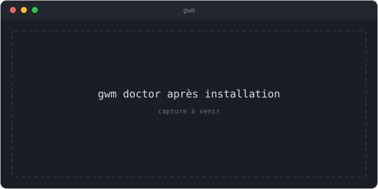

import { Tabs, TabItem, Steps, Aside } from '@astrojs/starlight/components';

gwm est livré comme un **unique binaire autonome**. Choisissez le canal qui
correspond à votre workflow — ils produisent tous le même exécutable `gwm`.

<Tabs>
  <TabItem label="Homebrew">

```sh
brew tap kbrdn1/tap
brew install gwm
```

La formule vit dans [`kbrdn1/homebrew-tap`](https://github.com/kbrdn1/homebrew-tap)
(`Formula/gwm.rb`) et est rafraîchie automatiquement à chaque release **stable**.
Les tags de pré-release (`-rc.N`, `-alpha.N`, `-beta.N`) sont filtrés, donc
`brew install gwm` pointe toujours vers un build stable.

  </TabItem>
  <TabItem label="cargo-binstall">

```sh
cargo binstall gwm
```

[`cargo-binstall`](https://github.com/cargo-bins/cargo-binstall) télécharge
l'archive précompilée correspondant à votre plateforme depuis la GitHub Release,
l'extrait et dépose le binaire dans `~/.cargo/bin/`. Aucune toolchain Rust ni
compilation C de libgit2 n'est nécessaire — bien plus rapide que `cargo install`.

  </TabItem>
  <TabItem label="Cargo (sources)">

```sh
git clone https://github.com/kbrdn1/gwm-cli.git
cd gwm-cli
cargo install --path .
```

Le binaire arrive dans `~/.cargo/bin/gwm`. Nécessite une toolchain Rust stable
récente — le MSRV est **1.82**.

  </TabItem>
  <TabItem label="Binaire précompilé">

Les [releases](https://github.com/kbrdn1/gwm-cli/releases) fournissent des
binaires accompagnés de sidecars `.sha256` pour :

- Linux (`x86_64`, `aarch64`)
- macOS (Intel, Apple Silicon)
- Windows (`x86_64`)

Déposez le binaire sur votre `$PATH`, rendez-le exécutable, et c'est terminé.

  </TabItem>
  <TabItem label="Nix">

```sh
# exécution one-shot, sans clone
nix run github:kbrdn1/gwm-cli -- list

# installer dans votre profil
nix profile install github:kbrdn1/gwm-cli
```

Dans une configuration NixOS / nix-darwin, via l'overlay :

```nix
nixpkgs.overlays = [ inputs.gwm.overlays.default ];
environment.systemPackages = [ pkgs.gwm ];
```

Le paquet est construit via `rustPlatform.buildRustPackage` et épingle
`Cargo.lock` ; la feature `vendored-libgit2` de `git2` garde la closure exempte
de libgit2 système.

  </TabItem>
</Tabs>

<Aside type="note" title="Prérequis C (uniquement depuis les sources)">
  `cargo install` compile `git2`, qui embarque libgit2 et le construit depuis les sources au premier
  build : un **compilateur C** est donc requis. Les canaux `cargo binstall`, Homebrew, binaire
  précompilé et Nix livrent un binaire déjà lié et n'ont pas cette contrainte.
</Aside>

## Vérifier l'installation

<Steps>

1. Confirmez la version installée :

   ```sh
   gwm --version
   ```

2. Lancez le diagnostic intégré :

   ```sh
   gwm doctor
   ```

</Steps>

`gwm doctor` exécute une batterie de vérifications de cohérence et sort avec un
code significatif (`0` tout vert, `1` avertissement, `2` échec). Si le code est
non nul, voyez [Diagnostic (doctor)](/guides/doctor/) pour la remédiation par
vérification.

Sur un dépôt sain sans `.gwm.toml`, la sortie ressemble à :

```text
✓ .gwm.toml parses
    no .gwm.toml present — defaults assumed
✓ guard references resolve
✓ `when` predicates supported
✓ external binaries on PATH
    1/1 binaries found
✓ no prunable worktrees
    1 worktree(s) tracked, none prunable
✓ no orphan gwm branches
✓ base directory writable
✓ [tui.keys] keymap resolves
    30 action(s) bound
```

Le sigil `!` signale un avertissement (code de sortie `1`) — par exemple des
binaires optionnels absents du `$PATH` ou un worktree prunable oublié. Le sigil
`✗` (code `2`) désigne un échec bloquant qui empêche gwm de fonctionner
correctement.


{/* TODO(visuel): remplacer ce placeholder par une vraie capture (asciinema / screenshot) — suivi dans une issue dédiée. */}

<Aside type="tip" title="PATH après cargo-binstall">
  `cargo binstall` dépose le binaire dans `~/.cargo/bin/`. Si `gwm: command not found` apparaît
  immédiatement après l'installation, vérifiez que ce répertoire est dans votre `$PATH` (ajoutez
  `export PATH="$HOME/.cargo/bin:$PATH"` à votre profil shell). Homebrew et les binaires précompilés
  installés manuellement nécessitent le même réflexe si le dossier cible n'est pas déjà dans
  `$PATH`.
</Aside>

## Suite

- [Prise en main](/guides/prise-en-main/) — créer votre premier worktree.
- [Fichier `.gwm.toml`](/reference/gwm-toml/) — configurer gwm par dépôt.
