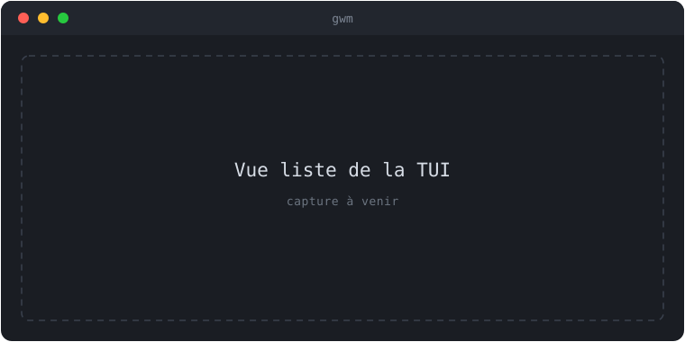
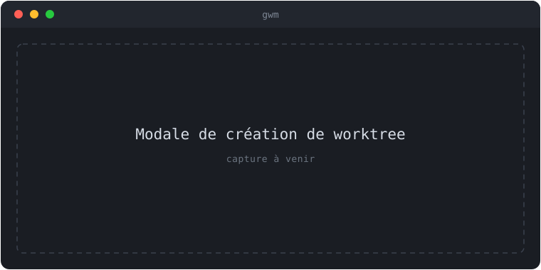
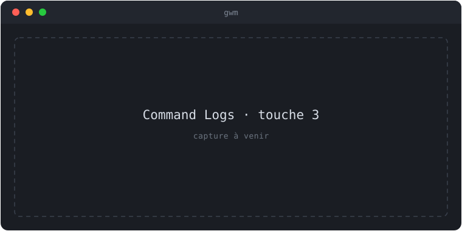
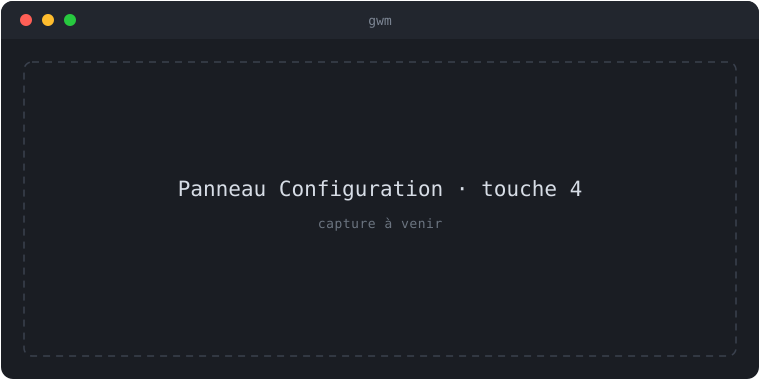

import { Aside } from '@astrojs/starlight/components';

Lancé sans sous-commande, `gwm` ouvre une TUI (interface ratatui) sur le dépôt
courant : navigation, filtre fuzzy, création/suppression, launchers et intégration
multiplexeur — le tout au clavier.

```sh
gwm
```



{/* TODO(visuel): remplacer ce placeholder par une vraie capture (asciinema / screenshot) — suivi dans une issue dédiée. */}

Appuyez sur `?` à tout moment pour l'overlay d'aide, piloté par le keymap résolu
(il affiche donc toujours vos vrais bindings).

## Navigation (vue liste)

| Touche    | Action                                                                      |
| :-------- | :-------------------------------------------------------------------------- |
| `↑` / `k` | worktree précédent (défile la sidebar quand elle a le focus)                |
| `↓` / `j` | worktree suivant                                                            |
| `g g`     | premier worktree                                                            |
| `G`       | dernier worktree                                                            |
| `1`       | focus du panneau Worktrees (`focus_worktrees`)                              |
| `2`       | ouvre + focus le panneau Status (`focus_status`, le crée si masqué)         |
| `/`       | filtre fuzzy, rendu dans le titre du pane (`Enter` confirme · `Esc` efface) |
| `f` / `r` | rafraîchir la liste des worktrees (off-thread, sans figer la TUI)           |
| `Tab`     | échanger le focus entre la liste et la sidebar                              |
| `:`       | palette de commandes (lance n'importe quelle action par son nom)            |
| `Enter`   | afficher le chemin sélectionné dans la barre de statut                      |
| `y`       | copier le chemin du worktree (pbcopy / wl-copy / xclip / xsel / clip)       |
| `?`       | overlay d'aide                                                              |
| `q`       | quitter (`Esc` efface un filtre persistant, sinon quitte)                   |

Le filtre utilise le moteur [nucleo-matcher](https://docs.rs/nucleo-matcher) —
le même que `gwm path / remove`.

Depuis la TUI v0.9.0, le filtre fuzzy se rend **dans le titre du pane
Worktrees** : la requête `/query`, le curseur, et un ratio `(visible/total)`
apparaissent dans la bordure du panneau — il n'y a plus de barre de filtre
séparée sous la table. Les deux panneaux sont étiquetés `[1] Worktrees (N)` et
`[2] Status` : les chiffres entre crochets sont les touches de focus direct.

`f` / `r` re-listent désormais sur un worker en arrière-plan : la TUI ne gèle
plus sur un gros dépôt, un spinner « refreshing worktrees… » s'affiche dans la
barre de statut, et `q` / `Esc` restent réactifs pendant le rafraîchissement.

## Sidebar de détails

| Touche | Action                                                               |
| :----- | :------------------------------------------------------------------- |
| `v`    | afficher / masquer la sidebar de détails                             |
| `s`    | basculer le mode Details (`commits` ↔ `stashes`)                     |
| `V`    | faire cycler la disposition (`auto` → côte-à-côte → empilé → `auto`) |
| `H`    | basculer la position gauche ↔ droite (disposition côte-à-côte)       |

Sur un terminal étroit, la sidebar se place sous la table au lieu de disparaître.
Le côté par défaut et l'orientation se configurent via `[tui].sidebar_position`
dans [`.gwm.toml`](/reference/gwm-toml/).

## Créer, supprimer, lier



{/* TODO(visuel): remplacer ce placeholder par une vraie capture (asciinema / screenshot) — suivi dans une issue dédiée. */}

| Touche | Action                                                                      |
| :----- | :-------------------------------------------------------------------------- |
| `n`    | nouveau worktree (formulaire type → issue → description)                    |
| `d`    | supprimer la sélection (`y` confirme ; compte à rebours quand `p` est armé) |
| `p`    | armer « supprimer la branche au retrait »                                   |
| `b`    | relancer le bootstrap sur le worktree sélectionné                           |
| `o`    | ouvrir le worktree selon `[tui.open]` (`shell` / `editor` / `finder`)       |
| `O`    | menu d'ouverture issue / PR liée (`i` / `p` → navigateur)                   |
| `L`    | invite de liaison (`i` ou `p`, puis le numéro)                              |
| `F`    | rafraîchir l'état d'issue / PR GitHub (fetch `gh`)                          |

<Aside type="note" title="Barrière de confiance TOFU">
  `n` (nouveau worktree) et `b` (re-bootstrap) passent par le [trust ledger
  (TOFU)](/concepts/trust-ledger/) : sur un `.gwm.toml` non approuvé, la TUI refuse avec une
  indication dans la barre de statut (pas de prompt inline) et ne crée **aucun** répertoire —
  corrigez l'état de confiance depuis un autre terminal puis réessayez.
</Aside>

L'overlay de confirmation de suppression met le focus par défaut sur **Cancel**
(le choix sûr) ; `←` / `→` / `Tab` déplacent le focus, `y` / `n` fonctionnent
toujours. Quand `p` est armé, `y` arme un compte à rebours de sécurité — `y` à
nouveau le **désarme** sans déclencher.

## Synchroniser un worktree (`S`)

`S` lance `gwm sync` sur le worktree sélectionné sans quitter la TUI : un
`fetch` puis un rebase de sa branche sur l'upstream. L'action est `sync`,
atteignable par `:sync` dans la palette.

Le défaut est `S` (majuscule) parce que `s` est déjà pris par le toggle de mode
de la sidebar — `S` rejoint les autres verbes de cycle de vie en majuscule (`F`
pour le fetch GitHub, `R` pour le launcher de review).

Le travail s'exécute hors du thread d'événements : un spinner « syncing… »
s'affiche dans la barre de statut et `q` / `Esc` restent réactifs pendant
l'opération. Une seconde pression sur `S` pendant qu'un sync tourne est sans
effet (les rebases ne se chevauchent jamais). Au retour, la liste est
re-listée pour refléter le nouvel état ahead/behind, puis l'issue est rapportée
dans la barre de statut :

| Issue                 | Message (barre de statut)                                             |
| :-------------------- | :-------------------------------------------------------------------- |
| déjà à jour           | `✓ <nom> already up to date with <upstream>`                          |
| rebasé                | `✓ <nom> rebased N commits from <upstream>`                           |
| arbre de travail sale | `sync failed: …` (le rebase refuse de toucher un arbre sale)          |
| conflit de rebase     | `sync failed: …` (le rebase est avorté, le worktree reste utilisable) |

Sur un conflit, le rebase est **avorté** automatiquement : le worktree n'est
jamais laissé à mi-rebase, et le message indique de réconcilier manuellement.
La stratégie par défaut est le rebase (la convention du dépôt) ; voir
[`gwm sync`](/reference/cli/) pour la version en ligne de commande.

## Ouvrir la doc (`.`)

`.` (action `open_docs`, `:open-docs` dans la palette) ouvre l'arborescence
`docs/` du dépôt dans le navigateur. L'URL est dérivée du dépôt
(`<repo>/tree/main/docs`) et donc fork-aware : sur un fork, elle pointe vers le
dépôt du fork, pas vers l'amont. Action en lecture seule.

## Command Logs (`3`)



{/* TODO(visuel): remplacer ce placeholder par une vraie capture (asciinema / screenshot) — suivi dans une issue dédiée. */}

`3` (action `command_logs`, `:command-logs` dans la palette) ouvre un overlay
occupant ~90 % de l'écran : le transcript scrollable des commandes externes
que gwm a lancées, le plus récent en premier. Chaque entrée porte la ligne de
commande résolue, sa durée, son code de sortie et la sortie capturée.

| Touche            | Action                  |
| :---------------- | :---------------------- |
| `j` / `k`         | défiler verticalement   |
| `h` / `l`         | défiler horizontalement |
| `g` / `G`         | aller en haut / en bas  |
| `Esc` / `q` / `3` | fermer l'overlay        |

L'overlay enregistre les appels `gh`, les étapes shell du bootstrap et les
hooks de cycle de vie — les commandes dont gwm **capture** la sortie. Il
**exclut** les previews read-only de la sidebar (le `git log` / `git status`
qui s'exécute à chaque changement de sélection) ainsi que les launchers
interactifs qui héritent du terminal (lazygit, etc.) : les noyer dans le
transcript le rendrait illisible, donc il reste signal-rich. C'est un
transcript en mémoire (256 entrées max, éviction FIFO), pas un journal durable
— l'historique persistant vit derrière `gwm undo` / `gwm history`.

## Panneau Configuration (`4`)



{/* TODO(visuel): remplacer ce placeholder par une vraie capture (asciinema / screenshot) — suivi dans une issue dédiée. */}

`4` (action `config_panel`, `:config-panel` dans la palette) ouvre une vue
~90 % plein écran, scrollable, du `.gwm.toml` **résolu** : la config globale
utilisateur fusionnée sous le fichier du dépôt, exactement comme la résolution
de `gwm config list`. Les lignes sont groupées par `[section]`, avec une
colonne **source** colorée indiquant quelle couche l'emporte :

| Source    | Sens                                                       |
| :-------- | :--------------------------------------------------------- |
| `repo`    | valeur du `.gwm.toml` du dépôt                             |
| `user`    | valeur de la config globale utilisateur                    |
| `default` | valeur par défaut intégrée (aucun fichier ne la surcharge) |

Le panneau est en lecture seule (l'édition inline est un follow-up) ;
naviguez avec `j` / `k`, `h` / `l`, `g` / `G`, fermez avec `Esc` / `q` / `4`.
Pour le détail des champs et de leur résolution, voir
[`.gwm.toml`](/reference/gwm-toml/) et [`gwm config list`](/reference/cli/).

## Launchers configurables (`l` et `R`)

Deux touches lancent des outils externes pilotés par `.gwm.toml`, partageant la
même mini-API : lire la section, résoudre les placeholders, découper avec
`shell-words`, sonder `argv[0]` sur `$PATH`, puis exécuter avec `cwd` = chemin du
worktree.

| Touche | Section TOML | Défaut                           | Placeholders                           |
| :----- | :----------- | :------------------------------- | :------------------------------------- |
| `l`    | `[git_tui]`  | `lazygit -p {path}`, plein écran | `{path}`                               |
| `R`    | `[review]`   | inerte tant que non configuré    | `{path}`, `{base}`, `{head}`, `{diff}` |

```toml
[git_tui]
command    = "lazygit -p {path}"
fullscreen = true

[review]
tool         = "lumen"        # OU command = "<votre ligne>"
fullscreen   = true
default_base = "main"
```

Presets `[review].tool` : `lumen`, `claude`, `codex`, `aider`, `gh`. Si `command`
et `tool` sont définis ensemble, `command` l'emporte (avec un avertissement au
démarrage).

<Aside type="caution" title="fullscreen = false est synchrone">
  Avec `fullscreen = false`, la TUI reste dans l'alt-screen et **bloque** jusqu'à la fin du
  processus enfant (`Command::output()`) — adapté aux outils rapides en print seul (`claude
  --print`, `gh pr view --web`). Choisissez `fullscreen = true` pour tout outil long, afin que la
  TUI soit suspendue et le terminal utilisable.
</Aside>

### Résolution de la base (`{base}`)

Le placeholder `{base}` suit cette chaîne — le premier résultat non vide gagne :

1. `branch.<name>.merge` — l'upstream de la branche, s'il existe.
2. `branch.<name>.gwm-base` — le tronc d'origine, posé par `gwm create`.
3. `[review].default_base` — le fallback configuré.
4. `dev` — seulement s'il existe localement.
5. `main` — sentinelle finale (garantie non vide).

Le placeholder `{diff}` est **paresseux** : un fichier temporaire contenant
`git diff {base}..{head}` n'est matérialisé que si le template le référence.
`gwm doctor` sonde les binaires `[git_tui]` (manquant → échec) et `[review]`
(manquant → avertissement).

## Intégration tmux / zellij

À l'intérieur d'une session de multiplexeur, ces commandes ouvrent une fenêtre /
un onglet / un panneau dont le shell démarre dans le worktree matché — sans `cd`
manuel.

```sh
gwm tmux auth          # nouvelle fenêtre tmux dans le worktree matché
gwm tmux auth -p       # split du panneau courant (--split)
gwm zellij auth        # nouvel onglet zellij
gwm zellij auth -p     # nouveau panneau dans l'onglet courant
```

- **tmux** : `new-window -c <path>` (ou `split-window -c <path>` avec `-p`).
  Nécessite `$TMUX`.
- **zellij** : `new-tab --cwd <path>` (zellij ≥ 0.40) ou `new-pane --cwd` avec
  `-p`. Nécessite `$ZELLIJ`.

En dehors d'une session, la commande **refuse** avec une erreur claire plutôt que
de lancer un serveur orphelin. Le `<pattern>` utilise le même matcher fuzzy ;
une ambiguïté sort `1` et liste les candidats.

## Palette de commandes (`:`)

`:` ouvre une modale avec une entrée de recherche en haut et les matches en
dessous : tapez le nom (fuzzy) d'une action et lancez-la sans connaître son
binding. Utile quand vous avez remappé une touche, ou pour les actions sans
défaut mémorable.

Le nom de la palette n'est pas toujours le binding : chaque action en a un
explicite. Quelques exemples vérifiés contre le keymap :

| Nom (palette)     | Action           | Défaut |
| :---------------- | :--------------- | :----- |
| `create`          | `Create`         | `n`    |
| `sync`            | `Sync`           | `S`    |
| `command-logs`    | `CommandLogs`    | `3`    |
| `config-panel`    | `ConfigPanel`    | `4`    |
| `focus-worktrees` | `FocusWorktrees` | `1`    |
| `focus-status`    | `FocusStatus`    | `2`    |
| `open-docs`       | `OpenDocs`       | `.`    |
| `fetch-github`    | `FetchGithub`    | `F`    |

L'overlay d'aide (`?`) et `gwm tui keys` listent vos bindings résolus ; la
liste complète des noms d'actions vit dans [`.gwm.toml`](/reference/gwm-toml/).

## Keymap & thèmes

Chaque binding ci-dessus est une **valeur par défaut**. Le bloc `[tui.keys]` de
`.gwm.toml` remappe n'importe quelle action (y compris des chords comme `g g`) ;
`[theme]` re-skinne toute la TUI par rôles sémantiques. `gwm tui keys` et
`gwm theme list` / `gwm theme show <name>` les inspectent. Schéma complet, liste
des actions rebindables et rôles de thème : [`.gwm.toml`](/reference/gwm-toml/).

`Ctrl+C` et les touches contextuelles `Esc` / `Enter` sont des échappatoires
codées en dur, hors keymap.

## Voir aussi

- [Prise en main](/guides/prise-en-main/) — créer un premier worktree.
- [Commandes CLI](/reference/cli/) — `tmux`, `zellij`, `theme`, `tui keys`.
- [Fichier `.gwm.toml`](/reference/gwm-toml/) — `[tui]`, `[tui.keys]`, `[git_tui]`, `[review]`, `[theme]`.
