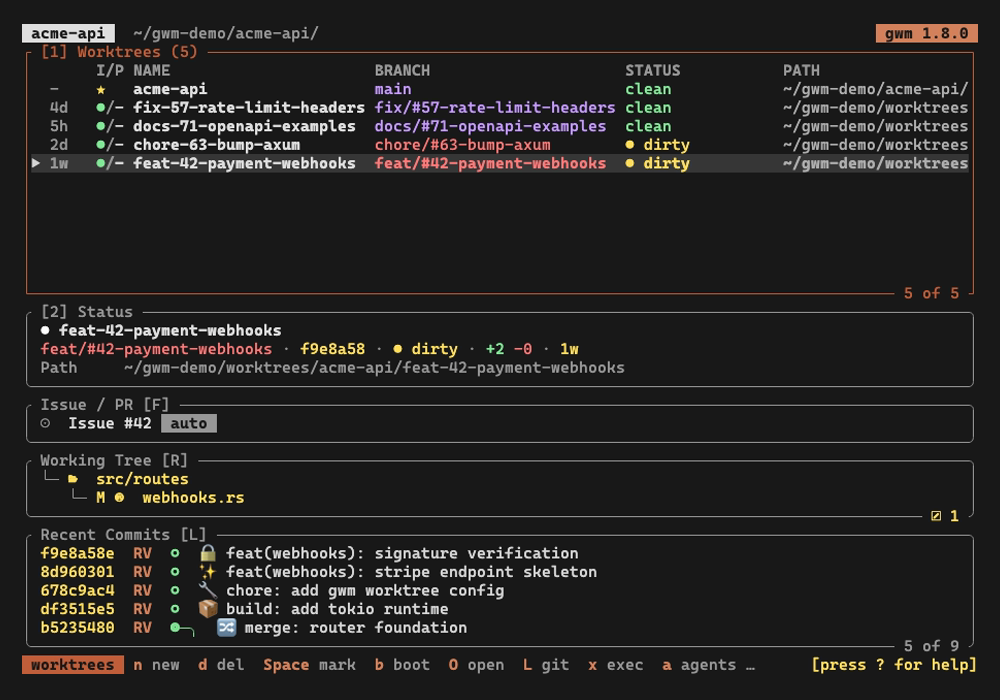

Bare `gwm` (no arguments) opens the ratatui interface on the current repo. From there you can create, delete, bootstrap, and jump between worktrees without leaving the terminal.

- **[Keybindings](/tui/keybindings)**: the full key map, including the [v0.10 keymap redesign (#290)](/tui/keybindings#v010-rebind-summary) that reshuffled the defaults (e.g. `O` is now the fullscreen terminal, not open-menu; `y` now yanks the branch name, not the path). The keymap is fully configurable via `[tui.keys]`.
- **[Details sidebar](/tui/sidebar)**: the four subsections on the right pane, the responsive orientation, the lazygit-style commit graph, the live Issue / PR block (with the CI status indicator), the `git status` file-explorer tree, and the `S` stashes mode.
- **[Fuzzy filter](/tui/filter)**: `/` opens the inline filter bar; nucleo-matcher under the hood.
- **[Confirm-overlay countdown](/tui/confirm-countdown)**: the safety countdown that prevents accidental branch deletions when `D` is armed.
- **[Configurable launchers](/tui/launchers)**: `[git_tui]` (`l` overlay / `L` fullscreen) and `[review]` (`r` overlay / `R` fullscreen), with `{base} {head} {path} {diff}` placeholders and the embedded PTY overlay.
- **[Open dispatch](/tui/open-dispatch)**: `o` opens a terminal in an embedded PTY overlay; `O` runs the `[tui.open]` dispatch (`shell` / `editor` / `finder`).
- **[Exec / clean overlays](/tui/keybindings#exec-picker-overlay-x)**: `x` picks an `[exec.profiles]` profile and runs it in a PTY overlay; `X` previews and reclaims build artifacts (same git-ignored safety gate as `gwm clean --yes`, behind a confirm countdown).
- **[Themes](/tui/themes)**: role-based `[theme]` colours and the built-in presets (`catppuccin`, `gruvbox`, `tokyo-night`, `claude-dark`).
- **[Keymap & command palette](/tui/keymap-and-palette)**: remap any binding via `[tui.keys]` (with chord support), or fire an action by name from the `:` palette.
- **[Agent sessions](/tui/agent-sessions)**: which AI agent (Claude Code, Codex, opencode, Mistral Vibe) is working in which worktree, read from each tool's on-disk artefacts and shown in the `AGENT` column, the sidebar and the `a` overlay.

`n` (new worktree) and `b` (re-bootstrap) are gated by the [TOFU trust ledger](/configuration/trust-ledger): an untrusted `.gwm.toml` lands a refuse message in the status bar rather than running bootstrap. The picker variant (`gwm switch`, alias `gwm s`) reuses the same TUI but disables create / delete / bootstrap, then prints the chosen worktree's path on stdout, meant to be `eval`d by the `gcd` shell wrapper.

## Chrome

The v0.8.0 polish pass tightened the TUI's frame. All colours follow the resolved [`[theme]`](/tui/themes):

- **Statusline**: a single line. Key hints render as reverse-video badge chips (the key painted with the theme accent, then a short label); the status message (action log) is pinned flush-right with absolute priority. Under width pressure the hint list truncates with an `…` marker while the log stays visible.
- **Header**, a single borderless row: the version is a reverse-video chip, the repo name is bold, and the working directory is dimmed and tilde-compressed. The `picker` flag is its own reverse-video chip. Drop order under width pressure is path → repo name → version chip (the version survives last).
- **Modals** all share one frame: a rounded border carrying a bold themed title in its top rule, theme colours, and a box sized to its content rather than a fixed percentage of the screen. The title moved into the rule in [#549](https://github.com/kbrdn1/gwm-cli/issues/549): it used to be a centred row inside the frame followed by a blank spacer, so every overlay is two rows shorter.

### Layout

`[tui] layout` ([#545](https://github.com/kbrdn1/gwm-cli/issues/545)) chooses how panes and sidebar sections are framed. **`"compact"` is the default**: no box rules, one filled header line per section. The title keeps its bracketed keybinding and goes uppercase, the counter sits at the right of that same line, a `muted` rule marks the boundary between the two panes, and the worktrees pane sizes itself to its row count rather than reserving its share of the split. Focus reads on the header: the active pane takes the `selection_bg` fill. `[tui] dim_unfocused` additionally dims the inactive pane's body, in either layout, off by default.

The capture at the top of this page shows it, as does every other capture in these docs.

`layout = "bordered"` restores gwm's layout up to 1.7, the lazygit-style boxes:

Modals keep their frame under either value. Configuration and the `section_bg` theme role are documented under [`.gwm.toml`](/configuration/gwm-toml#layout).

`[tui] status_one_line` ([#547](https://github.com/kbrdn1/gwm-cli/issues/547)) folds the Status block's four values (branch, head, state badges, diff, age) onto one row joined by `·`, leaving only the path a row of its own. **On by default**, under either layout. It is the content half of the same density argument: `layout` cut what a section spends on its frame, this cuts what the identity card spends on labels. Set `status_one_line = false` for the labelled four-row block.
