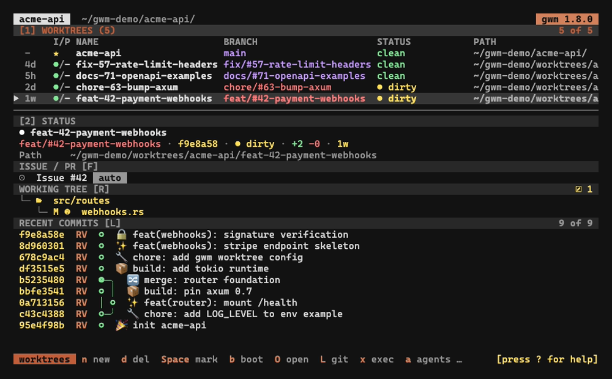
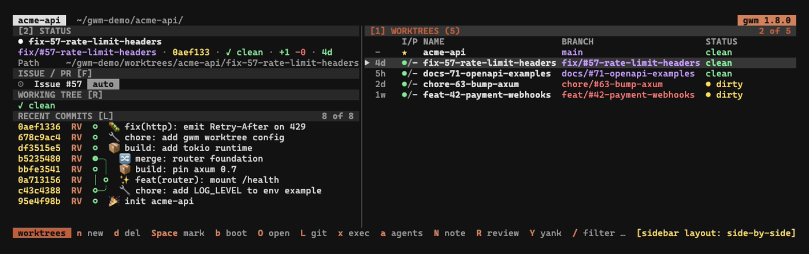
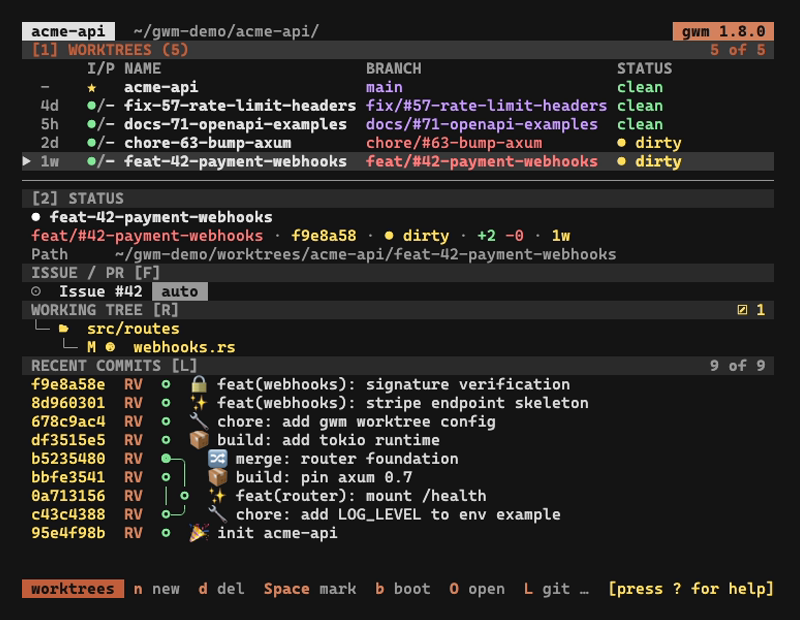

When the sidebar is enabled (default ON, toggle with `V`), the pane shows a lazygit-style details panel for the currently selected worktree.



## Layout: responsive orientation & position

By default the sidebar is **stacked** (`SidebarOrientation::Stacked` is the runtime default, issue [#217](https://github.com/kbrdn1/gwm-cli/issues/217)): the table sits on top and the status pane below it, separated by a horizontal divider, regardless of terminal width. The width-driven behaviour below only kicks in when you cycle the orientation to **auto** with `z`.

In the **auto** orientation the sidebar adapts to the terminal width (issue [#188](https://github.com/kbrdn1/gwm-cli/issues/188)):

- **wide** (≥ **120 columns**) → **side-by-side**: the table keeps **55 %** of the width, the sidebar takes the remaining **45 %**.
- **narrow** (< 120 columns) → **stacked**: the table takes **42 %** of the height and the status pane the remaining **58 %** below it, separated by a horizontal divider. It is no longer hidden on narrow terminals: only `V` (close) reclaims the full width for the table.

Two keys override the automatic behaviour (rebindable in [`[tui.keys]`](/configuration/gwm-toml#tuikeys); the [#290](https://github.com/kbrdn1/gwm-cli/issues/290) keymap redesign reassigned these defaults):

- `z` (`cycle_sidebar_layout`) cycles the orientation `auto → side-by-side → stacked → auto` (the cycle starts from the **stacked** runtime default). `auto` is the width-driven mode above; `side-by-side` and `stacked` pin the orientation regardless of width.
- `v` (`toggle_sidebar_position`) toggles the sidebar **position** left ↔ right. This only affects the side-by-side layout; in the stacked layout the sidebar is always at the bottom. The default side is set by `[tui] sidebar_position = "left" | "right"` (default `right`) in `.gwm.toml`, and `v` flips it live for the session.

The pane is composed of **four independent rounded-border subsections**: section titles live on the borders themselves, so there are no inline `Basic Settings:` / `Recent commits:` lines anymore. Press `Tab` to focus the sidebar; `j` / `k` (or arrow keys) then scroll it instead of moving the worktree selection. The focused panel's border paints with the theme `focus` role (default `Cyan`).

The variable-height sections (Agents, `Working Tree` and `Recent Commits`) share the column responsively. When everything fits, each keeps its natural height and `Recent Commits` absorbs the slack. When the terminal is short, every visible scrollable section keeps a guaranteed floor: **7 lines** for `Working Tree` (border + 5 content rows) and **5 lines** for `Recent Commits` (border + 3 content rows). The remaining height is then split proportionally to content size. The Agents pane, which cannot scroll, always keeps its full (bounded) height instead. Overflowing content stays reachable through the section scrolls (`j` / `k` for `Recent Commits`, `J` / `K` for `Working Tree`), and an overflowing `Working Tree` paints a scrollbar on its inner right edge so the viewport position is visible. An empty section still collapses entirely (clean tree, no agent session).




## Header

```
● <worktree-name>
```

- The `●` colour tracks the linked PR / issue state:
  - **green**: open
  - **gray**: draft
  - **magenta**: merged
  - **red**: closed
  - **darkgray**: nothing linked / unknown
- The worktree name itself is coloured by `BranchStatus` (worst-state wins):
  - **red**: dirty (uncommitted changes)
  - **yellow**: ahead / behind upstream
  - **magenta**: unpublished (no upstream)
  - **green**: synced
  - **darkgray**: unknown

The same colour is applied to the `BRANCH` column in the worktree table, so the header and the table stay visually in sync.

## `Worktree` block

The first block holds the worktree-level facts:

- `branch`: coloured by status (same scheme as the header)
- `path`: the absolute path on disk (tilde-compressed)
- `head`: short OID of the current commit
- **`Created`**: branch age in compact relative form (`2d`, `3w`, `1M`), colour-coded by freshness: **green** < 7d, **yellow** < 30d, **darkgray** otherwise. Added by [#73](https://github.com/kbrdn1/gwm-cli/issues/73) / [#74](https://github.com/kbrdn1/gwm-cli/pull/74).
- **`Diff`**: `+<ins> -<del>` of the branch versus its base trunk, using three-dot `git diff --shortstat <base>...HEAD` semantics (the same base as `gwm pr`). Insertions paint **green**, deletions **red**. Hidden when no base resolves, when HEAD is the trunk itself, or when the branch has no committed diff yet. Added by [#287](https://github.com/kbrdn1/gwm-cli/issues/287).
- flags: `main`, `locked`, `prunable`, etc.
- `branch status`: the textual long form of the column shown in the table (`clean`, `dirty (N files)`, `↑N ↓M`, `unpublished`, …)

## `Issue / PR` block

Hidden when nothing is linked to the selected worktree. Otherwise renders one or two live lines fetched via `gh`:

```
Issue #42 [open] TUI: fuzzy search
PR #61 [draft]   CI running 8/9
```

- The bracketed state is `gh`'s view (`open` / `closed` / `merged` / `draft`).
- The trailing **CI indicator** (issue [#299](https://github.com/kbrdn1/gwm-cli/issues/299)) only shows up for PRs and renders an overall CI state for the linked PR, derived from the `statusCheckRollup` already fetched (no extra GitHub request):
  - ` CI passing 9/9`: **green**, all checks succeeded
  - ` CI failing 7/9`: **red**, at least one check failed
  - ` CI running 8/9`: **yellow**, checks still in flight
  - The state follows **failing > running > passing**, so a red check is never hidden behind an in-flight one. A PR with **no checks** renders nothing.
- Refresh on demand with the `F` key: the fetch updates the status bar with success / per-fetch error detail.

The block is auto-rebuilt every selection change, so it never shows stale data from a previously selected worktree. See [GitHub issue / PR linking](/integrations/github-linking) for the linking model.

## `Agents` block

One line per **pinned** AI-agent session on the selected worktree
(`claude` / `codex` / `opencode` / `vibe`), coloured by freshness
(**active** / **idle**), with a human-readable last activity and the
session's backend-reported name (first prompt, recorded title, or the
tool's own registry, or the full id when unnamed). The pane is the deliberate view: detected-but-unpinned sessions
stay in the [agent sessions overlay](/tui/keybindings#agent-sessions-overlay-a)
(`a`), where `a`/`i` pin them: several pins can coexist on one worktree.
Capped at three lines with a `+N more` beyond that. The block collapses
entirely when nothing is pinned. Added by
[#408](https://github.com/kbrdn1/gwm-cli/issues/408).

## `Working Tree` block

The selected worktree's `git status`, rendered as a nested **nerd-font file
tree** (issue [#300](https://github.com/kbrdn1/gwm-cli/issues/300)) rather than
a flat `XY PATH` list:

```
 src/
├─  tui/
│  ├─  app.rs        M
│  └─  theme.rs      A
└─  worktree.rs      M
 docs/               ?
```

- **Directories sort before files**, alphabetically within each level.
- **Single-child directory chains collapse** (`src/tui/` shown as one row, then
  the file under it).
- Each file row carries an **extension-driven file-type icon** plus its `M` /
  `A` / `D` / `?` status badge.
- **Tree connector lines** (`├─` / `└─` / `│`) draw the hierarchy like
  `tree(1)`, painted in the muted role. An extra space pads each nerd-font glyph
  (most render double-width) so the following name isn't clipped.

Everything is painted in the file's **change-category colour** (issue
[#287](https://github.com/kbrdn1/gwm-cli/issues/287)), so a row matches the
footer count it belongs to:

- modified → **yellow**
- created / untracked → **green**
- deleted → **red**

**Directory rows are coloured retroactively by git**: a folder takes the
aggregate change-category of its subtree: only-modified → yellow, only-new →
green, only-deleted → red, mixed → a neutral accent. The previous
staged-vs-worktree cyan column split is retired.

Empty checkout renders as `✓ clean`.

### Counts footer

The bottom-right footer breaks the tally into **colour-coded counts**:
created (green), modified (yellow), deleted (red), each segment shown only when
non-zero; a clean tree shows nothing. A rename counts once.

### Bounds on pathological trees

A huge untracked directory can't stall the scan or flood the non-scrollable
section:

- The underlying `git status --porcelain -z --untracked-files=all` scan is
  **streamed and stopped after 5000 records** (git is killed at the cap, under
  `--no-optional-locks` so it can't leave a stale `.git/index.lock`).
- The tree then renders at most **500 file leaves**; the remainder collapses to
  a single `… N more` row (`… N+ more` when the scan itself was truncated, since
  the true total is then unknown).
- `-uall` expands an untracked directory into its individual files (git-ignored
  paths stay excluded); `--porcelain -z` emits paths verbatim and
  NUL-delimited, so filenames with spaces, arrows, quotes, or non-ASCII bytes
  parse unambiguously. Names are **sanitised** before rendering (control
  characters → `?`) so a verbatim filename can't corrupt the layout or inject
  terminal escape sequences.

## `Recent Commits` block

A lazygit-style commit graph that fills the available height. Added by [#71](https://github.com/kbrdn1/gwm-cli/issues/71) / [#72](https://github.com/kbrdn1/gwm-cli/pull/72) and finished in [#73](https://github.com/kbrdn1/gwm-cli/issues/73) / [#74](https://github.com/kbrdn1/gwm-cli/pull/74).

Per-row format:

```
<8-char hash>  <author initials>  <node>  <subject>
```

- `<node>` is `○` for a normal commit, `◎` for a merge commit.
- Subjects are **hard-clipped at the panel's right edge**: no wrapping, exactly one visual line per commit.
- A right-aligned footer `<viewport-bottom> of <total>` lives at the bottom of the block.
- Default buffer is **300 commits** (matches lazygit's `git log -300`).

The full topology renderer draws the diverging branches with `│` (vertical pipe), `╮ ╭ ╯ ╰` (corners), `┴ ┬` (junctions), `─` (horizontal stroke). Linear history collapses to a single `○`-stack column; merges spawn fresh columns to the right. The algorithm is width-deterministic on the commit list: the same input always produces the same output regardless of terminal width.

The pre-v0.6 `Commands` cheat-sheet block was dropped. Press `?` for the full key map overlay instead. The 15-line block duplicated the `?` overlay and pushed the `Issue / PR` block off-screen on common terminal sizes.

## Stashes mode

Press `S` (rebindable as `toggle_sidebar_mode` in [`[tui.keys]`](/configuration/gwm-toml#tuikeys)) to toggle the Details panel between two modes. Added by [#34](https://github.com/kbrdn1/gwm-cli/issues/34) / [#166](https://github.com/kbrdn1/gwm-cli/pull/166).

- **`commits`** (default): the existing behaviour, `git log --oneline` plus `git status --short`.
- **`stashes`**: `git stash list` for the selected worktree.

The panel title shows the active mode. In `stashes` mode the bottom hint becomes `Enter: copy stash@{N} to status`. The panel content is cached keyed by `(worktree-path, mode)`, so toggling re-shells the right git command without leaking stale content between modes.

## Focus and scrolling

- Hit `Tab` to move focus into the sidebar. The currently focused panel's border paints with the theme `focus` role (default `Cyan`).
- With the sidebar focused, `j` / `k` (or arrow keys) scroll its content, useful for long `Recent Commits` lists.
- Still focused, `J` / `K` (`wt_scroll_down` / `wt_scroll_up`) scroll the `Working Tree` file tree independently: on a large change set the tree gets clamped by the layout, and the offset makes the overflow reachable. The offset resets when the selection moves to another worktree.
- Hit `Tab` again to return focus to the worktree list.
- `V` toggles the entire sidebar on/off (useful when the terminal is narrow but ≥ 120 cols, or when you need maximum table width).
